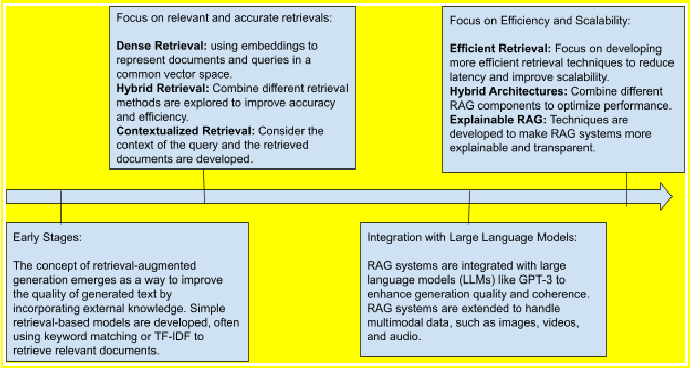

# RAG-Survey-Gupta2024

> 来源等级：FULL_TEXT
> 一句话定位：RAG 领域综述，梳理 RAG 从基础概念到多模态与最新进展的演化脉络，并总结挑战与未来方向。
> 生成时间：2026-09-18 22:02:38

---

## 1. 论文概要与作者意图

论文英文全称：**A Comprehensive Survey of Retrieval-Augmented Generation (RAG): Evolution, Current Landscape and Future Directions**；通用缩写即 **RAG Survey**。作者：Shailja Gupta、Rajesh Ranjan（Carnegie Mellon University, USA）、Surya Narayan Singh（BIT Sindri, India）。

发表年份与会议/期刊：**[材料未提供]**——PDF 正文首页未给出发表年份与会议/期刊名（参考文献中出现 2024 年文献，可推断为 2024 年前后，但原文未明写）。

本文是一篇 **survey（综述）**，关注的核心问题域是 **Retrieval-Augmented Generation (RAG) 的整体演化与当前图景**：RAG 把检索机制与生成式语言模型结合，以提升输出准确性、缓解 LLM 的知识局限。作者明确指出本领域缺少一篇追踪演化与近期变化的充分综述，本文意在填补该空白。

作者指出的现有方法/现状不足（保留原文措辞）：

- **Hallucination（幻觉）**：纯生成模型（GPT、BERT-based 生成器）依赖内部参数化知识，会生成"plausible but incorrect or non-existent information"。
- **无法高效更新知识**：LLM "cannot efficiently update their knowledge bases without retraining"，难以适应动态、知识密集的任务。
- **检索与生成的对齐不总成立**：两者"seamless in theory, can sometimes fail in practice"，生成模块未必有效利用检索到的信息，导致不一致或幻觉。
- **检索质量与计算开销**：依赖 dense vector 表示可能检索到无关文档；每个 query 都要走检索+生成两步，"resource-intensive"。
- **伦理与透明性**：检索源中的 bias 可能被放大，检索结果如何被选取与使用缺乏透明度。

作者的核心意图与主张：

> "This paper presents a comprehensive study of Retrieval-Augmented Generation (RAG), tracing its evolution from foundational concepts to the current state of the art... This survey aims to serve as a foundational resource for researchers and practitioners in understanding the potential of RAG and its trajectory in the field of natural language processing."

## 2. 方法框架

本文是综述性工作，**不提出自己的新模型**，而是把 RAG 系统拆解为两个核心模块并梳理其组件谱系。整体框架定位：RAG 是一种 **hybrid architecture**，用外部检索增强 NLG，使生成结果 grounded 在实时、相关的外部文档上。

1. **Retriever（检索器）**
   - 输入：用户 query 与外部语料库（corpus，如 Wikipedia 或私有数据库）。
   - 输出：与 query 最相关的文档/段落（top relevant documents）。
   - 功能：从外部知识源取回相关内容。论文梳理了三类代表性机制：
     - **BM25**：基于 TF-IDF 的经典稀疏检索，按词频与文档长度、词在全语料中的频率打分；简单高效，但"cannot capture the relationships between words"，语义复杂查询表现差。
     - **Dense Passage Retrieval (DPR)**：bi-encoder 架构，把 query 与文档分别编码到高维稠密向量空间，支持高效最近邻搜索，擅长语义相似度匹配。
     - **REALM**：把检索整合进语言模型预训练过程，retriever 与 generator 联合优化（jointly），使检索到的文档不仅相关、而且"helpful for generating accurate and coherent responses"。
   - 论文还提到检索后的增强手段：cross-encoder 重排序（jointly encode query 与每个文档计算相关性分数）、pointwise/pairwise ranking（基于 Learning-to-Rank, LTR）。
2. **Generator（生成器）**
   - 输入：query + 检索到的文档。
   - 输出：连贯、上下文相关、基于检索事实的最终文本。
   - 功能：以 LLM 为 backbone 综合检索信息生成回答。论文列举的代表模型：
     - **T5 (Text-to-Text Transfer Transformer)**：把所有 NLP 任务统一成 text-to-text，便于多任务微调，在 Natural Questions、TriviaQA 等基准上优于 GPT-3、BART。
     - **BART (Bidirectional and Auto-Regressive Transformer)**：去噪自编码器，适合从含噪输入生成，与 retriever 配对可提升事实准确性。

模块间数据流：query → retriever 从外部语料取回相关文档 → 文档与 query 一并送入 generator → generator 综合生成 grounded 的回答；检索与生成可以是松耦合的独立组件，也可以像 REALM 那样端到端联合优化。

论文还按模态梳理了 RAG 的类型：**Text-Based**（最成熟，BERT/T5 等）、**Audio-Based**（Wav2Vec 2.0 等 embedding）、**Video-Based**（I3D、TimeSformer 等）、**Multimodal**（Flamingo 等统一框架、跨模态检索）。

框架图：Fig. 2（p.3），"A basic flow of the RAG system along with its component"。

> 图注原文：Figure 2: A basic flow of the RAG system along with its component
> 文档引用：../analysis/figures/RAG-Survey-Gupta2024_Fig2.png

## 3. 关键机制与创新点

本文为综述，**不提出新的数学机制或算法公式**。全文正文未给出任何编号公式，因此本节的"关键机制"以作者梳理的技术脉络与代表性创新点呈现，**不抄录公式**（原文无公式可抄）。

### RAG 的演化脉络

作者给出的演化主线是：早期 hybrid 系统（如 DrQA，检索用于 QA 但生成成分极小，往往只是从检索文档中直接选文本）→ 检索与生成被视为独立组件（如 Dai et al. 2019）→ **REALM**（Guu et al. 2020）首次联合训练检索与生成，实现二者对齐 → **RAG**（Lewis et al. 2020）用 dense passage retrieval 取文档、用 BART 类 transformer 生成，实现更无缝的融合，兼顾流畅性与事实 grounding。

演化时间线：Fig. 3（p.8），"Timeline of the evolution of the RAG system and its components"。

> 图注原文：Figure 3: Timeline of the evolution of the RAG system and its components
> 文档引用：../analysis/figures/RAG-Survey-Gupta2024_Fig3.png

### 近期代表性创新（作者在第 4 节归纳）

- **Agentic RAG**（Ravuru et al. 2024）：层级化多智能体架构，master agent 把任务分派给用 SLM 微调的专用 sub-agent，sub-agent 从共享知识库检索 prompt。
- **RULE**（Xia et al. 2024）：面向医学 Vision-Language Model 的多模态 RAG，用 calibrated selection strategy 控制事实性风险，并用 preference optimization 平衡模型内在知识与检索上下文。
- **METRAG**（Gan et al. 2024）：多层 thoughts 增强的 RAG，结合 LLM 监督生成 utility-oriented thoughts，融合文档相似度与 utility，并配 task-adaptive summarizer。
- **RAFT**（Zhang et al. 2024）：训练模型忽略 distractor documents、直接引用相关来源，结合 chain-of-thought 提升推理。
- **FILCO**（Wang et al. 2023）：针对过度/不足依赖检索段落的问题，用 lexical 与 information-theoretic 方法识别有用上下文，训练 context filtering 模型在 test time 精炼上下文。
- **Self-RAG**（Asai et al. 2023）：引入 **Reflection Token**，自适应检索并自我反思评估、精炼回答。
- **CommunityKG-RAG**（Chang et al. 2024）：零样本框架，把知识图谱中的 community structure 与多跳连接引入 RAG，提升 fact-checking 的准确性与上下文相关性。
- **RAPTOR**（Sarthi et al. 2024）：递归地 embedding、clustering、summarizing 构建 summary tree，在不同抽象层级检索；与 GPT-4 配对在 QuALITY 基准上提升 20%。
- **Self-Route**（Li et al. 2024）：比较 RAG 与 long-context LLM，按模型自反思动态把 query 路由到 RAG 或 LC，平衡成本与性能。
- 其他：SFR-RAG、LA-RAG（语音识别）、HyPA-RAG（法律）、MemoRAG、NLLB-E5（多语言检索）。

作者论证这些机制有效的核心逻辑是：

> "Intelligence and effectiveness of RAG are dependent a lot on the quality of retrieval and more meta-data understanding of the repository would enhance the effectiveness of the RAG system."

## 4. 训练目标

本文是 **survey（综述）**，**不训练任何模型，因此没有自己的训练目标、损失函数或训练策略**。全文正文未出现任何损失函数或训练目标公式。

论文中出现的与"训练"相关的描述，都是对**被综述文献**的训练方式的转述，而非本文提出的目标：

- **REALM**：在预训练阶段联合训练 retriever 与 generator，retriever 被训练去识别"不仅与 query 相关、而且有助于生成准确连贯回答"的文档。
- **DPR**：在大量 question-answer pairs 语料上训练 retriever。
- **RAFT**：作为 LLM 的 post-training enhancement，训练模型忽略 distractor documents 并引用相关来源。
- **FILCO**：训练 context filtering 模型，在 test time 精炼检索上下文。

推理期与训练期的区分：论文提到 FILCO 的 context filtering 是 **test time** 的精炼操作，Self-RAG 的 reflection token 用于推理时自适应检索与自我评估——这些都不是本文的训练目标，而是被综述方法的推理期机制。本文自身无新增训练目标。

## 5. 可引用原句（供 blockquote）

- "RAG combines retrieval mechanisms with generative language models to enhance the accuracy of outputs, addressing key limitations of LLMs."
- "Traditional large language models (LLMs) such as GPT-3 and BERT, which are pre-trained on vast corpora, rely entirely on their internal representations of knowledge, making them susceptible to issues like hallucinations."
- "The integration between retrieval and generation, while seamless in theory, can sometimes fail in practice."
- "Intelligence and effectiveness of RAG are dependent a lot on the quality of retrieval and more meta-data understanding of the repository would enhance the effectiveness of the RAG system."
- "This survey aims to serve as a foundational resource for researchers and practitioners in understanding the potential of RAG and its trajectory in the field of natural language processing."
