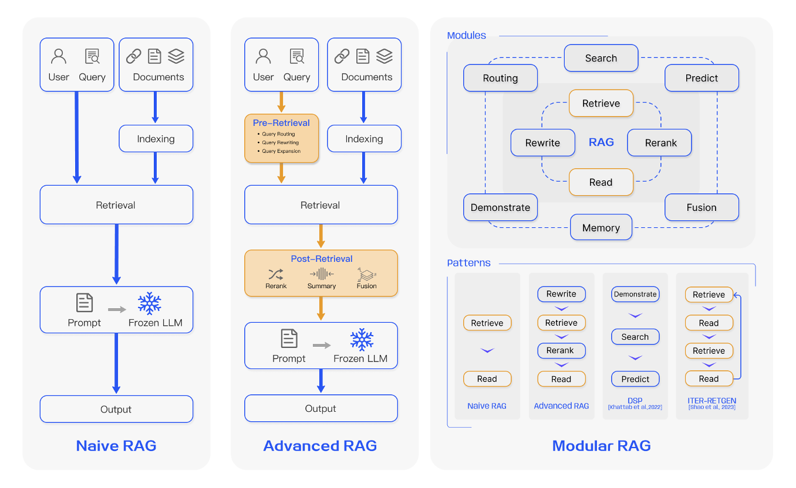
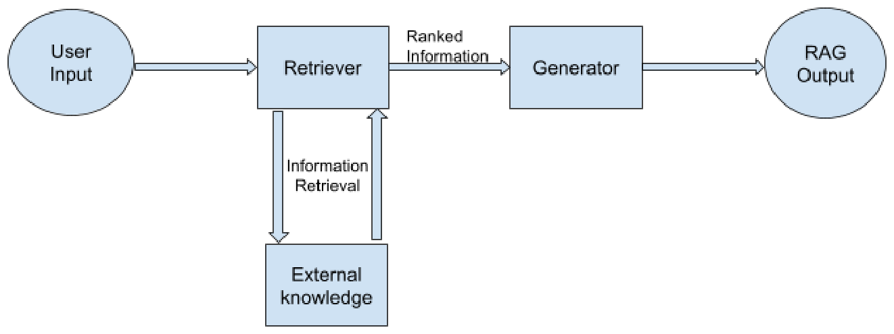

[TOC]

# RAG 综述调研：面向大语言模型的检索增强生成

> **调研背景**: 检索增强生成（Retrieval-Augmented Generation, RAG）通过引入外部知识库缓解大语言模型的幻觉、知识过时与推理不可追溯问题，是 2023 年后 LLM 应用层的核心方向之一。本调研选取两篇 2023 年后的 RAG 综述，梳理它们各自的组织框架与关注重点，并比较二者在"如何切分 RAG 技术空间"上的差异。
> **调研范围**: 2023 年后（year_from = 2023），入选论文 2 篇（FULL_TEXT 2 篇，仅摘要来源 0 篇）

**关于详细内容**：每篇论文的四维信息、公式逐字抄录与来源等级保存在
`investigation/RAG/analysis/{论文短名}.md`。本文档只做**归纳与对比**，
不复述这些文件的正文——需要细节时请直接查阅对应文件。

> **说明**：本课题入选的两篇均为 **survey（综述）**，其性质是梳理既有工作而非提出新模型。因此"关键机制"与"训练目标"两个维度在本文档中呈现的是**综述所归纳的技术脉络**，而非作者自创的公式或损失函数。两篇原文正文均无编号公式，经全文通读确认（见各篇 analysis 文件 §3/§4 的核对说明），故本文档不含任何公式引用。

---

## 论文清单

| # | 论文 | 年份/会议 | 来源等级 | 一句话定位 | 详细分析 |
| - | ---- | --------- | -------- | ---------- | -------- |
| 1 | RAG-Survey-Gao2023 | arXiv:2312.10997v5（2024-03-27）；正式会议/期刊 [材料未提供] | FULL_TEXT | 提出 Naive / Advanced / Modular 三范式演进主线，并以检索、生成、增强三支柱加评估体系组织 100+ 篇工作，是该领域被引用最广的框架性综述 | [analysis/RAG-Survey-Gao2023.md](../analysis/RAG-Survey-Gao2023.md) |
| 2 | RAG-Survey-Gupta2024 | arXiv:2410.12837（2024-10-03） | FULL_TEXT | 以 retriever + generator 两组件为骨架，追踪 RAG 从早期 hybrid 系统到多模态与 Agentic RAG 的演化脉络，偏重技术谱系与未来方向 | [analysis/RAG-Survey-Gupta2024.md](../analysis/RAG-Survey-Gupta2024.md) |

---

# 1. 逐篇定位

## 1.1 RAG-Survey-Gao2023

针对 LLM 的幻觉、知识过时与推理不透明问题，以及 Naive RAG 在检索、生成、增强三方面暴露的具体缺陷，这篇综述把 100+ 篇 RAG 工作组织成"**三范式演进 + 三支柱技术 + 评估体系**"的分析框架。它的核心贡献是分类学而非新方法：把 RAG 的发展刻画为 Naive RAG（固定 Retrieve-Read 链路）→ Advanced RAG（pre-/post-retrieval 优化）→ Modular RAG（可替换、可重组的模块化架构）三个阶段。**在本课题中它提供的是"领域地图"**——后续工作大多沿用其范式命名与三支柱划分。

> 图注原文：Fig. 3. Comparison between the three paradigms of RAG.

## 1.2 RAG-Survey-Gupta2024

这篇综述同样面对 LLM 幻觉与知识无法高效更新的问题，但切分方式不同：它把 RAG 视为一种 **hybrid architecture**，以 retriever（BM25 / DPR / REALM）与 generator（T5 / BART）两个组件为骨架展开，并沿时间轴追踪从早期 hybrid 系统到 REALM、Lewis et al. 的 RAG，再到 Agentic RAG、RAPTOR、Self-Route 等近期工作的演化。**在本课题中它的位置是"补时间线与补模态"**：相比 Gao 等的技术分类学，它更侧重演化叙事、多模态 RAG（text / audio / video / multimodal）与未来方向。

> 图注原文：Figure 2: A basic flow of the RAG system along with its component

---

# 2. 对比分析

## 2.1 方法框架对比

两篇综述都不提出模型，因此这里比较的是**它们各自用来组织 RAG 技术空间的框架**——即"以什么为轴切分领域"。

| 对比维度 | RAG-Survey-Gao2023 | RAG-Survey-Gupta2024 |
| -------- | ------------------ | -------------------- |
| 框架主轴 | **范式演进**（Naive → Advanced → Modular） | **组件构成**（Retriever + Generator） |
| 第二组织轴 | 三支柱：Retrieval / Generation / Augmentation | 演化时间线 + 模态分类（text / audio / video / multimodal） |
| 覆盖范围 | 100+ 篇 RAG 研究，含专门一章评估体系 | 以组件谱系与近期代表性工作为主，含未来方向讨论 |
| 检索侧展开粒度 | 细：检索源、检索粒度（Token/Sentence/Chunk/Document、KG 上为 Entity/Triplet/Sub-Graph）、索引优化、查询优化、Embedding、Adapter | 粗：以 BM25 / DPR / REALM 三类代表性机制为主线，另提 cross-encoder 重排序与 LTR |
| 生成侧展开粒度 | Context Curation（Reranking、Selection/Compression）+ LLM Fine-tuning | 以 T5、BART 为代表性 backbone，说明 text-to-text 与去噪自编码两类范式 |
| 增强/交互流程 | 单独归纳三类：Iterative / Recursive / Adaptive Retrieval | 未做同粒度归纳，改为按"检索与生成是否联合优化"叙述（独立组件 → REALM 联合训练 → Lewis et al. 融合） |
| 对评估的处理 | 有独立评估框架：3 个 Quality Scores + 4 项 Required Abilities，并列举 RGB/RECALL/CRUD 与 RAGAS/ARES/TruLens | 未给出独立评估框架，评估内容散见于各被综述工作的效果描述 |

**关键差异**：Gao 等的框架是**"横向技术轴 + 纵向演进轴"的二维网格**，因此能容纳大量方法并保持可比较性；Gupta 等的框架是**"组件 + 时间线"的一维叙事**，读起来更像领域发展史，代价是缺少统一的评估口径与细粒度分类。

## 2.2 关键机制对比

由于两篇均为综述、原文无编号公式，本节比较的是**它们各自认定为"关键机制"的技术及其归纳方式**，不涉及公式。

| 论文 | 归纳的核心机制类别 | 代表性机制（论文所引） | 该机制解决什么 |
| ---- | ------------------ | ---------------------- | -------------- |
| RAG-Survey-Gao2023 | **三类增强流程**（检索与生成的交互拓扑） | Iterative Retrieval（ITER-RETGEN）、Recursive Retrieval（IRCoT、ToC）、Adaptive Retrieval（FLARE、Self-RAG） | 单次检索在复杂问题上不足；让检索时机与轮次由问题难度决定 |
| RAG-Survey-Gao2023 | **检索前后优化** | Pre-retrieval：query rewriting / transformation / expansion、索引结构优化；Post-retrieval：rerank chunks、context compressing | 检索精度与召回不足、上下文信息过载 |
| RAG-Survey-Gupta2024 | **检索器机制谱系** | BM25（稀疏，无法刻画词间关系）、DPR（bi-encoder 稠密检索）、REALM（检索并入预训练、retriever 与 generator 联合优化） | 从词频匹配到语义匹配，再到检索与生成的目标对齐 |
| RAG-Survey-Gupta2024 | **近期代表性创新** | Agentic RAG（层级多智能体）、RAFT（忽略 distractor 并引用来源）、FILCO（test time 上下文过滤）、RAPTOR（递归聚类摘要树）、Self-Route（RAG 与 long-context 动态路由） | 检索质量控制、上下文噪声、成本与性能权衡 |

**取舍差异**：Gao 等的归纳停留在**流程层**——它告诉你"检索与生成可以迭代、递归或自适应地交互"，但不评判具体实现；Gupta 等的归纳停留在**组件层与案例层**——它给出具体机制的名字与效果，但未把它们收敛成一套可比较的交互拓扑。两者互补：前者提供坐标系，后者提供时间线上的实例。

> 机制细节与被综述工作的原始描述见各篇 analysis 文件的"关键机制与创新点"一节，本文档不重复。

## 2.3 训练目标对比

两篇综述**均不训练任何模型，因此都没有自己的训练目标、损失函数或训练策略**——这是文献类型的固有属性，不是材料缺失。两篇原文正文均无编号公式。

| 论文 | 本文档自身是否有训练目标 | 论文中出现的"训练"内容 | 训练期与推理期的区分 |
| ---- | ------------------------ | ---------------------- | -------------------- |
| RAG-Survey-Gao2023 | **无新增训练目标**（survey） | 对既有工作训练策略的分类转述：retriever 微调（LSR/PROMPTAGATOR、LLM-Embedder、REPLUG、RA-DIT）、Adapter 方案（UPRISE、AAR、PRCA、BGM、PKG）、LLM 微调（含 SANTA 三阶段）、联合/协同微调 | 论文明确指出 Self-RAG 的 critic 分数权重可在**推理期**调整、FLARE 的检索触发阈值作用于生成过程的 token 概率、reranking 与 context compression 发生在**推理期**后检索阶段——这些都不构成训练损失 |
| RAG-Survey-Gupta2024 | **无新增训练目标**（survey） | 对既有工作的转述：REALM 在预训练阶段联合训练 retriever 与 generator、DPR 在 QA pairs 上训练 retriever、RAFT 作为 post-training enhancement、FILCO 训练 context filtering 模型 | 论文指出 FILCO 的 context filtering 是 **test time** 精炼、Self-RAG 的 reflection token 用于**推理时**自适应检索与自我评估——均非本文的训练目标 |

**两篇一致的主张**：RAG 与 fine-tuning 不是互斥关系。Gao 等明确写道 RAG 与 FT 可以互补、在不同层面增强模型能力，并引用评估指出 RAG 在多种知识密集型任务上一致优于无监督微调。

## 2.4 对比汇总表

| 论文 | 作者主要想解决的问题 | 方法框架 | 关键机制 | 是否 Training-free |
| ---- | -------------------- | -------- | -------- | ------------------ |
| RAG-Survey-Gao2023 | RAG 领域膨胀但缺少能厘清整体轨迹的系统综述 | 三范式演进 + 三支柱技术 + 评估体系 | 用 Naive/Advanced/Modular 三阶段刻画演进，用 Iterative/Recursive/Adaptive 归纳检索—生成交互 | 不适用（综述，无模型与训练） |
| RAG-Survey-Gupta2024 | 缺少追踪 RAG 演化与近期变化的充分综述 | Retriever + Generator 两组件 + 演化时间线 | 以 BM25/DPR/REALM 梳理检索器谱系，按时间线串联从 hybrid 系统到 Agentic RAG 的进展 | 不适用（综述，无模型与训练） |

> 汇总表的"是否 Training-free"一列对两篇综述均填"不适用"：该列用于区分提出方法的工作是否引入训练，而本课题入选的两篇都不提出方法、不训练模型，填"是/否"都会造成误读。两篇在**被综述对象**层面的训练情况差异已列于 §2.3。

---

# 3. 结论与开放问题

**共识**：两篇综述对 RAG 的动机判断一致——LLM 的参数化知识导致幻觉与知识过时，RAG 通过外部检索把生成 grounded 在可核验的来源上。两篇也都认同检索质量是 RAG 效果的上限，且 RAG 与 fine-tuning 可以互补而非互斥。

**分歧**：主要分歧在于**组织领域的方式**，而非技术判断。Gao 等用范式演进加三支柱构建二维坐标系，并给出独立的评估框架（3 个 Quality Scores + 4 项 Required Abilities）；Gupta 等用组件加时间线做一维叙事，不设独立评估章节。这导致两篇对同一批工作的定位不同：例如 Self-RAG 在 Gao 等那里是"Adaptive Retrieval"这一类机制的代表，在 Gupta 等那里是"近期代表性创新"中的一个条目。

**尚未解决的问题**（两篇共同指向的开放方向）：

1. **评估口径不统一**：Gao 等明确指出其列举的指标仍是传统度量、"do not yet represent a mature or standardized approach"，说明该领域缺乏统一量尺；Gupta 等亦未提供可操作的评估框架。
2. **检索质量的决定性作用**：Gupta 等强调 RAG 的智能与效果高度依赖检索质量与对语料库元数据的理解，但两篇都未给出"检索质量到生成质量"的定量传导关系。
3. **规模律是否适用于 RAG**：Gao 等提出 "While scaling laws are established for LLMs, their applicability to RAG remains uncertain."，这是一个两篇都没有回答的问题。
4. **噪声与矛盾信息**：Gao 等引用 "Misinformation can be worse than no information at all" 指出检索噪声可能反向损害输出质量，如何稳健地筛选上下文仍开放。

**对本次调研的说明**：入选论文仅 2 篇且均为综述，本文档的比较对象是**综述框架本身**，不构成对具体 RAG 方法的性能对比。候选池中的 C3（arXiv:2407.13193，RAG for NLP: A Survey）因目标论文数上限未下载，如需在"检索融合"这一细分维度上做更细的比较，可回退检索阶段补入。

---

# 参考文献

1. Yunfan Gao, Yun Xiong, Xinyu Gao, Kangxiang Jia, Jinliu Pan, Yuxi Bi, Yi Dai, Jiawei Sun, Meng Wang, Haofen Wang. "Retrieval-Augmented Generation for Large Language Models: A Survey." arXiv preprint arXiv:2312.10997, 2023 (v5, 2024-03-27). https://arxiv.org/abs/2312.10997 — 来源等级：FULL_TEXT
2. Shailja Gupta, Rajesh Ranjan, Surya Narayan Singh. "A Comprehensive Survey of Retrieval-Augmented Generation (RAG): Evolution, Current Landscape and Future Directions." arXiv preprint arXiv:2410.12837, 2024 (2024-10-03). https://arxiv.org/abs/2410.12837 — 来源等级：FULL_TEXT
