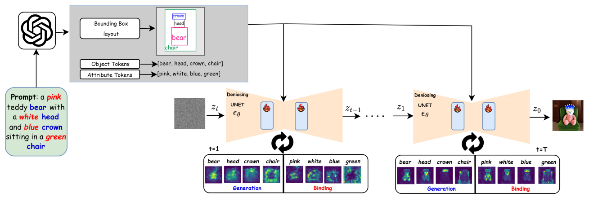
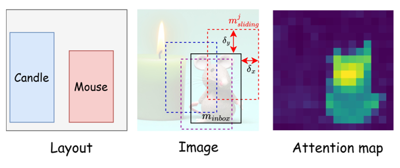
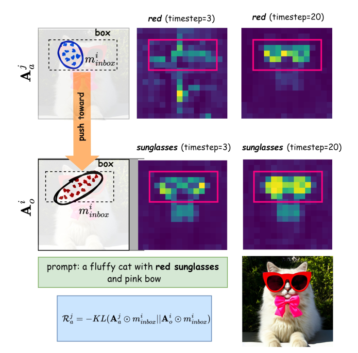

# B2B

> 来源等级：FULL_TEXT
> 一句话定位：B2B 是免训练的即插即用模块，用物体生成奖励与属性绑定奖励在推理期引导潜变量，同时解决多主体布局控制与属性绑定。
> 生成时间：2026-09-20 00:17:30

---

## 1. 论文概要与作者意图

**Box-it-to-Bind-it (B2B): Unified Layout Control and Attribute Binding in T2I Diffusion Models**（arXiv:2402.17910v1，2024 年 2 月 27 日；作者 Ashkan Taghipour、Morteza Ghahremani、Mohammed Bennamoun、Aref Miri Rekavandi、Hamid Laga、Farid Boussaid，单位为 University of Western Australia、Munich Center for Machine Learning (MCML)、The University of Melbourne、Murdoch University）。论文正文与致谢中未给出正式会议/期刊名，[材料未提供]。

B2B 关注的是 **training-free 的文本到图像（T2I）潜扩散模型（LDM）布局控制与属性绑定**，用一个即插即用模块同时处理三个挑战：**Catastrophic Neglect**、**Attribute Binding**、**Layout Guidance**。

作者认为已有方法存在以下不足：

- **Catastrophic Neglect**：prompt 中的一个或多个 token（物体）根本没有被生成出来（Attend-and-Excite 针对此问题，但缺乏空间推理能力）。
- **Attribute Binding 失败**：模型要么无法正确关联物体属性，要么把属性错误地绑定到别的 token 上（BoxDiff 在把属性加到物体 token 上时难以有效管理属性）。
- **Layout Guidance 缺失**：多数属性绑定类方法（Composable Diffusion、Divide&Bind、Syngen、Structured Diffusion Guidance、GORS）无法控制生成物体的空间位置。
- **两条既有技术路线的代价**：(a) 从零训练或微调扩散模型（如以 pose、mask 等额外输入为条件）需要大量算力与漫长开发周期；(b) 利用预训练模型再注入可控生成特征，则往往只解决属性或布局中的一项。
- **LLM 布局方法的侧重不同**：并行的 LLM Blueprint 用 LLM 生成布局并引导扩散，但其主要关注长 prompt 中所有物体的生成，而非属性绑定。

因此作者的核心意图是：

> "To this end, our method aims to bridge the gap between layout-based and attribute-based methods, ensuring that both the given layout and object attribute binding are satisfactorily followed."

> "The proposed B2B is designed to guide the LDMs' latent encoding in two steps during the inference phase: object generation and attribute binding."

## 2. 方法框架

B2B 是一个 **reward-guided diffusion** 模块，在推理期（zero-shot setting）通过奖励梯度更新潜编码 $z_t$，不训练任何新参数。整体由两个模块组成：

1. **Object Generation（生成阶段）**
   - 输入：prompt $y$；由 LLM（论文中为 GPT-4）从 prompt 提取的每个物体的 bounding box 坐标、物体 token、及其属性；交叉注意力图 $A$。
   - 输出：物体生成奖励 $R^i_o$。
   - 功能：用 IoU-based framework 提高 bounding box 内部（$A^i_o \odot m^i_{inbox}$）的注意力权重、抑制框外（$A^i_o \odot (1-m^i_{inbox})$）权重，并用 $N$ 个滑动框把物体推向主框中心，从而保证每个物体都被生成且落在指定布局内。
2. **Attribute Binding（绑定阶段）**
   - 输入：属性注意力图 $A^j_a$、对应物体注意力图 $A^i_o$、物体 mask $m^i_{inbox}$。
   - 输出：属性奖励 $R^j_a$。
   - 功能：用 KL 散度度量属性分布与对应物体分布的差异并缩小该距离，使属性绑定到正确的物体上。

**数据流**：prompt → LLM（GPT-4）解析出每个物体的 bbox 坐标、物体 token 与属性 → 这些信息在潜空间被送入去噪 UNet 的 $16\times16$ 交叉注意力层、在指定 timestep $T_t$ 上生效 → 生成模块与绑定模块分别算出 $R^i_o$ 与 $R^j_a$ → 二者合成奖励梯度更新 $z_t$ 得到 $z'_t$，进入下一步去噪。

框架图：Fig. 2（p.3），"The framework of the proposed B2B method."

> 图注原文：Figure 2: The framework of the proposed B2B method. Given a prompt, it first enters an LLM (here GPT-4) to extract the corresponding bounding box coordinates for each object in the text, the object tokens, and their respective attributes. In the latent space, this information is fed into the 16 × 16 cross-attention layer of the denoising UNet at specified timesteps Tt. The generation module ensures the generation of each object in the prompt and adherence to each object in the given layout while the binding module is applied for attribute binding.
> 文档引用：../analysis/figures/B2B_Fig2.png

## 3. 关键机制与创新点

### 概率建模：从贝叶斯推导到奖励分解

B2B 把引导写成一个概率模型，从贝叶斯角度出发（式 2–式 7），最终把目标简化为"同时最大化每个物体出现的概率与其属性的条件概率"：

> "The equation indicates that we i must increase the probability of every object's presence (or object's generation) in a scene, ii simultaneously, its associated attributes should also be maximized."

据此把式 7 分解为物体奖励 $R_o$ 与属性奖励 $R_a$，并在每一步更新潜变量：

$$
z'_t = z_t + \gamma \nabla \left( \sum_{i=1}^{n_o} R^i_o + \lambda_a \sum_{j=1}^{n_a} R^j_a \right)
$$

其中：

- $z_t$ 是第 $t$ 步的潜编码，$z'_t$ 是更新后的潜编码；
- $\gamma$ 是决定奖励步长的超参数（"a hyperparameter that determines the reward step"）；
- $\lambda_a$ 是平衡物体奖励与属性奖励的超参数；
- $n_o$ 是物体数量，$n_a$ 是属性数量；
- $R^i_o$ 是第 $i$ 个物体的生成奖励，$R^j_a$ 是第 $j$ 个属性的绑定奖励。

### IoU-based Object Generation Reward

为提升物体生成概率 $p(A^i_o)$，作者提出 IoU-based framework（Fig. 3）：提高主框内注意力、抑制框外注意力，并用 $N$ 个滑动框把权重推向主框中心。奖励为：

$$
R^i_o = R^i_{mainbox} - R^i_{outbox} + \lambda_{iou} R^i_{iou}
= \mathbb{E}[A^i_o \odot m^i_{inbox}] - \mathbb{E}[A^i_o \odot (1 - m^i_{inbox})]
+ \frac{\lambda_{iou}}{N} \sum_{k=1}^{N} \text{IoU}(A^i_o \odot m^i_{inbox}, A^i_o \odot m^k_{sliding})
$$

其中：

- $R^i_{mainbox} = \mathbb{E}[A^i_o \odot m^i_{inbox}]$：主框内注意力期望，用于对抗 catastrophic neglect；
- $R^i_{outbox} = \mathbb{E}[A^i_o \odot (1 - m^i_{inbox})]$：框外注意力期望，被减去以抑制框外权重；
- $m^i_{inbox}$ 是布尔 mask，"assigned a value of 1 for pixels inside the bounding box and 0 elsewhere"；
- $\odot$ 是逐元素乘法（element-wise multiplication）；
- $m^k_{sliding}$ 是距主框 $(\delta_x, \delta_y)$ 像素的滑动框；$N$ 个滑动框覆盖不同的 $(\delta_x, \delta_y)$ 对，取值随机选自交叉注意力图高 $h$、宽 $w$ 最小值（$\min(h,w)$）的 10%–20% 范围；
- $\lambda_{iou}$ 是 IoU 奖励的超参数；
- IoU 项使注意力权重集中于主框中心区域，减少边界处的分散。

机制图：Fig. 3（p.4）。

> 图注原文：Figure 3: IoU-based framework for object generation. As LDMs do not generally position objects within their designated bounding boxes, we enforce LDMs to generate objects centered within the specified bounding box by exerting additional N boxes that push them away from the borders.
> 文档引用：../analysis/figures/B2B_Fig3.png

### KL-based Attribute Binding Reward

为提升条件概率 $p(A^j_a | A^i_o)$，作者用 KL 散度度量属性分布与对应物体分布的差异，并给出奖励：

$$
R^j_a = -\text{KL}(A^j_a \odot m^i_{inbox} \| A^i_o \odot m^i_{inbox})
$$

其中：

- $A^j_a$ 是第 $j$ 个属性的交叉注意力图；$A^i_o$ 是第 $i$ 个物体的交叉注意力图；
- $m^i_{inbox}$ 是第 $i$ 个物体的框内布尔 mask，把比较限制在物体框内；
- 负号的作用是使式 8 的奖励最大化成立——"the minus sign in equation 10 ensures that equation 8 is satisfied for reward maximization"，当属性分布完全跟随物体分布时取得最大。

作者论证该机制有效的原因：物体注意力图在生成阶段已被先富集（enriched），因此从属性到物体的分布推挤能产生有意义的注意力权重。

> "As shown in Figure 4, we enforce the attributes' distribution to converge towards their respective objects. This is more plausible since the contents of the objects' attention maps are previously enriched in Section 3.1."

机制图：Fig. 4（p.5）。

> 图注原文：Figure 4: Asymmetrical distance KL pushes attributes' distribution toward their corresponding objects' in the cross-attention maps. Since the attention maps of the objects are previously enriched during the generation stage, the distribution push from attributes to their objects yields meaningful attention weights.
> 文档引用：../analysis/figures/B2B_Fig4.png

### 实现流程

算法 1（Algorithm 1 B2B Algorithm）给出伪代码：输入为 prompt $y$、去噪 UNet $\epsilon_\theta$、物体与属性 token 索引 $O$ 与 $D$ 及其对应 mask $m^i_{inbox}$、总扩散步数 $T$、施加生成与绑定过程的步 $T_t$；输出为用于下一步的 refined latent $z'_t$。每个 $T_t$ 步内对 $i \in O, j \in D$ 计算 $R^i_{mainbox}$、$R^i_{outbox}$、$R^i_{iou}$、$R^i_o$ 与 $R^j_a$，再按式 8 更新潜变量。

## 4. 训练目标

**B2B 是 training-free 方法，不训练任何新参数，因此严格来说没有新增的模型训练目标。** 论文明确说明其引导发生在推理阶段（"The proposed B2B operates within a zero-shot learning setting during inference"），并作为 plug-and-play 模块接入已有 T2I 模型（Stable Diffusion、GLIGEN）。

论文式 1 给出的

$$
L_{LDM} = \mathbb{E}_{z,y,\epsilon \sim \mathcal{N}(0,I)} \left\| \epsilon - \epsilon_\theta(z_t, t, \tau_\theta(y)) \right\|_2^2
$$

只是回顾条件 LDM 的预训练目标（引用 Rombach et al. [37] 与 Ho et al. [38]），其中 $\tau_\theta(y)$ 是把文本 prompt $y$ 投影到中间表示的可学习编码器，$\epsilon_\theta$ 是去噪 UNet，不是 B2B 引入的训练损失。

**推理期约束（须与训练目标严格区分）**：式 8 的潜变量更新

$$
z'_t = z_t + \gamma \nabla \left( \sum_{i=1}^{n_o} R^i_o + \lambda_a \sum_{j=1}^{n_a} R^j_a \right)
$$

是**推理期的奖励引导**，不是训练监督信号——它只更新潜编码 $z_t$，不更新模型权重。相关超参数为 $\gamma$、$\lambda_a$、$\lambda_{iou}$，以及施加奖励的 timestep 集合 $T_t$。

**训练策略**：无。B2B 不冻结也不微调任何模块；论文在 GLIGEN 上的实验只是把生成与绑定模块接入其 $16\times16$ 分辨率交叉注意力层（"we enhance its performance with our generation and binding modules in its 16 × 16 resolution cross-attention layers"），同样不涉及训练。

## 5. 可引用原句（供 blockquote）

- "we introduce the Box-it-to-Bind-it (B2B) module - a novel, training-free approach for improving spatial control and semantic accuracy in text-to-image (T2I) diffusion models."
- "B2B targets three key challenges in T2I: catastrophic neglect, attribute binding, and layout guidance."
- "B2B is designed as a compatible plug-and-play module for existing T2I models, markedly enhancing model performance in addressing the key challenges."
- "our method aims to bridge the gap between layout-based and attribute-based methods, ensuring that both the given layout and object attribute binding are satisfactorily followed."
- "The equation indicates that we i must increase the probability of every object's presence (or object's generation) in a scene, ii simultaneously, its associated attributes should also be maximized."
- "Since the attention maps of the objects are previously enriched during the generation stage, the distribution push from attributes to their objects yields meaningful attention weights."
- "The results indicate the critical role of generation rewards in spatial reasoning and adhering to the layout for object placement."
