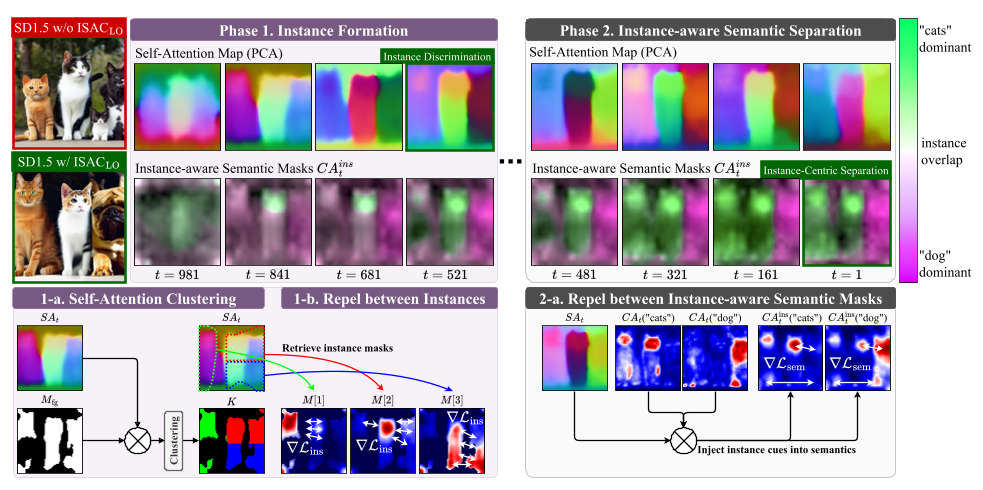
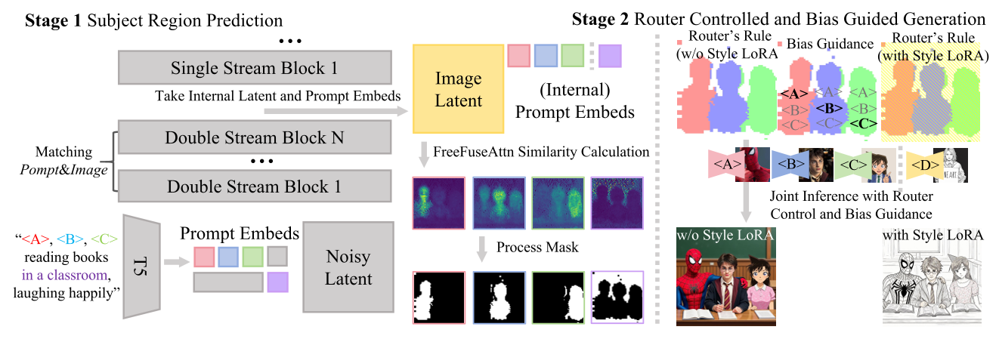
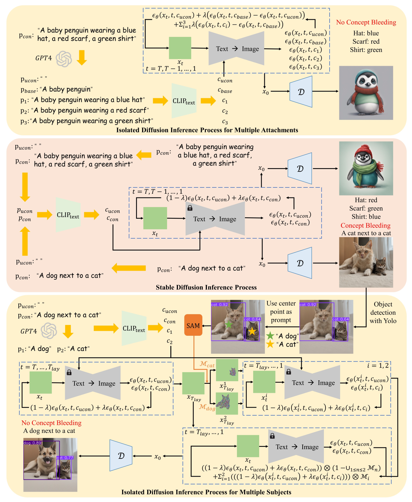
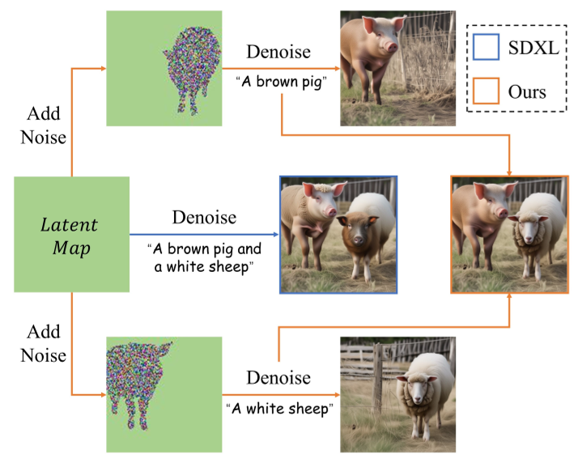
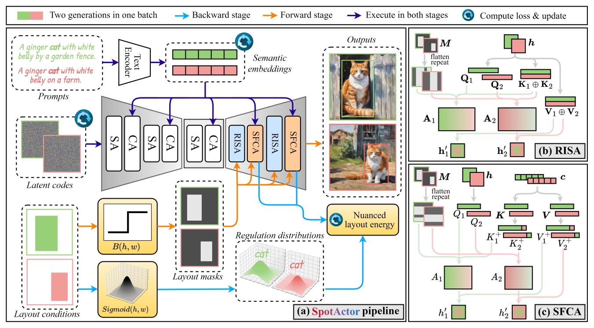

[TOC]

# 无训练（Training-Free）的多主体图像生成与布局控制调研

> **调研背景**: 多主体图像生成要求在保持每个参考主体身份的同时，让各主体出现在用户指定的位置上。基于训练的方法通常需要布局标注数据与额外的 adapter 微调，代价高且泛化受限。本调研聚焦 2024–2025 年的**无训练（training-free）**路线，梳理其如何在推理期操控注意力、区域约束与扩散采样过程来实现布局控制，并比较各自的机制、代价与适用场景。
> **调研范围**: 2024–2025 年，入选论文 6 篇（FULL_TEXT 6 篇，仅摘要来源 0 篇）

**关于详细内容**：每篇论文的四维信息、公式逐字抄录与来源等级保存在
`investigation/多主体布局控制/analysis/{论文短名}.md`。本文档只做**归纳与对比**，
不复述这些文件的正文——需要细节时请直接查阅对应文件。

---

## 论文清单

| # | 论文 | 年份/会议 | 来源等级 | 一句话定位 | 详细分析 |
| - | ---- | --------- | -------- | ---------- | -------- |
| 1 | AnyMS | arXiv:2512.23537, 2025（v2 2026-01；会议/期刊信息 [材料未提供]） | FULL_TEXT | 用自底向上双层注意力解耦分离文本、主体图像与布局三类条件，是"纯注意力重整、零新增参数"路线的代表 | [analysis/AnyMS.md](../analysis/AnyMS.md) |
| 2 | ISAC | arXiv:2505.20935, 2025（会议/期刊信息 [材料未提供]） | FULL_TEXT | 提出 instance-first 层级：先用自注意力稳定实例布局，再把交叉注意力语义绑定进这些区域 | [analysis/ISAC.md](../analysis/ISAC.md) |
| 3 | FreeFuse | TMLR 09/2026（OpenReview id `Bvela8OAMc`） | FULL_TEXT | 把多个主体 LoRA 的加性残差按 token 路由到各自语义区域，实现空间互斥的免训练 LoRA 融合 | [analysis/FreeFuse.md](../analysis/FreeFuse.md) |
| 4 | IsolatedDiffusion | arXiv:2403.16954, 2024（v2 2025-01；会议/期刊信息 [材料未提供]） | FULL_TEXT | 拆分文本条件并把各主体隐变量区域隔离去噪，用 YOLO+SAM 锁定布局、缓解 concept bleeding | [analysis/IsolatedDiffusion.md](../analysis/IsolatedDiffusion.md) |
| 5 | SpotActor | arXiv:2409.04801, 2024（会议/期刊信息 [材料未提供]） | FULL_TEXT | 提出 L2CI 新任务，用 latent–semantic 联合双能量引导布局并保持跨图主体一致 | [analysis/SpotActor.md](../analysis/SpotActor.md) |
| 6 | B2B | arXiv:2402.17910, 2024（会议/期刊信息 [材料未提供]） | FULL_TEXT | 即插即用模块，用物体生成奖励与属性绑定奖励在推理期同时解决布局控制与属性绑定 | [analysis/B2B.md](../analysis/B2B.md) |

---

# 1. 逐篇定位

## 1.1 AnyMS

AnyMS 关注 layout-guided multi-subject customization 中 text alignment、subject identity preservation 与 layout control 三者难以兼顾的问题，把根源归结为不同条件之间的 attention 竞争。它不训练任何新模块，而是在推理期对 attention 做两级解耦：全局上分离文本分支与图像分支，局部上让每个 bbox 区域只注意对应的参考主体，并借助预训练 image adapter（IP-Adapter）提取主体特征。**它是本课题中"完全不动模型参数、只重整 attention"这一路线的代表**，部署成本最低，但效果上限受预训练基座与 adapter 能力约束。

> 图注原文：Figure 3. The Overview of Pipeline. AnyMS applies a dual-level attention decoupling strategy alongside the general denoising process of the diffusion model. (a) The global decoupling separates cross-attention between text and subject images. (b) The local decoupling further disentangles image cross-attention based on layout constraints. The final z0 is then decoded back to target image IG.

## 1.2 ISAC

ISAC 针对多实例文生图中的 count failure 与 semantic mixing，主张这两类失败的根源是**早期去噪步中实例边界尚未稳定**，而既有 training-free 引导大多只纠正"语义侧"。它提出 instance-first 层级：Phase 1 从自注意力聚类出 N 个类别无关的实例布局并用 MPO 惩罚最坏重叠，Phase 2 再把这些稳定结构注入交叉注意力、用 repel-and-bind 损失绑定语义。**它是本课题中唯一把"结构先于语义"作为显式时间顺序来组织的方法**，且不需要微调或外部视觉模型。

> 图注原文：Fig. 4: Overview of ISAC. Guided by diffusion dynamics, ISAC computes a hierarchical objective in two phases. Phase 1 (Sec. 3.2) clusters self-attention to shape N class-agnostic instance layouts, repelling overlaps to establish clean boundaries early in the trajectory. Phase 2 (Sec. 3.3) then inject these reliable instance structures into cross-attention to align semantic evidence, using a repel-and-bind loss to prevent cross-instance semantic mixing. An instance-to-semantic schedule (Sec. 3.4) seamlessly transitions the objective from Phase 1 to Phase 2.

## 1.3 FreeFuse

FreeFuse 关注多主体 LoRA 直接叠加导致的特征冲突，把根因定位为**LoRA 参数更新被无差别广播到整张图**，而非单纯的生成伪影。它先用 FreeFuseAttn 在早期去噪步（第 5 步、block 18）从 cross-attention 空间相似度重建稠密主体掩码，再在 Phase 2 用 token 级 Router 与 Attention Bias 只门控加性 LoRA 残差、保留冻结基座的全局注意力路径。**它是本课题中唯一以"LoRA 融合"为切入点的免训练框架**，不需外部分割器或用户空间约束。

> 图注原文：Fig. 2 The FreeFuse Pipeline. In Phase 1, we employ FreeFuseAttn to extract robust subject masks, which are subsequently processed into a spatial Router and Attention Bias. In Phase 2, the Router enforces subject LoRA exclusivity per token to suppress direct cross-region LoRA interference, while the Bias mechanism actively reduces concept bleeding by ensuring precise semantic-spatial alignment.

## 1.4 IsolatedDiffusion

IsolatedDiffusion 关注免训练多概念文生图中的 **concept bleeding**（不同概念意外重叠或合并），把成因归于预训练文本编码器把复杂 prompt 压缩进固定数量 token。它用两条可组合的推理期规则应对：多附着属性场景下用 split prompt 的噪声线性组合替代整条 prompt 的条件噪声；多主体场景下先用 YOLO 检测判断是否发生 bleeding，再用 SAM 分割出主体 mask，把隐变量中其他主体区域替换为随机噪声后逐个隔离去噪，最后按 mask 融合。**它是本课题中"检测/分割驱动 + 隐变量分区"路线的代表**，需要外部视觉模型。

> 图注原文：Fig. 3: Overview of Isolated Diffusion. We decompose complex text prompts into simpler forms with GPT4 and denoise each concept under split conditions to avoid mutual interference between various concepts for better text-image consistency.

> 图注原文：Fig. 2: We isolate multi-subject generation by replacing the regions of other subjects in latents with random noises and denoise each subject with split text prompts individually. Our approach avoids mutual interference between various subjects and gets a more reasonable result than SDXL.

## 1.5 SpotActor

SpotActor 首次提出 layout-to-consistent-image（L2CI）任务，要求主体既按给定 bbox 就位、又在多张图之间保持外观一致。它把每个采样步拆成 layout-conditioned backward update 与 consistent forward sampling 两段，在 latent 与 semantic 组成的**联合 dual space** 中做能量引导，并用 RISA（区域互连自注意力）与 SFCA（语义融合交叉注意力）实现跨图交互。**它是本课题中唯一同时处理"布局控制"与"跨图一致性"的方法**，并给出首个 L2CI 基准 ActorBench。

> 图注原文：Figure 2: The overall architecture of SpotActor. (a) Our method consists of two stages at each sample step in a dual energy guidance manner. The backward stage optimizes the latent codes and semantic embeddings with the nuanced layout energy based on the sigmoid-like objective. Subsequently, the forward sampling is enhanced by two intricate attention mechanisms: (b) RISA and (c) SFCA.

> 图注原文：Figure 3: Illustration of the attention analysis. (a) IntraM is the attention map normalized within each token, while (b) InterM is normalized across all the tokens. We further visualize (c) 3D distributions of attention maps and propose (d) sigmoid-like approximate distributions.

## 1.6 B2B

B2B 针对 T2I 潜扩散模型中的 catastrophic neglect、attribute binding 与 layout guidance 三个挑战，主张把"基于布局"与"基于属性"两类方法打通。它作为即插即用模块在推理期用奖励梯度更新潜编码：物体生成奖励用 IoU-based framework 把注意力压向主框中心，属性绑定奖励用 KL 散度把属性分布推向对应物体分布。**它是本课题中"奖励/能量引导 + 属性绑定"路线的代表**，布局由 LLM（GPT-4）从 prompt 解析得到。

> 图注原文：Figure 2: The framework of the proposed B2B method. Given a prompt, it first enters an LLM (here GPT-4) to extract the corresponding bounding box coordinates for each object in the text, the object tokens, and their respective attributes. In the latent space, this information is fed into the 16 × 16 cross-attention layer of the denoising UNet at specified timesteps Tt. The generation module ensures the generation of each object in the prompt and adherence to each object in the given layout while the binding module is applied for attribute binding.

> 图注原文：Figure 3: IoU-based framework for object generation. As LDMs do not generally position objects within their designated bounding boxes, we enforce LDMs to generate objects centered within the specified bounding box by exerting additional N boxes that push them away from the borders.

---

# 2. 对比分析

## 2.1 方法框架对比

| 对比维度 | AnyMS | ISAC | FreeFuse | IsolatedDiffusion | SpotActor | B2B |
| -------- | ----- | ---- | -------- | ----------------- | --------- | --- |
| 模块划分 | Global Decoupling + Local Decoupling（crop-and-merge） | Phase 1 Instance Formation + Phase 2 Instance-aware Semantic Separation | Phase 1 FreeFuseAttn 掩码提取 + Phase 2 Router + Attention Bias | 多附着属性隔离去噪 + 多主体隐变量隔离与 mask 融合 | Layout-conditioned Backward Update + Consistent Forward Sampling（RISA + SFCA） | Object Generation 模块 + Attribute Binding 模块 |
| 数据流 | 文本支路与图像支路分别 attention 后相加；图像支路按 bbox 裁剪区域后合并回原位 | prompt → LLM parser → SA/CA hooks → 实例 mask → $\mathcal{L}_{ins}$ / $\mathcal{L}_{sem}$ → 更新 latent | 掩码同时供给 Router（决定 token 用哪组 adapter）与 Attention Bias（调制 cross-attention 权重） | 先正常生成 $X_0$ → YOLO 判据 → SAM 分割 → 分区隔离去噪 → 按 mask 融合 | 每步 $z_t,c_t$ → backward 更新为 $z_t^*,c_t^*$ → forward 采样得 $z_{t-1},c_{t-1}$ | prompt → LLM 解析 bbox/token/属性 → 交叉注意力层算奖励 → 更新 $z_t$ |
| 空间约束来源 | 用户给定 bbox（仅用于区域裁剪） | 自注意力结构聚类（无需用户 bbox） | 基座模型内在分割能力（无需用户空间约束） | YOLO 检测 + SAM 分割得到的 mask | 用户给定 bbox，转为 sigmoid-like 目标分布 | LLM 从 prompt 解析的 bbox |
| 干预发生在哪一层 | 注意力层（cross-attention 的 query 裁剪与合并） | 注意力图 → 推理期损失（latent optimization / selection） | LoRA 残差路径 + cross-attention 权重偏置 | 隐变量空间的分区替换与噪声预测组合 | latent 与 semantic 双空间梯度更新 + 跨图注意力 | 潜编码的奖励梯度更新 |
| 是否需外部预训练权重/适配器 | 是（预训练 image adapter，如 IP-Adapter） | 否（仅需访问 $X_t$ 与注意力图） | 否（复用基座内在分割能力）；但需已训练好的主体 LoRA | 否（不新增权重） | 否（不新增权重） | 否（不新增权重） |
| 是否需外部检测/分割/LLM 组件 | 否 | 是（LLM-based prompt parser，用于解析类别与实例数） | 否 | 是（GPT4 拆 prompt + YOLOv8x 检测 + SAM ViT-H 分割） | 否 | 是（GPT-4 解析布局与属性） |
| 基座模型 | SDXL + IP-Adapter | 未限定（model-agnostic，含 U-Net 与 DiT 情形） | FLUX.1-dev / SDXL | SD 系列（SDXL 等） | SDXL | Stable Diffusion、GLIGEN |

**这一维度的分野**：六篇都回答"谁在什么位置说话"，但干预的**载体**完全不同——AnyMS 改 attention 的 query 区域，ISAC 改 latent（以注意力图为损失），FreeFuse 改 LoRA 残差的施加范围，IsolatedDiffusion 改隐变量与噪声组合，SpotActor 同时改 latent 与 semantic embedding，B2B 改潜编码（以奖励梯度）。**载体决定了它们能复用什么、又必须依赖什么**：改 attention 的可复用预训练 adapter，改 latent 的则往往需要检测/分割或 LLM 来提供空间信息。

## 2.2 关键机制对比

| 论文 | 核心机制 | 解决什么 | 代价 / 适用场景 |
| ---- | -------- | -------- | --------------- |
| AnyMS | 全局分离文本/图像 cross-attention；局部按 bbox 裁剪 query 做 region-subject 路由，重叠区域按语义优先级（attribute > object、foreground > background）消解 | 多条件竞争导致的 identity distortion、background leakage、布局失准 | 布局完全依赖用户 bbox；效果受预训练基座与 adapter 能力上限约束；适合"已有主体参考图 + 已知布局"的定制场景 |
| ISAC | 先用自注意力聚类出实例布局并以 MPO 惩罚最坏重叠，再把语义绑定到这些 instance-aware mask 上（repel-and-bind） | 多实例计数失败与相似物体语义混淆；重叠 bbox 下布局控制器失效 | 需 LLM 解析 prompt 的类别与实例数；模糊计数 prompt 不在范围内；适合"同类多实例"这类语义引导最易失效的场景 |
| FreeFuse | 只门控加性 LoRA 残差到各自语义区域，冻结基座注意力保持激活；用掩码构造 spatial attention bias | 多主体 LoRA 叠加造成的特征冲突与 concept bleeding | 需已训练好的主体 LoRA；掩码提取格点（步数/block）需扫描确定；适合"多主体 LoRA 组合"场景 |
| IsolatedDiffusion | 多附着：split prompt 噪声线性组合；多主体：替换其他主体隐变量区域为随机噪声后逐个隔离去噪，再按 mask 融合 | concept bleeding（多附着属性错配、多主体概念合并） | 依赖 YOLO 检测与 SAM 分割质量，YOLO 漏检或 SD 忽视主体时失效；适合可被检测器稳定识别的常见物体 |
| SpotActor | latent 与 semantic 联合 dual space 中的双能量引导（sigmoid-like 目标分布）；RISA 做跨图 spatial-spatial 互连，SFCA 做 spatial-semantic 交互 | 布局控制与跨图主体一致性无法同时满足 | 本质是 score-matching，依赖基座训练分布，bbox 过小/贴边时布局对齐变差（OOD）；适合漫画、分镜等多图创作 |
| B2B | 物体生成奖励（框内加权、框外抑制、滑动框推向中心）+ 属性绑定奖励（KL 把属性分布推向物体分布） | catastrophic neglect、属性绑定错误、缺少布局引导 | 布局由 LLM 解析，布局质量受 LLM 输出影响；适合"prompt 中已含物体与属性、希望自动获得布局"的场景 |

**共同的收敛点**：六篇最终都回到"**限制某个主体的条件能影响哪些空间位置**"这一条主线。区别在于空间约束的**来源**（用户 bbox / LLM 解析 / 检测分割 / 自注意力结构 / 基座内在分割）与**施加位置**（attention / latent / 噪声组合 / 奖励梯度）。这两者共同决定了方法的自动化程度与鲁棒性：越依赖外部组件（检测、分割、LLM），自动化程度越高但失败模式越多；越依赖用户 bbox，则越稳定但交互成本越高。

> 机制细节与逐字抄录的公式见各篇 analysis 文件的"关键机制与创新点"一节，本文档不重复。

## 2.3 训练目标对比

| 论文 | 是否训练 | 训练什么 | 阶段划分 | 与预训练目标的关系 |
| ---- | -------- | -------- | -------- | ------------------ |
| AnyMS | **否** | 无新增训练参数 | — | 直接复用预训练 SDXL 与 IP-Adapter；文中 $L_{rec}$ 只是对预训练去噪目标的回顾 |
| ISAC | **否** | 无新增训练参数 | — | 沿用扩散去噪预训练目标；$\mathcal{L}_{ISAC}$ 是**推理期**引导目标，用于 latent optimization / selection |
| FreeFuse | **否** | 无新增训练参数（也不重训 LoRA） | — | 沿用基座流匹配/扩散推理过程；Router 门控、Attention Bias、形态学后处理均为推理期空间约束 |
| IsolatedDiffusion | **否** | 无新增训练参数 | — | 仅拆分 prompt，不额外训练；式 (2)–(9) 全部是推理期噪声组合/替换规则 |
| SpotActor | **否** | 无新增训练参数 | — | 式 (1) 是 DDPM 标准采样；$\nabla_z e$、$\nabla_c e$ 是推理期能量引导，不更新网络权重 |
| B2B | **否** | 无新增训练参数 | — | 式 (1) 是条件 LDM 预训练目标的回顾；式 (8) 的潜变量更新是推理期奖励引导 |

**六篇全部为 training-free，均无新增训练目标。** 它们靠不同的方式替代训练：

- **复用预训练适配器**：AnyMS 用 IP-Adapter 提供主体特征，把"学习主体"换成"编码主体"。
- **复用基座内在能力**：FreeFuse 用基座模型自身的 cross-attention 空间相似度提掩码，无需外部分割器。
- **推理期损失驱动 latent**：ISAC（注意力图损失）、B2B（奖励梯度）、SpotActor（能量梯度）都在推理期更新 latent 或 semantic embedding，**这类损失不是训练监督信号**，不产生参数更新。
- **推理期条件/隐变量改写**：IsolatedDiffusion 只改写文本条件与噪声组合，是六篇中唯一完全不引入梯度优化的路线。

**两处容易误读的地方**：ISAC 的 $\mathcal{L}_{ins}$、$\mathcal{L}_{sem}$ 与 B2B 的 $R_o$、$R_a$ 都写作"loss / reward"，但它们作用于 $X_t$ 或 $z_t$ 而非模型权重，属于**推理期约束**；SpotActor 的 backward update 同理。汇总表据此填写。

## 2.4 对比汇总表

| 论文 | 作者主要想解决的问题 | 方法框架 | 关键机制 | 是否 Training-free |
| ---- | -------------------- | -------- | -------- | ------------------ |
| AnyMS | 文本、主体图像、布局多条件 attention 冲突 | Global Decoupling + Local Decoupling | 全局分离文本/图像分支；局部按 bbox 裁剪 query 做 region-subject 路由 | 是 |
| ISAC | 多实例计数失败与相似物体语义混淆 | Phase 1 Instance Formation + Phase 2 Instance-aware Semantic Separation | 先用自注意力聚类稳定实例布局，再把语义绑定到 instance-aware mask | 是 |
| FreeFuse | 多主体 LoRA 叠加导致特征冲突 | FreeFuseAttn + Router + Attention Bias | 只门控加性 LoRA 残差到各自语义区域，冻结基座注意力保持激活 | 是 |
| IsolatedDiffusion | 多概念生成中的 concept bleeding | 多附着属性隔离去噪 + 多主体隐变量隔离与 mask 融合 | 拆分文本条件；替换其他主体隐变量区域为噪声后逐个隔离去噪 | 是 |
| SpotActor | 布局控制与跨图主体一致性无法兼顾 | Backward Update + Consistent Forward Sampling | latent–semantic 联合双能量引导；RISA/SFCA 实现跨图与空间-语义交互 | 是 |
| B2B | 物体缺失、属性绑定错误、缺少布局引导 | Object Generation + Attribute Binding | IoU 奖励把注意力压向主框中心；KL 奖励把属性分布推向对应物体 | 是 |

---

# 3. 结论与开放问题

**共识**：六篇都认同一件事——多主体生成的核心困难是**多个条件在同一空间位置上竞争**，因此都必须回答"谁在什么位置说话"。且六篇一致选择了**不做训练**：它们分别在注意力、隐变量、噪声组合、奖励梯度与 LoRA 残差路径上施加推理期约束，说明在当前基座模型能力下，"推理期干预"已被普遍视为足够且更经济的方案。

**分歧**：分歧集中在**空间约束从哪来**。AnyMS、SpotActor 依赖用户显式给出 bbox，布局精度高但交互成本高；B2B、IsolatedDiffusion 依赖外部组件（LLM 解析、YOLO+SAM 检测分割）自动获得布局，自动化程度高但继承了这些组件的失败模式（YOLO 漏检、LLM 解析错误）；ISAC 与 FreeFuse 则主张从模型内部信号（自注意力结构、基座 cross-attention 相似度）推出布局，既不需要用户输入也不需要外部分割器。**"布局从模型内部涌现"还是"从外部注入"是本课题最实质的路线分歧**，目前没有第三方实验把两者放在同一基准下比较。

**尚未解决的问题**：

1. **正式发表信息不完整**：六篇中 AnyMS、FreeFuse、SpotActor、B2B 的正式会议/期刊信息在材料中为 [材料未提供]；ISAC 与 IsolatedDiffusion 的接收信息亦无法在论文原文中核实，暂按 [材料未提供] 处理。
2. **布局来源的自动化与鲁棒性权衡**：依赖外部组件的路线（B2B、IsolatedDiffusion）与依赖用户 bbox 的路线（AnyMS、SpotActor）各有失败模式，而"从模型内部推出布局"的路线（ISAC、FreeFuse）尚未证明能覆盖任意主体组合。
3. **训练成本的边界**：六篇都证明不训练也能做，但尚未回答"training-free 的能力上限在哪里"——AnyMS 自述其效果受预训练基座与 adapter 能力约束，SpotActor 自述存在 OOD 问题。
4. **评测口径**：六篇各自使用不同基准与指标（AnyMS 用 AP50/mIOU/CLIP-I 等，SpotActor 自建 ActorBench），布局精度、身份保真度与文本对齐之间如何权衡缺乏统一量尺。
5. **多图一致性与布局控制的联合**：六篇中仅 SpotActor 同时处理跨图一致性与布局控制，其余各篇均聚焦单图多主体，两者能否统一仍是开放问题。

**趋势信号（范围外）**：材料记录到若干方法高度相关但发表于 2026 年的工作（RTD、CoBind、Delta-K、RealDiffusion、MultiCompose、Canvas-to-Image），其中多篇同样标注为 training-free，提示该方向在 2026 年仍在快速演进；这些论文未下载、未精读，此处仅作趋势提示，不作为本文档的结论依据。

---

# 参考文献

1. Binhe Yu, Zhen Wang, Kexin Li, Yuqian Yuan, Wenqiao Zhang, Long Chen, Juncheng Li, Jun Xiao, Yueting Zhuang. *AnyMS: Bottom-up Attention Decoupling for Layout-guided and Training-free Multi-subject Customization.* arXiv:2512.23537 (cs.CV), 2025（v2 2026-01-02）；会议/期刊信息 [材料未提供]. https://arxiv.org/abs/2512.23537 — 来源等级：**FULL_TEXT**
2. Sanghyun Jo, Wooyeol Lee, Ziseok Lee, Jonghyun Choi, Jaesik Park, Kyungsu Kim. *ISAC: Training-Free Instance-to-Semantic Attention Control for Multi-Instance Generation.* arXiv:2505.20935 (cs.CV), 2025；会议/期刊信息 [材料未提供]. https://arxiv.org/abs/2505.20935 — 来源等级：**FULL_TEXT**
3. Yaoli Liu, Yao-Xiang Ding, Kun Zhou. *FreeFuse: Multi-Subject LoRA Fusion via Adaptive Token-Level Routing at Test Time.* Transactions on Machine Learning Research (TMLR), 09/2026；OpenReview id `Bvela8OAMc`. https://arxiv.org/abs/2510.23515 — 来源等级：**FULL_TEXT**
4. Jingyuan Zhu, Huimin Ma, Jiansheng Chen, Jian Yuan. *Isolated Diffusion: Optimizing Multi-Concept Text-to-Image Generation Training-Freely with Isolated Diffusion Guidance.* arXiv:2403.16954 (cs.CV), 2024（v2 2025-01-17）；会议/期刊信息 [材料未提供]. https://arxiv.org/abs/2403.16954 — 来源等级：**FULL_TEXT**
5. Jiahao Wang, Caixia Yan, Weizhan Zhang, Haonan Lin, Mengmeng Wang, Guang Dai, Tieliang Gong, Hao Sun, Jingdong Wang. *SpotActor: Training-Free Layout-Controlled Consistent Image Generation.* arXiv:2409.04801 (cs.CV), 2024；会议/期刊信息 [材料未提供]. https://arxiv.org/abs/2409.04801 — 来源等级：**FULL_TEXT**
6. Ashkan Taghipour, Morteza Ghahremani, Mohammed Bennamoun, Aref Miri Rekavandi, Hamid Laga, Farid Boussaid. *Box It to Bind It: Unified Layout Control and Attribute Binding in T2I Diffusion Models.* arXiv:2402.17910 (cs.CV), 2024；会议/期刊信息 [材料未提供]. https://arxiv.org/abs/2402.17910 — 来源等级：**FULL_TEXT**
