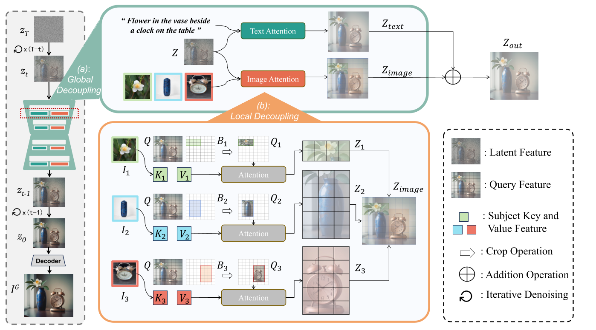

# AnyMS

> 来源等级：FULL_TEXT
> 一句话定位：AnyMS 提出免训练的自底向上双层注意力解耦框架，用全局与局部解耦分别平衡文本对齐、身份保持与布局控制，可扩展至 5 个以上主体。
> 生成时间：2026-09-19 23:23:24

---

## 1. 论文概要与作者意图

**AnyMS: Bottom-up Attention Decoupling for Layout-guided and Training-free Multi-subject Customization**（缩写 AnyMS），发表于 arXiv（arXiv:2512.23537v2，2026 年 1 月 2 日），作者来自浙江大学、HKUST 与浙江省烟草专卖局（Binhe Yu, Zhen Wang, Kexin Li, Yuqian Yuan, WenQiao Zhang, Long Chen, Juncheng Li, Jun Xiao, Yueting Zhuang）。会议/期刊录用信息 [材料未提供]。

AnyMS 关注的是 **training-free layout-guided multi-subject customization**（免训练的布局指导多主体定制）。任务定义：给定全局文本提示 $P$ 与一组「主体图像–布局」对 $D=\{(I_j, B_j)\}_{j=1}^{n}$，目标是合成一张同时满足三项要求的图像 $I_G$：1) 与 $P$ 的文本对齐；2) 每个主体 $S_j$ 的身份保持；3) 每个主体落在指定框 $B_j$ 的布局控制。

作者在引言中指出现有布局指导方法存在两类主要局限：

- **三项目标的权衡难以平衡（Difficulty in balancing the trade-off）**：text alignment、subject identity preservation 与 layout control 三者难以兼顾，**尤其当主体数量增加时**（especially as the number of subjects increases）。
- **依赖额外训练（Reliance on additional training）**：subject learning 或 adapter tuning 带来强数据依赖与可观算力开销（strong data dependency and substantial computational overhead）。

作者进一步把现有布局指导方法归为三种范式，并逐一指出其缺陷：

- **Latent Injection**（如 MuDI）：在 bbox 内组合分割后的主体以形成初始 latent noise。虽然对布局与身份保持有效，但 latent 级约束常**削弱文本对齐**（如物体关系），导致生成不连贯。
- **Attention Rectifying**（如 Cones2、Mix-of-Show）：用 bbox 调整每个主体的 cross-attention map，通过增强目标区域激活、抑制无关区域实现。但此类 attention 级指导通常要求把每个主体编码为**与文本提示拼接的特殊 token**，并经由 text cross-attention 控制，会造成视觉条件与文本条件之间的冲突，导致身份保持不精确。
- **Adapter Tuning**（如 MS-Diffusion）：引入可训练 adapter 联合编码视觉特征、文本 embedding 与布局约束，但依赖精心构造的 layout-labeled 多主体数据与额外模块调优，显著增加算力成本，并限制对未见主体/组合的泛化能力。

作者的核心意图与主张：

> In this paper, we present AnyMS, a novel training-free framework for layout-guided multi-subject customization. AnyMS leverages three input conditions: text prompt, subject images, and layout constraints, and introduces a bottom-up dual-level attention decoupling mechanism to harmonize their integration during generation.

作者声明的三点贡献：

1. 提出 AnyMS——免训练的布局指导多主体定制框架，采用 **bottom-up dual-level attention decoupling** 机制解耦文本、视觉与布局三类条件；
2. 引入 **pre-trained image adapters** 高效提取主体特定特征，免除额外调优或主体学习；
3. 在多基准上实验，证明达到 SOTA 且效率更优，支持复杂组合并扩展至更多主体。

## 2. 方法框架

AnyMS 是一个**免训练**框架，整体建立在 SDXL 之上，核心是把三类输入条件（textual / visual / layout）通过**自底向上的双层注意力解耦**在去噪过程中协调起来。生成从随机初始化的 latent $z_T \sim \mathcal{N}(0, I)$ 出发，逐步去噪到 $z_0$，最终解码为目标图像 $I_G$。

1. **Global Decoupling（全局解耦，第一层）**
   - 输入：latent features $Z$、文本提示 $P$、主体图像特征 $c_j$。
   - 输出：相加后的 cross-attention 输出 $Z_{out} = Z_{text} + Z_{image}$。
   - 功能：把文本条件与主体图像条件**分成两条独立的 cross-attention 流**（text cross-attention 与 image cross-attention），避免主体 token 与周围文本 token 在去噪中纠缠，从而在全局层面解耦文本语义与视觉身份，保证 text alignment。
2. **Local Decoupling（局部解耦，第二层）**
   - 输入：latent query 特征 $Q$、每个主体的 key/value $K_j, V_j$、边界框 $B_j$。
   - 输出：布局约束下的 image cross-attention 输出 $Z_{image}$。
   - 功能：以 bbox 限制 latent 区域与其对应主体特征的交互，每个空间区域**只**关注它被指定的主体，避免主体间干扰，从而同时保证身份保持与布局控制。包含两步：**training-free subject feature extraction** 与 **attention cropping and merging**。
3. **Training-free Subject Feature Extraction（免训练主体特征提取）**
   - 输入：主体 $S_j$ 的参考图 $I_j$。
   - 输出：已与扩散模型对齐的图像特征 $c_j$，再经 adapter 预训练投影矩阵 $W'_k, W'_v$ 投影为 $K_j = W'_k c_j$、$V_j = W'_v c_j$。
   - 功能：用**预训练 image adapter**（实现中用 IP-Adapter）直接提取主体特征，替代微调扩散模型学习新主体 embedding。
   - 关键操作：**crop-and-merge**——对每个主体按其 bbox 从全局 query $Q$ 中裁出子区域 $Q_j = Q[h_s:h_e, w_s:w_e]$，在该子区域内做 image cross-attention 得到 $Z_j$，再把 $Z_j$ 写回原位置 $Z_{image}[h_s:h_e, w_s:w_e] = Z_j$。重叠区域按**语义优先级**（如 attribute > object，foreground > background）解决主体间冲突。

数据流：`z_T → 逐 timestep 去噪 → 每个 cross-attention 层内：Z_text（文本流）+ Z_image（图像流，经 crop-and-merge 局部解耦）→ z_0 → Decoder → I_G`。该双层解耦被应用到 U-Net 的**所有 cross-attention 层**与推理的**每个去噪 timestep**。

框架图：Fig. 3（p.4），"The Overview of Pipeline. AnyMS applies a dual-level attention decoupling strategy alongside the general denoising process of the diffusion model. (a) The global decoupling separates cross-attention between text and subject images. (b) The local decoupling further disentangles image cross-attention based on layout constraints."

> 图注原文：Figure 3. The Overview of Pipeline. AnyMS applies a dual-level attention decoupling strategy alongside the general denoising process of the diffusion model. (a) The global decoupling separates cross-attention between text and subject images. (b) The local decoupling further disentangles image cross-attention based on layout constraints. The final z0 is then decoded back to target image IG.
> 文档引用：../analysis/figures/AnyMS_Fig3.png

## 3. 关键机制与创新点

### 3.1 预训练扩散模型与 cross-attention（预备知识，非本文创新）

论文回顾 Stable Diffusion 的噪声重建损失（式 1）与标准 cross-attention（式 2）：

$$
L_{rec} = \mathbb{E}_{z,\epsilon\sim\mathcal{N}(0,1),t,c_t}\left\|\epsilon - \epsilon_\theta(z_t, t, c_t)\right\|_2^2 \tag{1}
$$

$$
Z_{out} = \mathrm{CA}_{text}(Z, P) = \mathrm{Softmax}\left(\frac{QK^T}{\sqrt{d}}\right)V \tag{2}
$$

其中：

- $z_t = \sqrt{\bar\alpha_t} z_0 + \sqrt{1-\bar\alpha_t}\epsilon$ 是第 $t$ 步的 noisy latent，$\bar\alpha$ 为 noise scheduler 提供的系数；
- $\epsilon_\theta(\cdot)$ 是去噪网络，$c_t = \tau_\theta(P)$ 是 CLIP 文本编码器输出的条件 embedding；
- $Q = W_q Z$ 由 latent features 得到，$K = W_k c_t$、$V = W_v c_t$ 由文本特征投影得到；
- $W_q, W_k, W_v$ 为对应的预训练投影矩阵，$d$ 为缩放因子。

### 3.2 Global Decoupling：分离文本与视觉 cross-attention

针对「把主体编码为特殊 token 并与文本拼接、共同经 text cross-attention 处理」这一常见做法带来的文本–视觉冲突，AnyMS 把两条流分开，并把每个 cross-attention block 的输出重写为两项相加：

$$
Z_{out} = Z_{text} + Z_{image} \tag{3}
$$

其中：

- $Z_{text} = \mathrm{CA}_{text}(Z, P)$ 由文本 cross-attention 得到（即式 2）；
- $Z_{image}$ 由 image cross-attention 得到，即下文的局部解耦输出。

作者对该机制有效性的论证：

> In this way, textual semantics and visual identity are disentangled at the global level, enabling the model to preserve subjects faithfully while maintaining accurate text alignment.

作者指出的具体病灶（原话）："the subject token is entangled with surrounding textual tokens during denoising, resulting in identity distortion, background leakage, and unintended attribute transfer"；且当提示中描述空间关系（如 "standing in front of"）时，共享 cross-attention 会迫使主体 token 与布局条件竞争，进一步破坏位置控制。

### 3.3 Local Decoupling：基于布局约束解耦 image cross-attention

image cross-attention 被形式化为：

$$
Z_{image} = \mathrm{CA}_{image}(Z, \{(I_j, B_j)\}_{j=1}^{n}) \tag{4}
$$

局部解耦分两步。**第一步**用 adapter 提取主体特征并投影（见 §2 第 3 点）。**第二步** attention cropping and merging：先用 latent features 投影出的全局 query $Q \in \mathbb{R}^{H\times W}$ 初始化 $Z_{image}$；对每个主体 $S_j$ 及其 bbox $B_j = [h_s, h_e]\times[w_s, w_e]$，裁出子区域 $Q_j = Q[h_s:h_e, w_s:w_e]$，在该子区域内做 cross-attention：

$$
Z_j = \mathrm{Softmax}\left(\frac{Q_j K_j^T}{\sqrt{d}}\right)V_j \tag{5}
$$

随后把局部输出合并回原位置：

$$
Z_{image}[h_s:h_e, w_s:w_e] = Z_j \tag{6}
$$

其中：

- $Q_j$ 是第 $j$ 个主体 bbox 区域对应的 query 子区域；
- $K_j = W'_k c_j$、$V_j = W'_v c_j$ 是第 $j$ 个主体经 adapter 预训练投影矩阵得到的 key/value，$c_j$ 为 adapter 编码的、已与扩散模型对齐的主体图像特征；
- $d$ 为缩放因子；
- 式 6 表示把局部 attention 结果写回该 bbox 对应的 latent 位置；
- 重叠区域通过**语义优先级**（attribute > object，foreground > background）解决主体间冲突。

作者对该机制有效性的论证：

> Specifically, the bounding boxes are used to restrict the interaction between latent regions and their corresponding subject features, ensuring that each spatial area only attends to its designated subject.

并指出该双层解耦应用于所有 cross-attention 层与所有去噪 timestep，可"yield stronger text-subject-layout control with only marginal inference overhead"。

### 3.4 消融中的两个变体（用于说明 crop-and-merge 的必要性）

论文在消融中给出移除 crop-and-merge 后的替代形式（式 7）：直接用整个 query $Q$ 计算 $Z_j$，再用 bbox 掩码 $M_j$ 作用后相加：

$$
Z_j = \mathrm{Softmax}\left(\frac{QK_j^T}{\sqrt{d}}\right)V_j,\qquad Z_{image} = \sum_{j=1}^{n}(Z_j \odot M_j) \tag{7}
$$

另一变体则完全移除局部解耦，直接把各主体结果相加：$Z_{image} = \sum_{j=1}^{n} Z_j$。

其中：

- $M_j$ 是由 bbox $B_j$ 得到的掩码；
- $\odot$ 表示逐元素相乘。

消融结论（Table 2，在 7 个含 3 个以上主体的组合上评测）：AnyMS 全指标最优（mIOU 44.55 / CLIP-I 73.45 / CLIP-T 36.50）；移除 crop-and-merge 降至 38.78 / 72.13 / 35.67；移除整个局部解耦后 mIOU 无（表格记为 "-"），CLIP-I 67.26、CLIP-T 35.38。

## 4. 训练目标

**AnyMS 是 training-free 方法，不训练任何新参数。** 论文明确指出其"employs pre-trained image adapters to extract subject-specific features aligned with the diffusion model, removing the need for subject learning or adapter tuning"，因此**严格来说 AnyMS 本身没有新的模型训练目标**，也不存在分阶段训练策略。Table 1 中 AnyMS 的 "Training" 列标为 ✗（不需要训练），而 Cones2、MuDI、LatexBlend 标为 ✓。

论文中出现的

$$
L_{rec} = \mathbb{E}_{z,\epsilon\sim\mathcal{N}(0,1),t,c_t}\left\|\epsilon - \epsilon_\theta(z_t, t, c_t)\right\|_2^2
$$

只是对 Stable Diffusion 预训练所用标准噪声重建损失的**回顾**（论文 §3.1 Preliminary 中的式 1），并非 AnyMS 新增的训练目标。

**推理期约束与训练目标的区分**：AnyMS 的全部机制都发生在**推理期**——双层注意力解耦（式 3–6）、bbox 掩码与语义优先级冲突消解、crop-and-merge，都是对预训练 SDXL 的 cross-attention 计算过程的改写，而非监督信号。这些推理期约束**不产生任何梯度**，与预训练目标无关。

**实现细节**：基座模型为 Stable Diffusion XL (SDXL)，主体特征提取使用 IP-Adapter 作为预训练 image adapter，生成分辨率 1024×1024。评测数据集主体取自 DreamBooth、Custom-Concept101 与 Textual Inversion，共 29 个主体（动物、物体、车辆、人物），构成 11 个组合用于定量研究，主体数从 2 到 5。

## 5. 可引用原句（供 blockquote）

- "AnyMS leverages three input conditions: text prompt, subject images, and layout constraints, and introduces a bottom-up dual-level attention decoupling mechanism to harmonize their integration during generation."
- "1) Difficulty in balancing the trade-off among text alignment, subject identity preservation, and layout control, especially as the number of subjects increases. 2) Reliance on additional training for subject learning or adapter tuning, leading to strong data dependency and substantial computational overhead."
- "Global decoupling: separating cross-attention between text (i.e., text cross-attention) and subject images (i.e., image cross-attention) to mitigate global conflicts between textual and visual conditions, thereby ensuring text alignment."
- "Local decoupling: further disentangling image cross-attention using layout constraints, where each region only attends to its corresponding subject, avoiding interference among multiple subjects, thus guaranteeing both subject identity preservation and layout control."
- "For overlapping regions, we resolve subject–subject conflicts by enforcing a semantic priority order (e.g., attribute > object, and foreground > background), ensuring consistent layout and identity preservation."
- "AnyMS employs pre-trained image adapters [24, 43] to extract subject-specific visual features aligned with the diffusion model, thereby eliminating the need for time-consuming subject learning or additional tuning."
- "While AnyMS achieves strong performance without additional training, its effectiveness still depends on the capacity of the underlying pre-trained diffusion model and image adapters. Consequently, the upper bound on the number of subjects, the complexity of scenes, and the robustness of subject feature extraction may be constrained."（Limitations）
