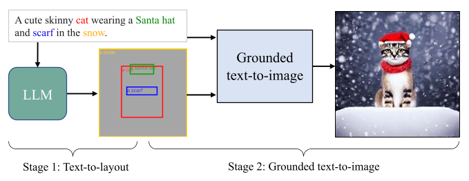
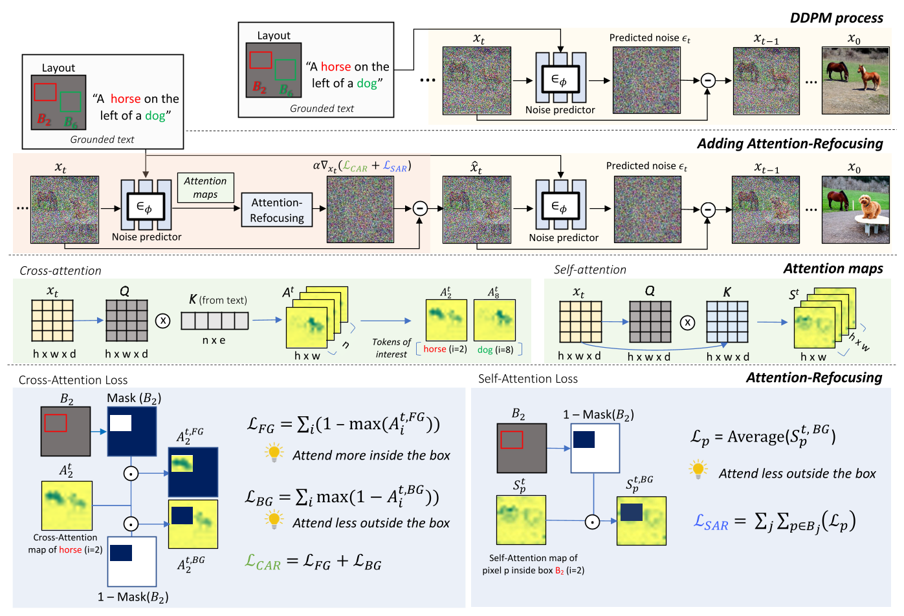
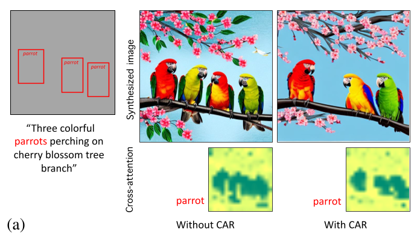

# AttnRefocusing

> 来源等级：FULL_TEXT
> 一句话定位：提出免训练的注意力重聚焦损失 CAR/SAR，在采样期修正交叉与自注意力图以贴合布局，缓解多主体缺失与属性混合。
> 生成时间：2026-09-19 23:23:29

---

## 1. 论文概要与作者意图

**论文英文全称**：Grounded Text-to-Image Synthesis with Attention Refocusing
**通用缩写**：Attention-Refocusing（方法内部含 CAR 与 SAR 两个损失）
**作者**：Quynh Phung, Songwei Ge, Jia-Bin Huang（University of Maryland College Park）
**发表信息**：正文首页标注为 arXiv preprint（`arXiv:2306.05427v2 [cs.CV] 2 Dec 2023`）；会议/期刊名称在正文中 [材料未提供]。项目主页：https://attention-refocusing.github.io/

本文关注的是 **training-free、model-agnostic 的 grounded text-to-image synthesis（带空间布局条件的文生图可控性提升）**。作者不改动任何模型参数，而是利用 GPT-4 生成显式布局（bounding box），再在采样过程中对注意力图施加损失，把注意力"重新聚焦"到布局指定的区域。

作者认为，已有方法在多对象、多属性的复杂空间关系提示下仍会失败，具体痛点如下：

- **Object missing / mixed（对象缺失或混合）**：提示中的部分对象、属性、空间组合在生成图中被混合、交换甚至完全缺失。
- **Cross-attention 的错误注意力**：作者观察到，特征相似的像素会产生相似的 attention query，从而关注到相似区域或 token；例如提示 "A dog on the right of a cat" 时，属于 "dog" 的像素可能与 "cat" 区域特征相似，于是错误地关注到 "cat" token，导致对象缺失或属性混合。
- **Self-attention 中的同类问题被忽视**：已有工作（如 Attend-and-Excite、Layout-guidance、BoxDiff）只操纵 cross-attention map，**overlook a similar issue in self-attention layers**——同一对象的像素与不同对象但特征相似的像素难以区分。作者原话是 "However, they overlook a similar issue in self-attention layers"。
- **手动指定布局代价高**：Creating the layouts manually requires additional effort and can be tedious。

因此作者的核心意图是：

> We propose a training-free approach — attention-refocusing — to substantially improve the controllability. Our method is model-agnostic and can be applied to enhance the control capacity of methods like GLIGEN [29] and ControlNet [60].

以及：

> We propose two novel losses to refocus attention maps according to a given spatial layout during sampling.

论文自述的三点贡献：提出在采样期正则化 cross- 与 self-attention 层的 attention-refocusing 损失；探索用 LLM 由文本提示生成布局；在 DrawBench、HRS、TIFA 上做全面实验并优于 SOTA。

## 2. 方法框架

整体框架是**两阶段、完全免训练**的流程：先用 LLM 生成布局，再用带注意力重聚焦损失的预训练扩散模型生成图像。两个阶段都用 off-the-shelf 预训练模型，不做任何额外训练。

1. **Stage 1：Text-to-layout（GPT-4 布局生成）**
   - 输入：用户的文本提示（user prompt）。
   - 输出：一组 bounding box 坐标（顺序为 left, top, right, bottom）以及每个 box 对应的物体标签。
   - 功能：利用 LLM 的空间推理能力，把文本提示转成显式布局，从而让最新的 LLM 能力被已训练好的文生图模型利用（避免为了升级 text encoder 而重新训练）。
   - 关键操作：用 instruction + in-context exemplars + user prompt 组成完整 prompt 调用 GPT-4 API（见附录 Sec. 9 与 Table 7）。

2. **Grounded text-to-image（带 Attention-Refocusing 的采样）**
   - 输入：文本提示 $P$、token 索引集合 $I$ 及其绑定的 bounding box 集合 $B_i$、时间步 $t$、预训练扩散模型（Stable Diffusion / GLIGEN / ControlNet 等）。
   - 输出：下一个时间步的 latent $x_{t-1}$。
   - 功能：在**每个去噪步**中，先由 Attention-Refocusing 损失（CAR + SAR）用梯度下降修改带噪样本 $x_t$，再把修改后的样本交给 UNet 预测噪声、恢复常规去噪过程。
   - 关键操作：跳过 `< sot >` token 的注意力图 → 对其余 cross-attention map 做 Softmax → 高斯平滑（filter 3×3, σ=0.5）→ 计算 CAR/SAR 损失 → 梯度更新 latent。

3. **两个损失模块（本方法的核心）**
   - **Cross-Attention Refocusing (CAR)**：让 box 内区域更多地关注对应 token，同时抑制 box 外区域关注该 token。
   - **Self-Attention Refocusing (SAR)**：让 box 内的像素少关注 box 外的区域，缓解不同区域属性互相混合。

模块间数据流：文本提示 →（GPT-4）→ 布局 box + 标签 → 转成二值 mask $\text{Mask}(B_i)$ → 与扩散模型各层的 cross-/self-attention map 一起送入 CAR/SAR 损失 → 梯度更新 latent → 回到 UNet 继续去噪。

框架图：Fig. 3（p.4），"Our pipeline"；机制与框架细节图：Fig. 2（p.3），"The proposed Attention-Refocusing framework"。

> 图注原文：Figure 3. Our pipeline. Our approach includes 1) text-to-layout using GPT-4 model and 2) grounded text-to-image using a pre-trained diffusion model with our attention-refocusing.
> 文档引用：../analysis/figures/AttnRefocusing_Fig3.png

> 图注原文：Figure 2. The proposed Attention-Refocusing framework. At each denoising step, we update the noised sample by optimizing our LCAR and LSAR losses (red block) before denoising with the predicted noise (yellow block). For each cross-attention map, LCAR is designed to encourage a region to attend more to the corresponding token while discouraging the remaining region from attending to that token. For each self-attention map, LSAR prevents the pixels in a region from attending to irrelevant regions (LCAR and LSAR in blue blocks).
> 文档引用：../analysis/figures/AttnRefocusing_Fig2.png

## 3. 关键机制与创新点

### 3.1 预备：cross-attention 与 self-attention 图

文本提示 $w = (w_1, w_2, \cdots w_n)$ 经 CLIP encoder 得到文本嵌入 $c = f_{CLIP}(w) \in \mathbb{R}^{n \times e}$，其中 $e$ 是嵌入维度。key $K \in \mathbb{R}^{n \times d}$ 与 value $V \in \mathbb{R}^{n \times d}$ 由文本嵌入 $c$ 经线性映射得到（$d$ 是特征维度）。给定由尺寸 $h \times w$ 的特征图计算出的 query 集合 $Q \in \mathbb{R}^{hw \times d}$，第 $t$ 步的 cross-attention map 为：

$$
A_t = \text{softmax}\left(\frac{QK^\top}{\sqrt d}\right) \in [0,1]^{hw \times n}
$$

其中：

- $A_t$ 由 $n$ 张注意力图 $\{A_1^t, ..., A_n^t\}$ 组成；
- $A_i^t \in [0,1]^{h \times w}$ 表示词 token $w_i$ 与特征图中每个空间位置的关联强度；
- $n$ 是文本 token 数，$d$ 是特征维度，$h,w$ 是特征图尺寸。

self-attention 层用同一特征图经线性映射得到 key/value/query，沿用同一计算式，self-attention map 记为 $S^t \in [0,1]^{hw \times hw}$；$S_p^t \in [0,1]^{h \times w}$ 表示所有像素关注像素 $p$ 的 self-attention map。

布局定义为 $k$ 个 bounding box $B \in (\mathbb{Z}^+)^{k \times 4}$，每个 box 关联一个 box caption；这些 caption 在输入文本提示 $w$ 中的 token 索引记为 $I = \{i_1 \cdots i_q\}$（$q$ 是感兴趣 token 的数量）。每个 token 索引 $i$ 可关联一个或多个 bounding box $B_i$。$\text{Mask}(B_i)$ 是由 box $B_i$ 生成的二值 mask，box 内为 1、其余为 0。

### 3.2 Cross-Attention Refocusing (CAR)

作者观察到用 GLIGEN 生成 "three parrots" 时，token "parrot" 错误地关注到无关区域，结果生成四只鹦鹉。为此设计前景损失，提升被 mask 覆盖的注意力图 $A_i^t \cdot \text{Mask}(B_i)$ 的分数：

$$
L_{FG} = \frac{1}{q}\sum_{i \in I}\left(1 - \max(A_i^t \cdot \text{Mask}(B_i))\right)
$$

并设计背景损失，抑制无关区域关注这些 token：

$$
L_{BG} = \frac{1}{q}\sum_{i \in I}\max\left(A_i^t \cdot (1 - \text{Mask}(B_i))\right)
$$

整体 CAR 损失为 $L_{CAR} = L_{FG} + L_{BG}$。

其中：

- $q$ 是感兴趣 token 的数量，$I$ 是这些 token 的索引集合；
- $A_i^t$ 是第 $t$ 步中 token $i$ 的 cross-attention map；
- $\text{Mask}(B_i)$ 是 box $B_i$ 的二值 mask（box 内为 1）；
- $\max(\cdot)$ 取注意力图在对应区域内的峰值，作者强调这是**迭代优化注意力图中的峰值**，而非像已有方法那样优化多个值，因而能保持图像质量。

该机制的核心是：

> For each cross-attention map, LCAR is designed to encourage a region to attend more to the corresponding token while discouraging the remaining region from attending to that token.

### 3.3 Self-Attention Refocusing (SAR)

作者观察到与 cross-attention 类似的问题：一个区域（如 "car"）的像素可能在 self-attention 中关注到区域外相似的区域（如 "chair"），导致两个区域的属性在生成中混合。对每个像素 $p \in B_i$，定义其 self-attention map 的背景区域为：

$$
S_p^{t,BG} = S_p^t \cdot (1 - \text{Mask}(B_i))
$$

目标是让每个像素 $p \in B_i$ 少关注 box $B_i$ 之外的区域，因此对每个像素 $p$ 定义 self-attention loss：

$$
L_p = \frac{\sum \sum (S_p^{t,BG})}{(1 - \text{Mask}(B_i))}
$$

整体 self-attention 损失为：

$$
L_{SAR} = \frac{1}{q}\sum_{i \in I}\sum_{p \in B_i} L_p
$$

其中：

- $S_p^t \in [0,1]^{h \times w}$ 是所有像素关注像素 $p$ 的 self-attention map；
- $S_p^{t,BG}$ 是该 map 中落在 box 之外（背景）的部分；
- $\text{Mask}(B_i)$ 是 box $B_i$ 的二值 mask；
- $p \in B_i$ 表示遍历 box $B_i$ 内的像素。

> 注：$L_p$ 的分子分母在 PDF 文本层中呈现为两个连写的求和号与分母，原文排版为分式；此处按原文符号体系逐字转录，未作化简。

该机制为何有效（作者论证）：

> As shown in Fig. 4b, using self-attention loss helps each box to focus less on the irrelevant regions, and the model consequently generates distinct attributes for each region.

机制示意图：Fig. 4（p.5），展示 CAR 与 SAR 对注意力图的重聚焦效果（"parrot" 的 cross-attention map 与各 box 像素的 self-attention map）。

> 图注原文：Figure 4. (a) Cross-Attention-Refocusing (CAR) visualization. Without CAR, the token "parrot" attends to background regions. Using CAR calibrates the cross-attention map to attend to the correct regions. (b) Self-Attention-Refocusing (SAR) visualization. The dots in each box represent the pixel query of the self-attention map. Applying SAR loss helps refocus the self-attention layer to attend less to the incorrect regions.
> 文档引用：../analysis/figures/AttnRefocusing_Fig4.png

### 3.4 采样期更新（把损失接到去噪过程中）

用 CAR 与 SAR 损失在每个去噪步修改带噪样本 $x_t$，以梯度下降最小化损失：

$$
\hat{x}_t \leftarrow x_t - \alpha \nabla_{x_t}(L_{CAR} + L_{SAR})
$$

其中：

- $\alpha$ 是控制优化在去噪过程中影响强度的步长；
- 单次更新往往不足以修正 cross-/self-attention map，因此作者在**每个早期去噪步内更新 $\tau$ 次**；完成 $\tau$ 次更新后，把输出喂给扩散 UNet 恢复去噪过程并计算 $x_{t-1}$。

附录 Sec. 8 给出的超参设置：注意力图分辨率为 16×16；图像共 50 步去噪；在极早期步（$t=0$ 或 $t=1$）$\tau=2$，在 $t \in \{2,3,4\}$ 时 $\tau$ 增至 6；前五步初始步长 $\alpha=4$，之后降到 3；前十个去噪步之后，只在 token 与对应 box 不对齐时才更新 latent（early stopping，避免后期优化导致质量下降）。

### 3.5 扩展到 segmentation mask 的 CAR

作者把 CAR 损失适配到 depth map、segmentation mask、edge map 等其他布局模态。对由 token $i$ 转换得到的 segmentation mask $M_i$，因为分割提供了精确的物体边界，作者在**整个前景上取平均而非取最大值**。前景损失为：

$$
L_{FG} = \frac{1}{q}\sum_{i \in I}\frac{(1 - \sum(A_i^t \cdot M_i))}{M_i}
$$

背景损失为：

$$
L_{BG} = \frac{1}{q}\sum_{i \in I}\frac{\sum A_i^t \cdot (1 - M_i)}{(1 - M_i)}
$$

其中：

- $M_i$ 是由第 $i$ 个 token 转换得到的 segmentation mask；
- $q$ 是感兴趣 token 的数量；
- $L_{SAR}$ 仍沿用主文中针对 bounding box 的公式。

> 注：式 (8)(9) 在 PDF 文本层中分式排版有粘连，此处按原文符号逐字转录，未作化简。

## 4. 训练目标

**Attention-Refocusing 是 training-free 方法，不训练任何新的模型参数。** 论文明确写道 "In both phases, we use off-the-shelf pretrained models without any extra training"，以及 "without needing extra training or additional models"。因此严格来说，本方法**没有新增的模型训练目标**：GPT-4 与扩散模型（Stable Diffusion、GLIGEN、ControlNet 等）都是冻结的预训练模型，CAR/SAR 损失只作用于**采样（推理）阶段**的 latent 更新。

- **训练策略**：无训练。不存在冻结/解冻参数、不存在分阶段训练。
- **与预训练目标的关系**：方法本身不修改预训练目标。论文中出现的扩散去噪过程（UNet 计算 score $\epsilon_t = U(x_t; c)$，$t$ 为时间步、$c$ 为条件信息嵌入）只是对预训练扩散模型采样过程的回顾性描述，不是本方法新增的训练损失。
- **推理期约束（必须与训练目标区分）**：本文的 $L_{CAR}$ 与 $L_{SAR}$ 是**推理期的注意力引导损失**，通过式 (7) 的梯度更新作用于带噪样本 $x_t$，属于 sampling-time guidance，**不是训练监督信号**，不参与任何参数更新。
- **推理期超参**：$\tau$（每个早期去噪步的更新次数）、$\alpha$（步长）、early stopping 阈值 $T$ 与生效步区间 $\{t_1,\dots,t_k\}$，见附录 Sec. 8 与 Algorithm 1。

## 5. 可引用原句（供 blockquote）

- "We propose a training-free approach — attention-refocusing — to substantially improve the controllability. Our method is model-agnostic and can be applied to enhance the control capacity of methods like GLIGEN [29] and ControlNet [60]."
- "In this paper, we reveal the potential causes in the diffusion model's cross-attention and self-attention layers. We propose two novel losses to refocus attention maps according to a given spatial layout during sampling."
- "We propose attention-refocusing losses to regularize both cross- and self-attention layers during the sampling to improve the controllability given the layout and text prompt."
- "However, our approach not only optimizes cross-attention maps but also self-attention maps, which is not commonly addressed by these methods."
- "Unlike the optimization of multiple values in these methods, which can lead to image quality degradation, our method iteratively optimize peak values in the attention maps, preserving image quality."
- "We exploit the spatial understanding ability in the latest large language models (LLMs) to produce visual representations such as bounding boxes as the layout given a text prompt."
