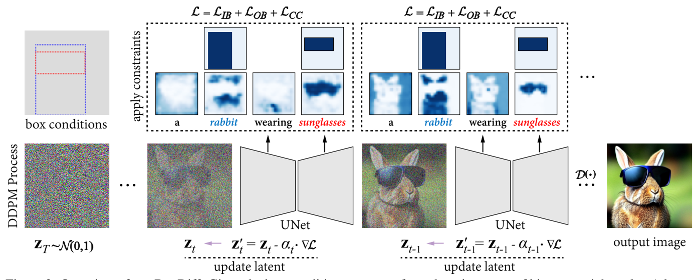
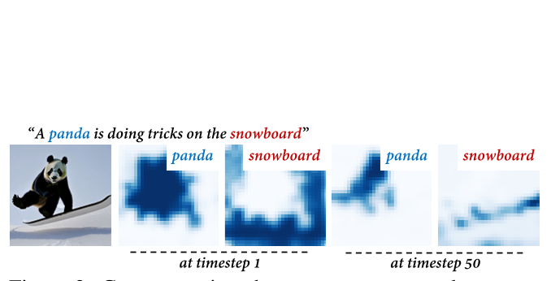
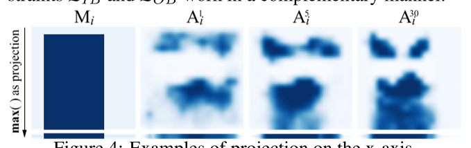

# BoxDiff

> 来源等级：FULL_TEXT
> 一句话定位：BoxDiff 提出 Inner-Box、Outer-Box、Corner 三种空间约束直接作用于交叉注意力，无需训练即可按框控制多主体位置与尺度。
> 生成时间：2026-09-19 23:23:26

---

## 1. 论文概要与作者意图

**BoxDiff**（Box-Constrained Diffusion）关注的是 **training-free 的空间条件（box / scribble）引导 text-to-image 合成**，即在不额外训练、不使用成对 layout-image 标注数据的前提下，让预训练扩散模型按用户给定的框控制对象与上下文出现的位置与尺度。

- 论文全称：BoxDiff: Text-to-Image Synthesis with Training-Free Box-Constrained Diffusion
- 发表信息：arXiv:2307.10816v4 [cs.CV]，2023 年 8 月 21 日（v4）。作者单位：Show Lab (NUS)、Jarvis Lab (Tencent)、KAUST。会议/期刊录用信息 [材料未提供]。
- 开源链接：https://github.com/showlab/BoxDiff

作者指出的现有方法不足：

- **Fully-supervised layout-to-image 依赖大量成对标注**：传统 layout-to-image 文献遵循 fully-supervised pipeline，"considerable paired box/skeleton/mask-image data is required for high-quality training"，而像素级标注 "time-consuming and labor-intensive to acquire"，label efficiency 成为瓶颈。
- **闭集类别限制**：这类方法 "restricted to the limited closed-set categories, which is infeasible to novel categories in open-world situations"（如 Make-a-Scene 仅 158 类）。
- **Stable Diffusion / ControlNet 仍需训练或微调**：它们虽具备强概念感知能力，但 "also follow the general pipeline of layout-to-image literature in a fully-supervised manner, in which massive paired image-layout data is indispensable"，训练周期耗时。

作者的核心意图与主张：

> This paper focuses on the simplest form of user-provided conditions, e.g., box or scribble. To mitigate the aforementioned problem, we propose a training-free method to control objects and contexts in the synthesized images adhering to the given spatial conditions. Specifically, three spatial constraints, i.e., Inner-Box, Outer-Box, and Corner Constraints, are designed and seamlessly integrated into the denoising step of diffusion models, requiring no additional training and massive annotated layout data.

其观察依据是：Stable Diffusion 中文本 token 与 UNet 中间特征的交叉注意力图，其高响应区域在空间上与合成图像中对象/上下文的位置 "perceptually equivalent"，因此可以直接在交叉注意力上加约束来间接控制生成内容的位置与尺度。

## 2. 方法框架

BoxDiff 的定位是：**不改动任何模型参数、不新增网络模块**，仅在预训练 Stable Diffusion 的每一步去噪中，对提取出的交叉注意力图施加三项空间约束，并把约束的梯度回加到当前 latent 上，从而把去噪轨迹推向"在指定框内生成对应对象"的方向。

1. **Cross-Modal Attention 提取（条件与注意力获取）**
   - 输入：文本 token $\tau_\theta(y)$ 与 UNet 中间特征 $\varphi(x_t)$。
   - 输出：每个目标 token 对应的空间注意力图 $A^t = \{A^t_i\}$。
   - 关键操作：按 Eq. (2)(3) 计算交叉注意力；**移除 start-of-text token（[sot]）与中间特征的注意力**后再做 Softmax；对注意力图沿空间维度施加 Gaussian filter 平滑；约束只施加在 $16\times16$ 这一分辨率的注意力图上（作者认为该尺度"inherent sufficient semantic information"）。
   - 用户条件 $B=\{b_i\}$ 被转换为二值空间掩码 $M=\{M_i\}$，每个 $M_i \in \mathbb{R}^{16\times16}$，由 top-left / bottom-right 坐标得到。

2. **三项空间约束（Inner-Box / Outer-Box / Corner）**
   - 输入：目标注意力图 $A^t_i$ 与对应掩码 $M_i$。
   - 输出：标量约束损失 $\mathcal{L} = \mathcal{L}_{IB} + \mathcal{L}_{OB} + \mathcal{L}_{CC}$。
   - 功能：$\mathcal{L}_{IB}$ 让框内响应足够高，$\mathcal{L}_{OB}$ 压制框外响应，$\mathcal{L}_{CC}$ 通过 x/y 轴投影对齐尺度；三者互补。

3. **Latent 更新（约束梯度注入去噪步）**
   - 输入：当前 latent $z_t$ 与约束损失 $\mathcal{L}$。
   - 输出：修正后的 latent $z'_t$，再进入常规 DDPM 去噪得到 $z_{t-1}$。
   - 关键操作：$z'_t \leftarrow z_t - \alpha_t \cdot \nabla \mathcal{L}$，步长 $\alpha_t$ 随 timestep 线性衰减。
   - 作者指出：过强的约束会损害图像保真度，因此用 **topk(·) / sample(·) 代表性采样**只约束部分元素来缓解。

框架图：Fig. 3（p.4），"Overview of our BoxDiff. Given the box conditions, we transform them into a set of binary spatial masks. A latent zT sampled from Normal distribution N(0,1) is passed to the denoiser, i.e., UNet, to obtain the denoised latent. At timestep t, zt is first passed to UNet to get the cross-attention maps, on which the proposed constraints, i.e., L = LIB + LOB + LCC, are applied. Subsequently, the current latent zt can be updated by the gradient ∇L to get z′t for the denoising step."

> 图注原文：Figure 3: Overview of our BoxDiff.
> 文档引用：../analysis/figures/BoxDiff_Fig3.png

## 3. 关键机制与创新点

### 交叉注意力与掩码的对应关系

作者先建立"注意力高响应区域 ≈ 图像中对象位置"的经验观察，据此把空间控制问题转化为对注意力图的约束问题。

$$
A = \mathrm{Softmax}(QK^\top / \sqrt{d})
$$

$$
Q = W_Q \varphi(x_t), \quad K = W_K \tau_\theta(y)
$$

其中：

- $A$ 为交叉注意力矩阵；
- $Q$ 是中间特征 $\varphi(x_t)$ 经可学矩阵 $W_Q$ 投影得到的 query；
- $K$ 是文本 token $\tau_\theta(y)$ 经 $W_K$ 投影得到的 key；
- $d$ 为缩放因子（原文写为 $\sqrt{d}$）；
- 给定含 $N$ 个文本 token 的 $\tau_\theta(y)$，交叉注意力 $A^t$ 含 $N$ 张空间注意力图 $\{A^t_1, \dots, A^t_N\}$；
- 施加约束前移除 [sot] token 与中间特征的注意力，并沿空间维度做 Gaussian 平滑。

### Inner-Box Constraint（框内约束）

$$
\mathcal{L}^1_s = 1 - \frac{1}{P}\sum \mathrm{topk}\left(A^t_i \cdot M_i, P\right)
$$

$$
\mathcal{L}_{IB} = \sum_{s_i \in S} \mathcal{L}^1_{s_i}
$$

其中：

- $\mathrm{topk}(\cdot, P)$ 表示选取响应最高的 $P$ 个元素；
- $M_i$ 为第 $i$ 个目标的二值掩码，用于"mask out"掩码区域外的注意力元素；
- $\mathcal{L}^1_s$ 通过 $1 - (\cdot)$ 最大化掩码区域内被选中元素的响应；
- $\mathcal{L}_{IB}$ 对集合 $S$ 中所有目标 token 求和。

### Outer-Box Constraint（框外约束）

$$
\mathcal{L}^2_s = \frac{1}{P}\sum \mathrm{topk}\left(A^t_i \cdot (1 - M_i), P\right)
$$

$$
\mathcal{L}_{OB} = \sum_{s_i \in S} \mathcal{L}^2_{s_i}
$$

其中：

- $(1 - M_i)$ 是掩码取反，用于选中目标区域**之外**的注意力元素；
- $\mathcal{L}_{OB}$ 最小化框外响应，防止对象"moving out of the target regions"；
- 作者强调 $\mathcal{L}_{IB}$ 与 $\mathcal{L}_{OB}$ "work in a complementary manner"。

### Corner Constraint（角点约束）

由于用户只给出弱空间条件（box/scribble），没有精确边界像素，仅用前两项约束会出现"target objects are synthesized on a smaller scale than the box regions"的取巧解，因此作者在 x/y 轴投影上补一项尺度约束。

$$
m_x(k) = \max_{j=1,\cdots,H}\{M_i(j,k)\}
$$

$$
a^t_x(k) = \max_{j=1,\cdots,H}\{A^t_i(j,k)\}
$$

$$
\mathcal{L}^3_s = \frac{1}{L}\sum \mathrm{sample}\left(\{|m_x(k) - a^t_x(k)|\}_{k=1,\cdots,W},\ L,\ x^i_1,\ x^i_2\right)
$$

$$
m_y(j) = \max_{k=1,\cdots,W}\{M_i(j,k)\}
$$

$$
a^t_y(j) = \max_{k=1,\cdots,W}\{A^t_i(j,k)\}
$$

$$
\mathcal{L}^4_s = \frac{1}{L}\sum \mathrm{sample}\left(\{|m_y(j) - a^t_y(j)|\}_{j=1,\cdots,H},\ L,\ y^i_1,\ y^i_2\right)
$$

$$
\mathcal{L}_{CC} = \sum_{s_i \in S}\left(\mathcal{L}^3_{s_i} + \mathcal{L}^4_{s_i}\right)
$$

其中：

- $m_x \in \mathbb{R}^W$、$a^t_x \in \mathbb{R}^W$ 分别是掩码与注意力在 x 轴上的 max 投影；$m_y$、$a^t_y$ 为 y 轴投影；
- $\mathrm{sample}(\cdot, L, x^i_1, x^i_2)$ 表示在给定角点坐标 $x^i_1$ 与 $x^i_2$ 附近均匀采样 $L$ 个误差项，作用与 Eq. (4)(6) 中的 topk 采样相同；
- $x^i_1, y^i_1$ 与 $x^i_2, y^i_2$ 即第 $i$ 个框的 top-left 与 bottom-right 坐标。

### 总体约束与 latent 更新

$$
\mathcal{L} = \mathcal{L}_{IB} + \mathcal{L}_{OB} + \mathcal{L}_{CC}
$$

$$
z'_t \leftarrow z_t - \alpha_t \cdot \nabla \mathcal{L}
$$

其中：

- $\mathcal{L}$ 为三项约束之和；
- $\alpha_t$ 为步长，**随 timestep 线性衰减**（原文："where $\alpha_t$ decays linearly at each timestep"）；
- $z'_t$ 为修正后的 latent，用于该步的去噪。

### 机制为何有效的作者论证

> With a combination of the aforementioned constraints, $z_t$ at each timestep gradually moves toward the direction of generating high-response attention in the given location and with a similar scale to the box, which leads to a synthesis of target objects in the user-provided box regions.

关于代表性采样（topk / sample）的必要性：

> As observed in the experiments, constraints added on all elements in the cross-attention map potentially lead to a collapse of image fidelity. Besides, constraints on only a few elements with high responses are sufficient to affect the synthesis of objects, which can reduce the impact of constraints and prevent the failure of denoising.

机制图（交叉注意力与掩码的对应）：Fig. 2（p.2），"Cross-attentions between target text tokens, e.g., panda, bamboo, snowboard, and intermediate features of the denoiser, i.e., a UNet, in the Stable Diffusion model."

> 图注原文：Figure 2: Cross-attentions between target text tokens, e.g., panda, bamboo, snowboard, and intermediate features of the denoiser, i.e., a UNet, in the Stable Diffusion model.
> 文档引用：../analysis/figures/BoxDiff_Fig2.png

机制图（Corner Constraint 的投影示意）：Fig. 4（p.5），"Examples of projection on the x-axis."

> 图注原文：Figure 4: Examples of projection on the x-axis.
> 文档引用：../analysis/figures/BoxDiff_Fig4.png

## 4. 训练目标

**BoxDiff 是 training-free 方法，无新增训练目标。** 它不训练新的 embedding、adapter、也不微调扩散模型参数；论文明确表述其贡献为 "requiring no additional model training and massive paired layout-image data"。

论文中出现的

$$
L_{DDPM} = \mathbb{E}_{z \sim E(x),\ y,\ \epsilon \sim \mathcal{N}(0,1),\ t}\left\|\epsilon - \epsilon_\theta(z_t, t, \tau_\theta(y))\right\|_2^2
$$

只是回顾 Stable Diffusion 预训练时使用的标准噪声重建损失（Eq. 1），其中 $\epsilon_\theta$ 为带 self-attention 与 cross-attention 的 UNet 去噪器，$E$ 为编码器，$\tau_\theta$ 为 CLIP 文本编码器。它不是 BoxDiff 的训练目标。

**推理期约束与训练目标的区分（关键）**：$\mathcal{L} = \mathcal{L}_{IB} + \mathcal{L}_{OB} + \mathcal{L}_{CC}$ 是**推理期的引导信号**，不是训练监督信号。它不通过反向传播更新任何模型参数，而是对当前 latent 做一次梯度步：

$$
z'_t \leftarrow z_t - \alpha_t \cdot \nabla \mathcal{L}
$$

即约束的梯度只作用于 latent $z_t$ 本身。推理期流程为：$z_T \sim \mathcal{N}(0,1)$，每个 timestep 提取交叉注意力、计算三项约束、用其梯度修正 latent，再执行常规 DDPM 去噪步，最终 $z_0$ 经解码器 $D$ 得到图像 $\tilde{x}$。

**推理期超参数与策略**：约束只施加在 $16\times16$ 分辨率的交叉注意力图上；用 topk(·)（Eq. 4、6）与 sample(·)（Eq. 10、13）做代表性采样，只约束部分元素以平衡"遵循空间条件"与"图像保真度"；$\alpha_t$ 随 timestep 线性衰减。消融显示 topk 优于 all sampling 与 random sampling（AP 22.3 vs 24.8 vs 21.4，T2I-Sim 0.3513 vs 0.3489 vs 0.3491）。

**可插拔性**：作者称 BoxDiff "can be used as a plug-and-play component in many diffusion models, including GLIGEN"，且除 box 外还可与 scribble 等条件交互（细节在附录）。

## 5. 可引用原句（供 blockquote）

- "To mitigate the aforementioned problem, we propose a training-free method to control objects and contexts in the synthesized images adhering to the given spatial conditions. Specifically, three spatial constraints, i.e., Inner-Box, Outer-Box, and Corner Constraints, are designed and seamlessly integrated into the denoising step of diffusion models, requiring no additional training and massive annotated layout data."
- "It can be observed from Fig. 2 that, during the denoising step of the Stable Diffusion model, the location and scale of high response regions in the cross-attention map are perceptually equivalent to that of synthesized objects in the decoded image."
- "As observed in the experiments, constraints added on all elements in the cross-attention map potentially lead to a collapse of image fidelity."
- "With a combination of the aforementioned constraints, $z_t$ at each timestep gradually moves toward the direction of generating high-response attention in the given location and with a similar scale to the box, which leads to a synthesis of target objects in the user-provided box regions."
- "This validates that our BoxDiff can be used as a plug-and-play component to improve the existing models."
