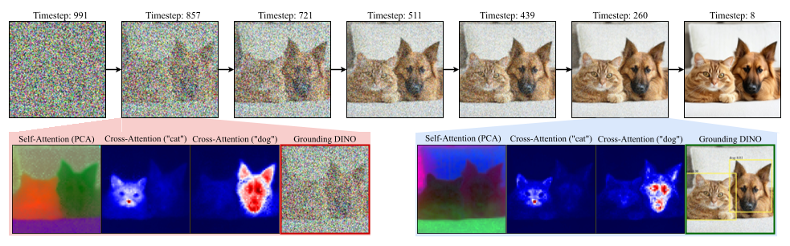

# ISAC

> 来源等级：FULL_TEXT
> 一句话定位：提出免训练、模型无关的两阶段注意力目标 ISAC：先稳住自注意力的实例布局，再把语义绑定进各实例，缓解多实例生成的计数失败与语义混淆。
> 生成时间：2026-09-19 23:23:31

---

## 1. 论文概要与作者意图

ISAC 关注的是 **training-free multi-instance text-to-image generation（免训练的多实例文生图）**，即在不微调、不引入外部视觉模型的前提下，让扩散模型按提示词生成指定数量、彼此分离且语义不混淆的多个实例。论文全称 *ISAC: Training-Free Instance-to-Semantic Attention Control for Multi-Instance Generation*，作者 Sanghyun Jo、Wooyeol Lee、Ziseok Lee、Jonghyun Choi、Jaesik Park、Kyungsu Kim（OGQ 与首尔大学），arXiv:2505.20935v4（2026-06-30），项目页 https://shjo-april.github.io/ISAC。发表会议/期刊 [材料未提供]。

作者认为，现有免训练引导方法主要修正生成的**语义侧**，隐含假设"不同实例区域已经形成"，因而在早期去噪步无法可靠地划出实例区域：

- **Count failures（计数失败）**：模型遗漏或合并被请求的物体，生成不出指定的实例数量；
- **Semantic mixing（语义混淆）**：属性在实例之间泄漏，语义相近的同类物体之间尤其严重；
- **Token-level semantic separation 的局限**：现有方法（InitNO、Self-Cross、SynGen、CONFORM 等）用 cross-attention 的 token 语义去选择、聚合或引导 self-attention 的结构图，其结构分组仍**以 CA 语义为条件**；当早期 CA 图已经把同类实例合并、或只激活在物体局部时，得到的 SA 结构会继承这种歧义，无法区分**共享同一语义 token 的多个实例**。

作者通过 Dice overlap 定量诊断发现：同一 supercategory 内的类别对，其 instance-aware semantic mask 重叠显著更高（如 "a dog and a sheep" Dice 0.805、"a cow and a dog" 0.756，而跨类别的 "a dog and a pear" 仅 0.321）。这促使作者提出 **instance-first hierarchy**：先从结构而非类别 token 语义稳住实例区域，再把语义绑定到各区域内。

> 在不对每个主体进行 test-time fine-tuning 的情况下，让扩散模型能够同时接收多个参考主体和对应 layout，并生成 identity-preserving、layout-aligned 的多主体图像。

（上句为四维模板示例措辞；本文作者的核心主张原句为：）

> "we propose ISAC (Instance-to-Semantic Attention Control), a training-free, model-agnostic objective that first stabilizes self-attention layouts and then binds cross-attention semantics within them, without fine-tuning or external vision models."

> "This motivates an instance-first hierarchy that first stabilizes instance regions from structure rather than class-token semantics, and then binds semantics within each region."

## 2. 方法框架

ISAC 是一个**免训练、模型无关的层级式目标函数**，沿去噪轨迹把"结构形成"与"语义绑定"分离为两个阶段；它只需访问 $X_t$ 与模型的注意力图，可用于 latent optimization（ISAC$_\text{LO}$）或 latent selection（ISAC$_\text{LS}$）。整体由三个关键模块组成：

1. **注意力读取与聚合（Attention Hooks）**
   - 输入：当前 latent $X_t$ 与文本 embedding $T$。
   - 输出：全层全头平均后的自注意力图 $\text{SA}_t$ 与交叉注意力图 $\text{CA}_t$。
   - 功能：在所有注意力层注册 hook，**不改变**原有计算，仅读出 SA/CA；U-Net 中不同分辨率的图先双线性上采样到最高分辨率再平均。

2. **Phase 1：Instance Formation（实例形成）**
   - 输入：$\text{SA}_t$、$\text{CA}_t$。
   - 输出：$N$ 个类别无关（class-agnostic）的实例掩码 $M^{[1]},\dots,M^{[N]}$，以及实例分离损失 $L_\text{ins}$。
   - 功能：先用语义图构造前景门控 $M_\text{fg}$，只在前景内对 SA 行做 $N$ 聚类（K-means，特征拼接归一化坐标 $(x,y)\in[-1,1]^2$），再用最大像素级重叠 MPO 惩罚实例掩码之间的重叠，从而在早期步就建立清晰的实例边界。

3. **Phase 2：Instance-aware Semantic Separation（实例感知的语义分离）**
   - 输入：Phase 1 稳定后的 $\text{SA}_t$、$\text{CA}_t$，以及 token 关系对 $\mathcal{P}_\text{repel}$、$\mathcal{P}_\text{bind}$。
   - 输出：repel-and-bind 损失 $L_\text{sem}$。
   - 功能：把稳定的实例结构注入语义，形成 instance-aware semantic mask $\text{CA}^\text{ins}_t=\text{SA}_t\text{CA}_t$；让不同实例的 token 相互排斥、同一实例的类/属性 token 相互拉近。

**数据流**：$X_t \to (\text{SA}_t,\text{CA}_t)$（Eq. 3）→ 前景门控与实例聚类（Eqs. 5–7）→ $L_\text{ins}$（Eq. 9）；同时 $\text{SA}_t\text{CA}_t \to \text{CA}^\text{ins}_t$（Eq. 4）→ $L_\text{repel},L_\text{bind}$（Eqs. 10–11）→ $L_\text{sem}$（Eq. 12）；两阶段经实例到语义调度 $\lambda_\text{ins}(t),\lambda_\text{sem}(t)$ 合成 $L_\text{ISAC}$（Eq. 13），用于对 $X_t$ 做梯度更新（latent optimization）或对多个候选 latent 打分（latent selection）。

框架图：Fig. 4（p.6），"Overview of ISAC"。

> 图注原文：Fig. 4: Overview of ISAC. Guided by diffusion dynamics, ISAC computes a hierarchical objective in two phases. Phase 1 (Sec. 3.2) clusters self-attention to shape N class-agnostic instance layouts, repelling overlaps to establish clean boundaries early in the trajectory. Phase 2 (Sec. 3.3) then inject these reliable instance structures into cross-attention to align semantic evidence, using a repel-and-bind loss to prevent cross-instance semantic mixing. An instance-to-semantic schedule (Sec. 3.4) seamlessly transitions the objective from Phase 1 to Phase 2.
> 文档引用：../analysis/figures/ISAC_Fig4.png

## 3. 关键机制与创新点

### 注意力图的读取与聚合

对第 $l$ 层、宽度 $d_h$ 的某个头，per-head 注意力图为：

$$
\text{SA}^h_l(X_t) = \text{softmax}\!\left(Q^\text{self}_t K^{\text{self}\top}_t / \sqrt{d_h}\right) \in [0,1]^{HW \times HW}, \tag{1}
$$

$$
\text{CA}^h_l(X_t, T) = \text{softmax}\!\left(Q^\text{cross}_t K^{\text{cross}\top}_t / \sqrt{d_h}\right) \in [0,1]^{HW \times L}. \tag{2}
$$

其中：

- $Q^\text{self}_t = X_t W^\text{self}_Q$，$K^\text{self}_t = X_t W^\text{self}_K$（自注意力）；
- $Q^\text{cross}_t = X_t W^\text{cross}_Q$，$K^\text{cross}_t = T W^\text{cross}_K$（交叉注意力）；
- $X_t \in \mathbb{R}^{HW \times d}$ 为 latent，$T \in \mathbb{R}^{L \times d}$ 为文本 embedding，$L$ 为 token 数；
- $d_h$ 为头宽度，$HW$ 为空间位置数。

（注：原文 Eq. (1) 的分母排版为 $\sqrt{Q^\text{self}_t K^{\text{self}\top}_t / \sqrt{d_h}}$ 的形式，存在明显的排版/OCR 歧义，此处按标准注意力形式给出；**符号含义以原文文字说明为准**。$\text{SA}^h_l$ 属于 $[0,1]^{HW\times HW}$ 与 $\text{CA}^h_l$ 属于 $[0,1]^{HW\times L}$ 的维度声明来自原文。）

每个时间步把注意力图在所有层与头上平均，得到单一的 SA/CA 对：

$$
\text{SA}_t = \frac{1}{N}\sum_{l,h} \text{SA}^h_l(X_t), \qquad
\text{CA}_t = \frac{1}{N}\sum_{l,h} \text{CA}^h_l(X_t, T), \tag{3}
$$

其中 $N = \sum_{l=1}^{M} h_l$，$M$ 为注意力层数，$h_l$ 为第 $l$ 层的头数。

### Instance-aware Semantic Mask（式 4）

$$
\text{CA}^\text{ins}_t = \text{SA}_t\, \text{CA}_t \in [0,1]^{HW \times L}, \tag{4}
$$

其中：

- $\text{CA}^\text{ins}_t$ 的第 $j$ 列高亮对 token $T^{[j]}$ 响应最强的区域；
- 该式把自注意力中的结构线索注入 token 级语义，是作者定量诊断语义重叠（Fig. 2 的 Dice）以及 Phase 2 语义分离的基础。

### Phase 1：前景门控与实例掩码（式 5–7）

先按列均值 $\mu_j$ 二值化 $\text{CA}^\text{ins}_t$，并对类 token 取并集得到前景门控：

$$
\text{CA}^\text{bin}_t \leftarrow \text{Binarize}(\text{CA}^\text{ins}_t), \tag{5}
$$

$$
M_\text{fg} = \bigcup_{T^{[i]} \in \{\tau_j\}_{j=1}^{k}} \text{CA}^\text{bin}_t[:, i] \in \{0,1\}^{HW}. \tag{6}
$$

其中：

- $\{\tau_j\}_{j=1}^{k}$ 为提示词解析出的 $k$ 个类 token；
- $\text{Binarize}(\cdot)$ 按每列均值 $\mu_j$ 做二值化；
- $M_\text{fg}$ 为前景位置集合的指示（1 表示前景）。

设 $I = \{p : M_\text{fg}[p]=1\}$，$F := |I|$。只在前景位置 $I$ 上对 $\text{SA}_t$ 的行做 $N$ 聚类，得到 one-hot 分配 $K \in \{0,1\}^{F \times N}$（对 $K$ **不传梯度**），实例掩码为：

$$
M = \text{SA}_t[I, I]\,\text{stopgrad}(K) \in [0,1]^{F \times N}. \tag{7}
$$

其中：

- $N = \sum_i n_i$ 为提示词请求的实例总数（$n_i$ 为第 $i$ 类的实例数）；
- $\text{stopgrad}(\cdot)$ 表示聚类分配不参与梯度回传；
- $M$ 的每一列对应一个实例掩码，突出**同一簇内相互注意强、簇外弱**的像素，从而得到更锐利的实例边界。

### Phase 1：实例掩码间的排斥引导（式 8–9）

用**最大像素级重叠 MPO** 惩罚最坏局部重叠：

$$
\text{MPO}(A,B) = \max_{p \in \{1,\dots,F\}} A[p]\cdot B[p], \tag{8}
$$

$$
L_\text{ins}(X_t) = \max_{1 \le i < j \le N} \text{MPO}\!\left(M^{[i]}, M^{[j]}\right). \tag{9}
$$

其中：

- $A,B$ 为两个实例掩码（逐像素向量）；
- $M^{[i]}$ 为第 $i$ 个实例掩码；
- 每个 step 内 $K$ 视为 stopgrad，梯度只经 $\text{SA}_t$ 回传。

### Phase 2：Repel-and-Bind 语义分离（式 10–12）

设 $\mathcal{P}_\text{repel}$ 为应保持区分的 token 对（如不同类/不同实例），$\mathcal{P}_\text{bind}$ 为应共同激活的 token 对（如同一实例内的类与属性）：

$$
L_\text{repel}(X_t) = \max_{(a,b)\in\mathcal{P}_\text{repel}} \left[\, 1 + \text{MPO}\!\left(\text{CA}^\text{ins}_t[:,a],\, \text{CA}^\text{ins}_t[:,b]\right) \right] \tag{10}
$$

$$
L_\text{bind}(X_t) = \max_{(a,b)\in\mathcal{P}_\text{bind}} \left[\, 1 - \text{MPO}\!\left(\text{CA}^\text{ins}_t[:,a],\, \text{CA}^\text{ins}_t[:,b]\right) \right] \tag{11}
$$

$$
L_\text{sem}(X_t) = L_\text{repel}(X_t) + L_\text{bind}(X_t) \tag{12}
$$

其中：

- $\text{CA}^\text{ins}_t[:,a]$ 为 token $a$ 的 instance-aware 语义图（式 4）；
- $a,b$ 为 token 索引；
- 式 (10) 的 `1 +` 使其成为 hinge 形式的排斥项，式 (11) 的 `1 −` 使其成为 hinge 形式的绑定项。

（注：原文 Eqs. (10)(11) 的 PDF 排版存在括号错位，此处按原文可见的符号与结构抄录；`1 +` / `1 −` 常数为原文排版所示。**符号含义以原文文字为准**。）

该机制的核心是：

> "While using such token relations is common [55, 64], our contribution lies in binding these relations to the instance-aware masks formed in Phase 1 (Sec. 3.2)."

### Instance-to-Semantic Loss Schedule（式 13）

$$
L_\text{ISAC}(X_t, t) = \lambda_\text{ins}(t)\, L_\text{ins}(X_t) + \lambda_\text{sem}(t)\, L_\text{sem}(X_t), \tag{13}
$$

其中：

- $\lambda_\text{ins}(t) = t/T$，$\lambda_\text{sem}(t) = 1 - t/T$；
- $t$ 为当前去噪时间步（从 $T$ 递减到 1），$T$ 为总步数；
- 因此**早期步侧重实例形成，后期步侧重语义精修**，且该调度**按设计固定**，不按模型或 benchmark 调参。

机制有效性的作者论证（消融 Table 7）：仅用实例项（A）多实例准确率高但多类准确率仅 10%；仅用语义项或固定平衡（B–C）次优；反向调度语义→实例（D）进一步退化；而实例→语义调度（E）在两项指标上均最优，支持"先建立实例结构、再精修语义"的假设。

> "Our instance-to-semantic schedule (E) achieves the best performance on both metrics, supporting the hypothesis that instance structure should be established first and then refined semantically."

关键机制图（扩散动力学证据，说明为何要在早期步用 self-attention 建立结构）：Fig. 3（p.4）。

> 图注原文：Fig. 3: Dynamics of text-to-image diffusion models. In the early stages of diffusion, instance structures emerge [39] while semantics remain underdeveloped. In later diffusion steps, instance structures are stabilized, and semantic refinements happen. Because detection models (e.g., [53]) rely on strong semantic cues, they are effective only in later steps. We use a prompt of "A photo of a cat and a dog" on SD3.5-M [23].
> 文档引用：../analysis/figures/ISAC_Fig3.png

## 4. 训练目标

**ISAC 是 training-free 方法，无新增训练目标。** 它不微调扩散模型、不训练 adapter、不训练主体 embedding，也不需要额外训练数据或外部视觉模型（counting model）。论文中出现的所有损失（$L_\text{ins}$、$L_\text{sem}$、$L_\text{ISAC}$）都是**推理期**的注意力引导目标，不是训练监督信号。

- **推理期目标（latent optimization，ISAC$_\text{LO}$）**：按 Algorithm 1，在每个去噪步读出 $\text{SA}_t,\text{CA}_t$，构造前景门控与实例掩码，算 $L_\text{ins},L_\text{sem}$ 与 $L_\text{ISAC}$，然后对 latent 做一步梯度更新

$$
\tilde{X}_t \leftarrow X_t - \eta\,\nabla_{X_t} L_\text{ISAC}(X_t, t),
$$

再以 $\tilde{X}_t$ 继续去噪。唯一需要调的超参是步长 $\eta = 0.01$，**在所有模型与 benchmark 上共享**。

- **推理期目标（latent selection，ISAC$_\text{LS}$）**：按 Algorithm 2，采样 $B$ 个候选 latent，逐步累加 ISAC 分数 $S^{[i]} \leftarrow S^{[i]} + L^{(i)}_\text{ISAC}(X^{(i)}_t, t)$，最后取 $i^\star = \arg\min_i S^{[i]}$。该变体**无梯度、不反传**，把 ISAC 目标仅当作 verifier，用于 Flux、Qwen-Image 等大骨干；实验中取 best-out-of-10。

- **与预训练目标的关系**：ISAC 不改动扩散模型的预训练去噪目标，只是在推理时对 latent 施加额外的注意力引导；论文未给出新的训练损失，也未给出预训练噪声重建损失的公式回顾。

- **推理期约束 vs 训练目标的区分**：$L_\text{ins}$（式 9）、$L_\text{sem}$（式 12）与 $L_\text{ISAC}$（式 13）**全部是推理期约束**，用于 latent optimization 的梯度或 latent selection 的打分，**不是**训练监督信号。论文中不存在针对 ISAC 的训练阶段、冻结/训练参数划分或分阶段训练流程。

- **提示词解析（非训练，属推理前置）**：用开源 LLM（GPT-OSS [57]）自动抽取类 tag–count 对 $(\tau_i, n_i)$ 与简单 token 关系 $\mathcal{P}_\text{repel}$、$\mathcal{P}_\text{bind}$。论文明确限定：**计数歧义的提示词不在本文范围内**（"Ambiguous-count prompts … are outside the scope of this work"）。

## 5. 可引用原句（供 blockquote）

- "we propose ISAC (Instance-to-Semantic Attention Control), a training-free, model-agnostic objective that first stabilizes self-attention layouts and then binds cross-attention semantics within them, without fine-tuning or external vision models."
- "This motivates an instance-first hierarchy that first stabilizes instance regions from structure rather than class-token semantics, and then binds semantics within each region."
- "By contrast, ISAC is designed to explicitly establish the instance structure first and subsequently bind semantics."
- "Constraining attention within each box either by excluding background [60] or other instances' layouts [21] only separates semantic regions rather than instance structures."
- "Our contribution lies in binding these relations to the instance-aware masks formed in Phase 1 (Sec. 3.2)."
- "Overall, instance-first control provides a practical, reproducible path toward narrowing the multi-instance reliability gap of open-weight diffusion models."
