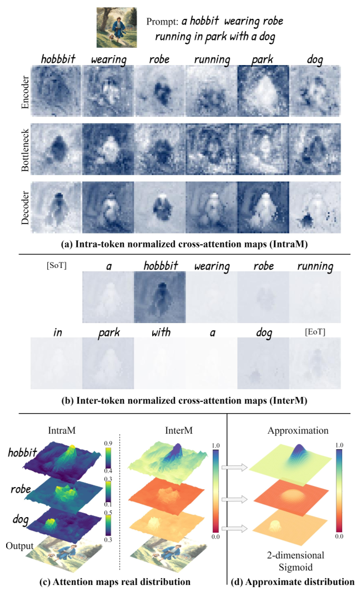

# SpotActor

> 来源等级：FULL_TEXT
> 一句话定位：首个 training-free 的布局到一致图像（L2CI）生成 pipeline，用双能量引导同时优化隐空间与语义空间，兼顾布局对齐与主体一致性。
> 生成时间：2026-09-19 23:23:30

---

## 1. 论文概要与作者意图

**论文全称**：SpotActor: Training-Free Layout-Controlled Consistent Image Generation
**通用缩写**：SpotActor
**作者**：Jiahao Wang, Caixia Yan, Weizhan Zhang, Haonan Lin, Mengmeng Wang, Guang Dai, Tieliang Gong, Hao Sun, Jingdong Wang（西安交通大学、浙江工业大学、SGIT AI Lab、中国电信人工智能技术有限公司、百度）
**发表信息**：arXiv:2409.04801v1 [cs.CV]，2024 年 9 月 7 日（预印本；正文与参考文献中未见正式会议/期刊录用信息 [材料未提供]）

SpotActor 关注的是作者首次提出的新任务 **Layout-to-Consistent-Image (L2CI) generation**：给定一组 bounding box、对应主体描述（如 fairy & unicorn）与情节描述，生成一系列图像，使主体既保持**跨图一致的外观**，又**落在指定的布局框内**。

作者指出现有方法存在以下具体不足：

- **两类挑战从未被同时解决**：subject consistency 与 layout controllability 一直是"two separate topics"，"no existing work embarks on addressing both challenges simultaneously"。
- **tuning-based 一致性方法代价高、伤画质**：TheChosenOne 的 "iterative backbone tuning process results in high computational expenses and may degrade the image quality"；OneActor 虽快 4×，仍需 tuning。
- **training-free 一致性方法忽视空间-语义交互**：现有 training-free 方法 "hardly pay attention to the spatial-semantic interaction of the diffusion process, and no attempts have been made to incorporate the layout controllability"。
- **纯隐空间能量引导的搜索范围受限**：layout 能量引导类方法 "optimizing solely in the latent space restricts the search range as the other half, the semantic space, is continuously neglected"。
- **激活分布近似不够精细**：LayoutGuidance 的 "inadequate approximation of the activation distribution leads to imperfectly aligned subjects"。

作者的核心意图与主张是：

> "We start from the insight that the semantic space and spatial latent space of diffusion models are inherently entangled and share certain properties. Hence, we consider the semantic and latent space as a whole dual space and present a new formalization of dual energy guidance, which defines an update trajectory in the dual space."

即：把语义空间与隐空间视为一个整体**对偶空间（dual space）**，用**双能量引导（dual energy guidance）**把生成过程拆成"布局条件化的反向更新阶段"与"一致性的前向采样阶段"，全程 **training-free**。

## 2. 方法框架

SpotActor 的整体框架是一个 training-free 的两阶段 pipeline：在**每个采样步**内先做一次反向更新（对齐布局），再做一次前向采样（保持一致性），二者共同构成对偶能量引导下的更新轨迹。

输入（用户给定）：$N$ 个 prompt embedding $\{c_i\}_{i=1}^{N}$、中心主体的 token embedding $\{c_i^{sub}\}_{i=1}^{N}$、以及 bounding box $\{b_i = (h_i^{min}, w_i^{min}, h_i^{max}, w_i^{max})\}_{i=1}^{N}$。输出：$N$ 张在给定框内、且主体外观一致的图像。

1. **Formalization of Dual Energy Guidance（对偶能量引导的形式化）**
   - 输入：标准能量引导的两阶段分解 $p(z_{t-1}\mid z_t) = p_f(z_{t-1}\mid z_t^*) \cdot p_b(z_t^*\mid z_t)$。
   - 输出：把采样轨迹从"仅隐空间"扩展为"隐空间 + 语义空间"的联合轨迹。
   - 功能：指出标准方法只优化隐空间、忽视语义条件，因此改写为式 (4) 的联合形式，明确定义 $p_b$（layout-conditioned backward update）与 $p_f$（consistent forward sampling）。

2. **Layout-Conditioned Backward Update（布局条件化反向更新，对应 backward stage）**
   - 输入：当前 latent $z_t$、语义 embedding $c_t$、bounding box $b$、主体 token embedding $c^{sub}$。
   - 输出：一批最优的 $(z_t^*, c_t^*)$。
   - 功能：先用 SDXL 标准生成过程收集 cross-attention map，分析其**组合性质**（IntraM / InterM），据此设计 **nuanced layout energy function**——以 2 维扩展 Sigmoid 拟合"每个名词 token 在其空间位置上呈峰形分布"的激活形态；再同时用式 (8) 的能量对 latent 与 semantic embedding 做梯度下降（式 (2) 与式 (9)）。
   - 关键操作：空间维度 min-max 归一化得到 $\tilde{A}^{ca}$；对 inter-token 分布采用**空间归一化**，让模型自行分配激活水平，避免直接约束 range level 导致画质退化。

3. **Consistent Forward Sampling（一致性前向采样，对应 forward stage）**
   - 输入：更新后的 $(z_t^*, c_t^*)$、各图的 layout mask $M_i$、latent 特征 $h_i$、语义条件 $c_i$。
   - 输出：$z_{t-1}$ 与 $c_{t-1} = c_t^*$。
   - 功能：用两个新注意力机制增强普通 U-Net，实现跨图交互：
     - **RISA（Regional Interconnection Self-Attention）**：把 self-attention 从单图内空间-空间交互扩展到 **inter-image level**，并按 layout mask 精确限定互联区域（式 (10)-(13)）。
     - **SFCA（Semantic Fusion Cross-Attention）**：让每张图与 batch 内**所有语义条件**交互，把其他图的主体 token 的 K/V 与自身的 cross-attention 做融合（式 (14)-(17)）。
   - 论文说明：虽然为简洁起见以单主体生成作图解，但该 pipeline 可无缝扩展到多主体生成。

框架图：Fig. 2（p.3），"The overall architecture of SpotActor"，含 (a) 两阶段双能量引导总览、(b) RISA、(c) SFCA 三个子图。

> 图注原文：Figure 2: The overall architecture of SpotActor. (a) Our method consists of two stages at each sample step in a dual energy guidance manner. The backward stage optimizes the latent codes and semantic embeddings with the nuanced layout energy based on the sigmoid-like objective. Subsequently, the forward sampling is enhanced by two intricate attention mechanisms: (b) RISA and (c) SFCA.
> 文档引用：../analysis/figures/SpotActor_Fig2.png

## 3. 关键机制与创新点

### 3.1 对偶能量引导的形式化（Dual Energy Guidance）

标准能量引导把每个步的两阶段记为式 (3)；作者认为它只在隐空间决定采样轨迹、忽视语义条件，而隐空间与语义空间"inherently entangled together and ought to be regarded as a whole"，因此改写为：

$$
p(z_{t-1}, c_{t-1} \mid z_t, c_t) = p_f(z_{t-1}, c_{t-1} \mid z_t^{*}, c_t^{*}) \cdot p_b(z_t^{*}, c_t^{*} \mid z_t, c_t)
$$

其中：

- $z_t$：第 $t$ 步的 latent code；
- $c_t$：第 $t$ 步的语义 embedding；
- $z_t^{*}, c_t^{*}$：反向更新后得到的最优 latent 与语义 embedding；
- $p_b$：layout-conditioned backward update（布局条件化反向更新）；
- $p_f$：consistent forward sampling（一致性前向采样）。

该机制的核心是：

> "the latent space and the semantic space are inherently entangled together and ought to be regarded as a whole"，因此把采样轨迹定义在语义-隐空间的对偶空间中，同时优化两者。

### 3.2 Nuanced Layout Energy Function（精细布局能量函数）

作者先分析 cross-attention 的组合性质：跨 token 归一化的 IntraM 显示语义 token 对空间像素的激活对应最终图像构图，且**随网络深度加深而增强**；归一化到同一尺度的 InterM 显示不同语义 token 对空间像素的激活**并不平等**。对三个名词的 3D 分布分析显示，每个名词的激活在其空间位置上呈**峰形**：中心高、接近边缘时急剧下降到低值。为拟合这种 intra-token 峰形分布，作者把 Sigmoid 扩展到 2 维：

$$
Sigmoid(x, y) = \frac{1}{1 + e^{-s \cdot (1 - \frac{(x-\mu_1)^2}{\sigma_1} - \frac{(y-\mu_2)^2}{\sigma_2})}}
$$

其中：

- $(x, y)$：空间坐标；
- $(\mu_1, \mu_2)$：峰的中心位置；
- $\sigma_1, \sigma_2$：margin（控制峰的范围）；
- $s$：shape control factor（控制峰的陡峭程度）。

给定 bounding box $b = (h^{min}, w^{min}, h^{max}, w^{max})$ 与主体 token embedding $c^{sub}$，目标分布参数由框直接确定：

$$
\mu_1 = \frac{h^{min} + h^{max}}{2}, \quad \mu_2 = \frac{w^{min} + w^{max}}{2}
$$

$$
\sigma_1 = \frac{(h^{max} - h^{min})^2}{4}, \quad \sigma_2 = \frac{(w^{max} - w^{min})^2}{4}
$$

随后执行 U-Net 前向采样，从 U-Net decoder 收集主体 token 的 cross-attention map $A^{ca} \in \mathbb{R}^{K \times S}$（跨不同层求平均），$K$ 为 attention head 数，$S = H \times W$ 为展平后的总像素数，$H, W$ 为高与宽。将其 reshape 并沿空间维度做 min-max 归一化得到 $\tilde{A}^{ca} \in \mathbb{R}^{K \times H \times W}$，能量函数为：

$$
e = \frac{1}{KHW} \sum_{k} \sum_{h} \sum_{w} \left( \tilde{A}^{ca}_{khw} - Sigmoid(h, w) \right)^2
$$

其中：

- $k, h, w$：分别是 head、高、宽三个维度的索引；
- $\tilde{A}^{ca}_{khw}$：归一化后的 cross-attention 激活值；
- $Sigmoid(h, w)$：式 (5) 给出的目标峰形分布。

从式 (4) 的对偶能量引导视角出发，除对 latent 做式 (2) 的更新外，**同时**对语义 embedding 做反向更新：

$$
c_t \leftarrow c_t - w \sigma_t \nabla_c \, e(z_t, t, c)
$$

其中：

- $c_t$：第 $t$ 步的语义 embedding；
- $w$：能量引导尺度（原文此处用 $w$，与式 (2) 中的 $v$ 对应）；
- $\sigma_t$：预定义常数，作者说明"even though the semantic update doesn't necessarily need $\sigma_t$, we add it as a dynamic step-wise weight"；
- $\nabla_c e$：能量函数对语义 embedding 的梯度。

该机制的核心是：

> "We consider this discovery to be highly significant, yet it has been hardly utilized in existing works." —— 用 2 维 Sigmoid 拟合 intra-token 峰形激活作为能量目标，并对 inter-token 分布采用空间归一化让模型自发分配激活水平，从而在提升布局对齐的同时避免画质退化。

机制依据图：Fig. 3（p.4），"Illustration of the attention analysis"，(a) IntraM、(b) InterM、(c) attention map 的 3D 分布、(d) 提出的 sigmoid-like 近似分布。

> 图注原文：Figure 3: Illustration of the attention analysis. (a) IntraM is the attention map normalized within each token, while (b) InterM is normalized across all the tokens. We further visualize (c) 3D distributions of attention maps and propose (d) sigmoid-like approximate distributions.
> 文档引用：../analysis/figures/SpotActor_Fig3.png

### 3.3 Regional Interconnection Self-Attention (RISA)

给定由 $b_i$ 变换得到的二值 layout mask $M_i \in \mathbb{R}^{H \times W}$ 与 latent code 特征 $h_i$，先把 mask 展平并扩展得到 $M_i^{sa} \in \mathbb{R}^{K \times S \times S}$，然后分别拼接各图的 key 与 value，并用 layout mask 精确控制互联区域：

$$
K^{sa+} = [K_1^{sa} \oplus K_2^{sa} \oplus \ldots \oplus K_N^{sa}]
$$

$$
V^{sa+} = [V_1^{sa} \oplus V_2^{sa} \oplus \ldots \oplus V_N^{sa}]
$$

$$
M_i^{sa+} = [M_1^{sa} \ldots M_{i-1}^{sa} \oplus I \oplus \sqrt{M_{i+1}^{sa}} \oplus \ldots \oplus M_N^{sa}]
$$

$$
h_i^{sa} = Softmax\left(Q_i^{sa} \cdot K_i^{sa+\top} / \sqrt{d_k} + \log M_i^{sa+}\right) \cdot V^{sa+}
$$

其中：

- $K_i^{sa}, V_i^{sa}, Q_i^{sa}$：第 $i$ 张图的 self-attention key / value / query；
- $\oplus$：矩阵拼接（matrix concatenation）；
- 上标 $+$：表示被扩大的矩阵（enlarged matrix）；
- $I$：全 1 矩阵（matrix of ones）；
- $M_i^{sa+}$：控制互联区域的 mask，自身位置用 $I$（全通），其他位置用各自的 layout mask（下一位置取 $\sqrt{M}$）；
- $d_k$：$W_Q$ 与 $W_K$ 的特征维度。

该机制的核心是：

> 把 self-attention 的交互范围从单图内的空间-空间交互**扩展到 inter-image level**，并按 layout 条件限定互联区域，从而在保持风格/内容一致的同时不破坏布局控制。

### 3.4 Semantic Fusion Cross-Attention (SFCA)

作者强调语义空间在一致生成工作中"has been continuously overlooked"，因此设计 SFCA 让每张图与 batch 内所有语义条件交互。给定 $M_i$、$h_i$ 与语义 embedding $c_i$，先经展平、转置、扩展得到 $M_i^{ca} \in \mathbb{R}^{K \times S \times 1}$，再定位主体 token 对应的 $K_i^{sub}$ 与 $V_i^{sub}$ 并做跨图拼接，在布局区域内融合交互：

$$
K_i^{ca+} = [K_1^{sub} \oplus \ldots K_{i-1}^{sub} \oplus K_i^{ca} \oplus K_{i+1}^{sub} \oplus \ldots \oplus K_N^{sub}]
$$

$$
V_i^{ca+} = [V_1^{sub} \oplus \ldots V_{i-1}^{sub} \oplus V_i^{ca} \oplus V_{i+1}^{sub} \oplus \ldots \oplus V_N^{sub}]
$$

$$
M_i^{ca+} = [M_1^{ca} \ldots M_{i-1}^{ca} \oplus I \oplus \sqrt{M_{i+1}^{ca}} \oplus \ldots \oplus M_N^{ca}]
$$

$$
h_i^{ca} = Softmax\left(Q_i^{ca} \cdot K_i^{ca+\top} / \sqrt{d_k} + \log M_i^{ca+}\right) \cdot V^{ca+}
$$

其中：

- $K_i^{ca}, V_i^{ca}, Q_i^{ca}$：第 $i$ 张图 cross-attention 的 key / value / query；
- $K_i^{sub}, V_i^{sub}$：第 $i$ 张图主体 token 的 key / value；
- $M_i^{ca+}$：融合交互的 mask，其余符号含义同 RISA。

该机制的核心是：

> 让每张图在生成时"看到"batch 内其他图的主体语义条件，从而把主体外观的一致性从隐空间交互（RISA）进一步扩展到语义空间交互。

## 4. 训练目标

**SpotActor 是 training-free 方法，不训练任何新参数**——不训练主体 embedding、不训练 adapter、不微调扩散骨干。因此严格来说 SpotActor 本身**没有新增的模型训练目标**。

论文中出现的损失/能量形式都只是**推理期的引导目标**，不是训练监督信号，二者必须区分：

- 式 (1) 的 DDPM 采样式与式 (2) 的能量引导式属于**对已有工作的回顾**（Preliminaries 中给出），不是本文新提出的训练损失：

$$
z_{t-1} = \frac{1}{\sqrt{\beta_t}}\left(z_t + \beta_t \nabla_{z_t} \log p(z_t)\right) + \sqrt{\beta_t}\,\epsilon
$$

$$
z_t \leftarrow z_t - v \sigma_t \nabla_z \, e(z_t, t, c)
$$

- 式 (8) 的 nuanced layout energy $e$ 是**推理期反向更新的目标函数**，通过梯度下降（式 (2) 对 latent、式 (9) 对语义 embedding）在每一步迭代中把 latent 与语义 embedding 推向与给定 box 对齐的最优 $(z_t^{*}, c_t^{*})$。它**不是**训练损失。
- 前向阶段的两个注意力机制（RISA、SFCA）是**推理期激活的手工模块**（"handicraft modules activated during the inference process"），不引入可训练参数。

训练策略：无训练阶段。推理期流程为——每个采样步内先做布局条件化的反向更新（对 latent 与 semantic embedding 做若干次梯度下降迭代），再做一致性前向采样（在增强后的 U-Net 中执行 RISA 与 SFCA），直至完成全部去噪步。

与预训练目标的关系：完全沿用 SDXL（Podell et al. 2023）预训练的去噪/分数估计能力，不改动其目标函数，仅在推理期通过能量引导与注意力改造施加约束。所有 baseline 与 ablation 也均实现于 SDXL 之上。

## 5. 可引用原句（供 blockquote）

- "we pioneer a novel task, Layout-to-Consistent-Image (L2CI) generation, which produces consistent and compositional images in accordance with the given layout conditions and text prompts."
- "we present a new formalization of dual energy guidance with optimization in a dual semantic-latent space and thus propose a training-free pipeline, SpotActor, which features a layout-conditioned backward update stage and a consistent forward sampling stage."
- "optimizing solely in the latent space restricts the search range as the other half, the semantic space, is continuously neglected."
- "the latent space and the semantic space are inherently entangled together and ought to be regarded as a whole."
- "Note that though we illustrate with single subject generation for simplicity, our pipeline can be seamlessly extended to multiple subject generation."
- "with dual energy guidance, our method rapidly converges to the optimum with improved layout alignment without image quality degradation."
