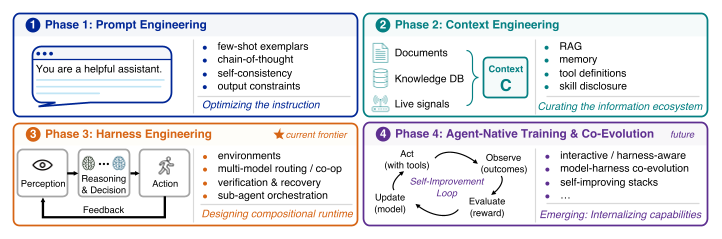

# AgentHarnessSurvey

> 来源等级：FULL_TEXT
> 一句话定位：一篇以"模型+执行框架"为视角的智能体综述，把上下文管理定位为执行框架六大运行时职责之一，并给出任务压力到框架配置的映射。
> 生成时间：2026-09-19 14:38:38

---

## 1. 论文概要与作者意图

论文英文全称：*From Question Answering to Task Completion: A Survey on Agent System and Harness Design*；通用缩写：本调研中记为 **AgentHarnessSurvey**（论文自身未给出缩写）。发表信息：arXiv preprint arXiv:2606.20683v1 [cs.AI]，2026 年 6 月 14 日（作者单位含香港城市大学、悉尼大学、北京大学、TokenRhythm Technologies；通讯作者 Chang Xu、Yunhe Wang）。这是一篇**综述（survey）**，不是提出新方法的论文。

论文关注的核心问题域是 **LLM-based agents 从 passive question answering 到 active task completion 的转变**，以及由此引出的核心追问：智能体性能的瓶颈究竟在 foundation model、在 execution harness，还是在两者的耦合处。作者主张用 **model–harness lens**（模型–框架视角）重新审视整个领域。

作者指出的现有方法/文献不足：

- **Model-centric scaling 的收益递减**：静态基准（MMLU、GPQA、HumanEval）在前沿已趋于饱和，而 agentic 基准（SWE-bench、WebArena、OSWorld、TheAgentCompany、Terminal-Bench）仍留有巨大空间，说明"仅靠模型规模无法弥合差距"。
- **Taxonomy-oriented lenses 的局限**：多数既有综述（Wang et al.、Xi et al.、Luo et al. 等）以模块分类或协作机制组织领域，把 harness 当作实现细节；作者认为这无法解释"为什么同一模型在不同运行时下表现差异巨大"。
- **Context engineering 是 feedforward 的**：作者明确指出 context engineering "remains fundamentally feedforward: it optimizes the input to each reasoning step but provides no structural mechanism to detect drift, verify intermediate outcomes, or recover from errors"。
- **Prompt engineering 只解决表达问题**："It does not solve the information problem: prompting alone cannot supply missing knowledge, manage dynamically evolving state, or maintain coherence across long action sequences."

作者的核心意图与主张：

> Rather than treating agents as models with auxiliary tools, this survey argues that agent quality—including success, efficiency, safety, and generalization—emerges from the interaction between model capability, runtime infrastructure, task structure, and evaluation design.

> Our goal is not to introduce another component taxonomy, but to use this progression and benchmark evidence (Sec. 7) to analyze how the dominant performance bottleneck moves across stages, and why harness design has become a central object of agent engineering.

## 2. 方法框架

作为综述，本文的"框架"是它提出的分析性分解：**LLM-based agent = foundation model + execution harness**，并把 harness 拆成六个耦合的运行时职责。整体定位是"implementation-oriented decomposition"，而非软件包示意图。

1. **Functional view（功能视角，Sec. 2.1）**
   - 输入：外部环境的 observations、任务目标。
   - 输出：作用于环境的 actions 与对 feedback/outcomes 的适应。
   - 功能：把 agent 定义为围绕任务目标组织五种操作的目标导向闭环系统——perception、state maintenance、reasoning and decision-making、action、feedback adaptation。goal 与 environment 条件化某次运行，但不属于 agent 的内部组件。
2. **Implementation view（实现视角，Sec. 2.2）**
   - 输入：单个或多个 foundation model $M$，以及运行时基础设施 $H$。
   - 输出：可执行、可检查、可持续的闭环交互。
   - 功能：把 agent 写成一个耦合系统 $\langle M,H\rangle$，并进一步把 $H$ 展开为六个运行时组件。
3. **Harness anatomy（框架解剖，Sec. 5）**——六个组件及其职责：
   - **Observation interface $I_{obs}$**：把原始环境信号（终端输出、file diffs、screenshots、DOM states、API responses、logs、retrieved passages、event streams）转成模型可用的观察；设计空间是"哪些状态相关、以何种抽象层级表示、何时刷新"。
   - **Context manager $C$**：决定哪些可用信息进入当前模型调用、以何种形式进入；负责 select、compress、order、refresh 观察、工具输出、检索证据、memory records、摘要、指令与任务产物。设计选择包括 inclusion、representation、refresh policy，以及向 active agents / sub-agents 暴露多少 shared state。
   - **Control loop $L$**：编排 observe–reason–act–feedback 循环，含 step scheduling、stopping criteria、retries、reflection、delegation、handoffs、multi-agent coordination；多模型设置下还负责 model routing 与 role assignment。
   - **Action interface $I_{act}$**：把模型输出映射为可执行操作（function calls、MCP tools、shell/code execution、browser actions、file operations、API calls、sub-agent invocations）。
   - **State and artifact store $S$**：跨 step/session/subtask 持久化执行状态与产物（conversation history、plans、scratchpads、checkpoints、logs、traces、diffs、memory records、generated files、task artifacts）。
   - **Verification and governance layer $V$**：通过 tests、assertions、verifier models、judge signals、sandbox policies、permission gates、rollback、retry、budget control、safety constraints、audit traces 检查、约束与修复执行。
   - **数据流关系**：六者并非独立模块。$I_{obs}$ 与 $C$ 紧耦合（观察越丰富，进入 active context 前的选择/压缩/格式化成本越高）；$I_{act}$ 与 $V$ 直接互动（动作越有表达力，越需要权限控制、沙箱、回滚与审计）；$S$ 反过来喂给 $C$ 与 $V$（持久化的 plans/logs/checkpoints/artifacts 既决定什么能被重新浮现给模型，也决定判断进展时可用的证据）。因此 harness design 是**耦合系统问题**，优化一层会把风险转移到别处。
4. **Task landscape → harness configuration（Sec. 6）**：用 task horizon、environment type、autonomy level 三个维度刻画任务对六个组件的 **pressure profile**，并给出 Tab. 5 的领域无关配置规则（如 long horizon → state drift → checkpoints/summaries/artifacts → 关键组件 $C,S,L$）。

框架图：Fig. 3（p.5），"Implementation view of an LLM-based agent as a foundation model coupled with an execution harness."

> 图注原文：Fig. 3: Implementation view of an LLM-based agent as a foundation model coupled with an execution harness. The harness mediates closed-loop interaction between the model and the external world through six runtime components: observation interface, context manager, control loop, action interface, state and artifact store, and verification and governance layer. The section labels inside the figure indicate where each component is analyzed in detail.
> 文档引用：../analysis/figures/AgentHarnessSurvey_Fig3.png

## 3. 关键机制与创新点

### 3.1 Agent = Model + Harness，harness 的六元组形式化

论文把 LLM-based agent 写成一个耦合系统，并把 harness 展开为六个运行时组件：

$$
A_{LLM} = \langle M,H\rangle = \langle M, I_{obs}, C, L, I_{act}, S, V\rangle, \tag{1}
$$

$$
H = \langle I_{obs}, C, L, I_{act}, S, V\rangle. \tag{2}
$$

其中：

- $M$ 表示 agent 的 model layer；最简单情形是单个 foundation model，多模型部署时 $M = \{M_1,\dots,M_k\}$ 表示能力、成本、上下文长度异构的骨干模型集合；
- $H$ 表示围绕 $M$ 的 execution harness；
- $I_{obs}$ 为 observation interface，$C$ 为 context manager，$L$ 为 control loop，$I_{act}$ 为 action interface，$S$ 为 state and artifact store，$V$ 为 verification and governance layer。

作者强调这是 implementation-oriented decomposition，不替代功能定义；$|M|=1$ 时退化为熟悉的单骨干设置，$|M|>1$ 时 harness 还必须决定每一步由哪个模型行动。该机制的意义在于：

> By separating these runtime responsibilities from the model itself, the decomposition explains why harness changes can improve agent performance even when the underlying model is unchanged.

### 3.2 Context as a dynamically assembled runtime object（上下文即运行时组装对象）

Phase 2 的核心技术视角是：context 不再是静态 prompt string，而是动态组装的运行时对象。论文把 $C=\text{prompt}$ 的假设替换为：

$$
C = A(c_1, c_2, \dots, c_n), \tag{3}
$$

其中：

- $A$ 表示高层 assembly function，把各上下文组件组合成最终 context $C$；
- $c_i$ 为上下文组件，包括 instructions、retrieved knowledge、tool descriptions and outputs、memory records、task state、intermediate artifacts 以及 current query。

在此基础上，工程问题从"优化 prompt 措辞"变为"优化检索、选择、压缩、格式化与刷新信息的函数"，其目标为：

$$
F^{*} = \arg\max_{F} \mathbb{E}_{\tau \sim T}\left[\mathrm{Reward}\left(P_{\theta}\left(Y \mid C_{F}(\tau)\right),\, Y^{*}_{\tau}\right)\right], \tag{4}
$$

其中：

- $F$ 表示 context-construction functions 的集合；
- $C_{F}(\tau)$ 表示为任务实例 $\tau$ 产出的 context；
- $Y^{*}_{\tau}$ 表示期望的或参考的结果；
- 优化目标是在所构造 context 下最大化期望任务质量，而不是孤立优化单条指令。

作者对这一机制为何重要的论证：

> Yet even well-engineered workflows and context do not by themselves guarantee reliable agency. They arrange information, tools, and intermediate steps around the model, but they do not fully specify how the overall process should remain stable, verifiable, and recoverable.

### 3.3 Context manager 的设计空间与核心权衡（Sec. 5.2）

论文对 $C$ 的职责界定为：决定哪些可用信息进入当前模型调用、以什么形式进入，并在其成为下一步 working context 之前 select、compress、order、refresh 观察、工具输出、检索证据、memory records、summaries、instructions 与 task artifacts。四个主要设计选择是 **inclusion、representation、refresh policy，以及暴露给 active agents / sub-agents 的 shared state 数量**。

反复出现的实现模式：retrieval-based systems 按需引入外部文档或存储状态；memory-oriented systems（如 MemGPT）把 active context 与更大的 external memory 分离；工业 harness 越来越把任务状态外化为显式 artifacts 并有选择地重新浮现，而不是依赖单一不断增长的对话轨迹。

作者给出的核心权衡与关键区分：

> The dominant trade-off is fidelity versus manageability: raw histories preserve detail but scale poorly, whereas summaries and retrieved context are cheaper but can omit or distort important state. Thus, the crucial distinction is not between long and short prompts, but between monolithic and managed context.

作者指出的开放问题：如何在保持 summary faithfulness 与 state integrity 的同时把 context cost 控制在界内，尤其是当 context repair 必须与 long-horizon 设置下的 verification、recovery 互动时。

### 3.4 上下文压力的任务侧来源（Sec. 6）

论文把"长程任务为何压垮上下文"机制化：$C$ 与 $S$ 必须**联合设计**。

> The configuration consequence is that the Context Manager and State and Artifact Store must be designed jointly: summaries decide what is visible now, whereas artifacts and checkpoints decide what remains recoverable later.

Tab. 4 的复杂度分级给出上下文压力的来源：L1 single-step 的瓶颈是 Context Mgr.; Verif. & Gov.；L2 multi-step 是 Act. Interface; State Store; Verif. & Gov.；**L3 long-horizon（repo-scale coding、research）的瓶颈是 Context Mgr.; State Store; Ctrl. Loop**；L4 open-ended 是 Verif. & Gov.; Ctrl. Loop。作者的论证是"最关键的跃迁通常是从 L2 到 L3"：长程任务对 Context Manager、State and Artifact Store、Control Loop 形成持续压力，因为 plans、intermediate artifacts、failed attempts 与 partial results 必须存活于单个 prompt window 之外。

四范式演化图（Phase 2 即 context engineering 阶段）：Fig. 5（p.8）。

> 图注原文：Fig. 5: Four paradigms of agent engineering. The main locus of effort shifts from eliciting model behavior, to organizing context, to stabilizing execution, composing and learning multi-model runtimes, and training or co-evolving agentic behavior.
> 文档引用：../analysis/figures/AgentHarnessSurvey_Fig5.png

## 4. 训练目标

本文是**综述**，不提出新的训练目标，也不训练任何模块；它没有自己的损失函数。文中出现的数学表达分为两类，需严格区分：

**(a) 对既有 context 优化目标的回顾**——式 (4) 是作者用来刻画 Phase 2 中 context-construction functions 优化问题的形式化，属于对既有研究（引用 [117]）的综述性表述，**不是本文提出的训练损失**：

$$
F^{*} = \arg\max_{F} \mathbb{E}_{\tau \sim T}\left[\mathrm{Reward}\left(P_{\theta}\left(Y \mid C_{F}(\tau)\right),\, Y^{*}_{\tau}\right)\right]. \tag{4}
$$

**(b) 展望章节提出的 evaluation / optimization 目标（Sec. 8.1）**——这些是作者建议未来评测采用的**部署期目标**，不是训练监督信号。设 $\tau \sim D$ 为任务实例，$z = \mathrm{Run}(\tau;M,H,\omega)$ 为模型 $M$ 与框架 $H$ 在随机性 $\omega$ 下产生的执行轨迹；$S(z)\in\{0,1\}$ 表示任务成功，$C(z)$ 为执行成本（token/API 用量、工具调用、算力、基础设施），$L(z)$ 为延迟（wall-clock 时间或交互步数），$R(z)$ 为安全或合规风险，$V(\tau)\ge 0$ 为任务效用（用户价值、科学价值、优先级或风险调整后的重要性）：

$$
P_{\mathrm{succ}}(\tau;M,H) = \mathbb{E}_{\omega}\left[S\left(\mathrm{Run}(\tau;M,H,\omega)\right)\right]. \tag{5}
$$

$$
\max_{M,H}\ \mathbb{E}_{\tau\sim D}\left[V(\tau)P_{\mathrm{succ}}(\tau;M,H)\bar{Q}_{\mathrm{proc}}(\tau;M,H)\right]
$$
$$
\text{s.t.}\quad \mathbb{E}_{\tau,\omega}[C(z)] \le B_C,\quad \mathrm{Quantile}_p(L(z)) \le B_L,\quad \mathbb{E}_{\tau,\omega}[R(z)] \le \epsilon,\quad \mathbb{E}_{\tau}[\mathrm{Rel}_k(\tau;M,H)] \ge \rho. \tag{6}
$$

$$
\alpha,\beta,\gamma = \mathbb{E}_{\tau,\omega}\left[V(\tau)S(z)Q_{\mathrm{proc}}(z)D(z)^{-1}\right],\qquad D(z) = (1+\tilde{C}(z))^{\alpha}(1+\tilde{L}(z))^{\beta}(1+\tilde{R}(z))^{\gamma}. \tag{7}
$$

其中：

- $Q_{\mathrm{proc}}(z)\in[0,1]$ 概括 process quality，含 trace inspectability、verifier use、recovery behavior、provenance quality、policy compliance；
- $\bar{Q}_{\mathrm{proc}}(\tau;M,H) = \mathbb{E}_{\omega}[Q_{\mathrm{proc}}(z)]$；
- $\mathrm{Rel}_k(\tau;M,H)$ 为从 $k$ 次运行估计的 repeated-run reliability（如 consistency、pass@k、stress-test reliability）；
- $B_C$、$B_L$、$\epsilon$、$\rho$ 分别是成本预算、延迟分位预算、风险上限与可靠性下限；
- $\tilde{C}(z)=C(z)/B_C$、$\tilde{L}(z)=L(z)/B_L$、$\tilde{R}(z)=R(z)/\epsilon$ 为归一化成本、延迟与风险。

作者明确声明式 (6)(7) "is not a universal leaderboard score"，而是让部署目标显式化的、与部署相关的一族效用，而非固定指标。

**(c) 自演化循环（Sec. 8.2）**——同样是展望中的控制结构，不是本文训练出的目标。设 $\theta_t$ 为第 $t$ 轮模型参数、$\phi_t$ 为该轮 harness 配置，在 $D$ 上运行产生轨迹 $Z_t$，并抽取含 outcomes、failure modes、verifier results、cost profiles、safety events 的证据集 $E_t$，更新算子 $U$ 可改变模型、框架或两者：

$$
(\theta_{t+1}, \phi_{t+1}) = \mathrm{VerifyRetain}\left(U(\theta_t, \phi_t, E_t)\right). \tag{8}
$$

其中 $\mathrm{VerifyRetain}$ 仅在更新通过 held-out tasks、regression tests、process checks 与 safety constraints 时才保留该更新，否则拒绝或回滚。作者指出该式不是固定算法，而是把控制结构显式化：可靠的自演化必须耦合 experience extraction、credit assignment、modification 与 validation。

**与预训练目标的关系**：本文不涉及预训练目标的改写。它讨论的是 agent-native training 与 model–harness co-evolution 这一方向（Phase 4），指出 agentic behaviors（planning、tool use、verification、recovery）正被训练进模型参数，但 harness 并未因此消失，而是转变为"training environment, evidence pipeline, verifier, and governance layer"。

**推理期约束与训练目标的区分**：本文的形式化中，式 (5)–(7) 属于**评测/部署期**的价值感知目标（含成本、延迟、风险、可靠性约束），式 (8) 属于**框架侧演化**的可验证更新规则；两者都不是模型训练时的损失函数。论文没有给出任何训练损失表达式。

## 5. 可引用原句（供 blockquote）

- "Rather than treating agents as models with auxiliary tools, this survey argues that agent quality—including success, efficiency, safety, and generalization—emerges from the interaction between model capability, runtime infrastructure, task structure, and evaluation design."
- "However, context engineering remains fundamentally feedforward: it optimizes the input to each reasoning step but provides no structural mechanism to detect drift, verify intermediate outcomes, or recover from errors."
- "It does not solve the information problem: prompting alone cannot supply missing knowledge, manage dynamically evolving state, or maintain coherence across long action sequences."
- "Thus, the crucial distinction is not between long and short prompts, but between monolithic and managed context."
- "The configuration consequence is that the Context Manager and State and Artifact Store must be designed jointly: summaries decide what is visible now, whereas artifacts and checkpoints decide what remains recoverable later."
- "A key open problem is how to preserve summary faithfulness and state integrity while keeping context cost bounded, especially when context repair must interact with verification and recovery in long-horizon settings."
- "By separating these runtime responsibilities from the model itself, the decomposition explains why harness changes can improve agent performance even when the underlying model is unchanged."
- "Harness design is therefore a coupled systems problem rather than the independent optimization of six modules. Improving one layer can shift risk elsewhere: stronger compression can reduce cost while weakening downstream verification."
