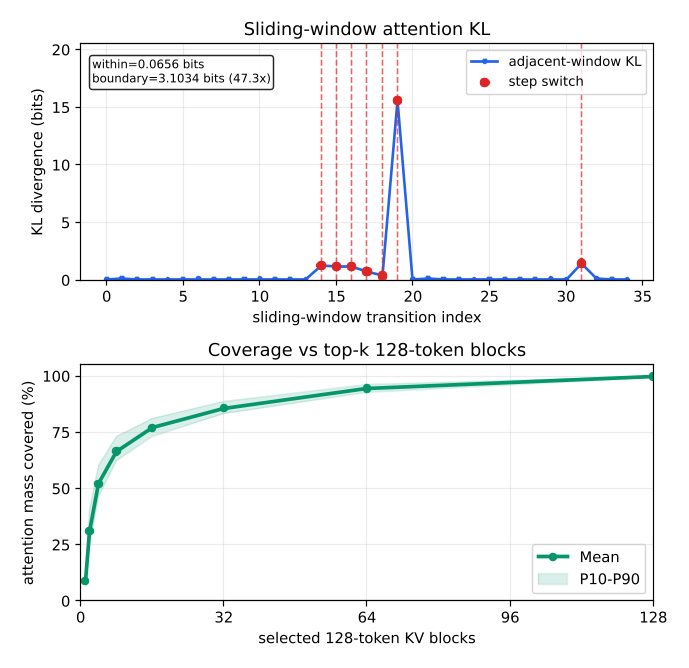

# KVMem

> 来源等级：FULL_TEXT
> 一句话定位：KVMem 将智能体溢出的工作区历史保留为跨 GPU/主机/NVMe 分页 KV 状态，按步检索并重建有界执行视图，避免重复 prefill。
> 生成时间：2026-09-19 14:38:40

---

## 1. 论文概要与作者意图

**KVMem**（论文全称 *KVMEM: Virtualizing Million-Token Agent Workspaces on a Consumer GPU*，正文中系统名写作 KVMEM）关注的是 **长时运行 LLM 智能体的工作区上下文虚拟化（workspace-context virtualization）**，即把智能体累积的历史上下文当作一种可虚拟化的系统资源来管理。

- 作者与单位：Di Chai（上海财经大学）、Leye Wang（北京大学，通讯作者）、Zeshen Su（北京大学）、Zhiguo Xia（西北工业大学）、Zhihang Yu（吉林大学）。
- 发表信息：arXiv 预印本，arXiv:2609.04852v1 [cs.LG]，2026 年 9 月 4 日。会议/期刊录用信息 [材料未提供]。
- 开源链接：正文脚注给出 `https://github.com/kvmem/kvmem-qw3`。

作者指出，现有智能体系统处理上下文溢出时普遍采用**以文本为中心（text-centric）的抽象**，由此产生一个耦合的 **fidelity–efficiency problem（保真度—效率问题）**。具体痛点：

- **Compaction 的早期相关性判断**：compaction 必须在后续问题、工具结果或推理步骤出现之前就决定保留什么，因此可能丢掉"a sentence from an earlier file, a value from a tool output, or a user constraint"这类当时低显著度、后来却任务关键的证据。
- **Text retrieval 重复 prefill**：检索到的文本虽然已被模型处理过，但若只保留文本，后续恢复必须重新 prefill 一遍才能重建可用 KV 状态，作者用 $T_{\text{text}} = T_{\text{retrieve}} + T_{\text{prefill}}(N_R)$ 刻画这一额外开销。
- **丢弃可复用 KV 计算**：历史上下文离开活跃窗口时，模型其实已经把它编码成 KV 状态；文本式处理"discards the reusable KV computation associated with that state"，而这份损失并非上下文溢出的必然结果。
- **token 级 KV 保留方法难以扩展到持久工作区**：H2O 按累积注意力分数对单个 token 排序、StreamingLLM 保留 attention sink 与近期 token，这类方法对剪枝活跃上下文有效，但直接扩展到百万 token 的持久工作区"would require maintaining and comparing retrieval state for every historical token"，在索引容量与查询时延上都不可行。

作者的核心意图与主张：

> Drawing inspiration from virtual memory, our key insight is to decouple the size of an agent's addressable KV workspace from the amount of KV state physically resident on the GPU. Overflowed workspace history can then be preserved as paged KV state in a larger backing store and selectively materialized when relevant.

## 2. 方法框架

KVMem 的整体框架是一个 **KV 上下文虚拟化系统**：把智能体已处理的工作区历史保留为跨 GPU 内存、主机内存与 NVMe 的分页 KV 块仓库，并在每个 agent step 物化一个受模型原生上下文窗口与 GPU KV 预算约束的、query-dependent 的有界执行视图。系统区分两个视图：**repository view**（记录每个历史块及其在 GPU page pool、主机内存、NVMe 中的有效副本位置）与 **execution view**（只含当前步选中的块，按时间顺序排列并赋予紧凑 GPU 注意力窗口中的连续位置）。

1. **Step-Level Memory Scheduling（何时召回）**
   - 输入：新 agent step 的 prefill 过程中收集的 model-native 信号。
   - 输出：本步固定的 historical working set。
   - 功能：每个 agent step 只更新一次历史工作集——在 prefill 之后、decoding 之前；选中的集合在整个 decode 期间保持不变，decode 结束后进入新的 recall epoch。
   - 关键依据：对 8 条 OpenHands SWE-bench Lite rollout 用 128-token 滑窗（stride 32）测量相邻窗口注意力分布的 KL 散度，同一 agent step 内平均仅 0.070 bits，跨 step 边界平均 2.59 bits，高 37.3×。

2. **Query-Conditioned KV Retrieval（召回什么）**
   - 输入：当前 query 的位置无关向量、各历史块的 Mean-K 索引。
   - 输出：按 relevance 排序后的候选块集合（默认选择器先保留配置的 sink 与 recent 区域，再用得分最大的块填满剩余预算）。
   - 功能：用服务模型自身的注意力空间信号做块级检索。每个逻辑块、每层、每个 KV head 只存一个位置无关的 Mean-K 向量，因此索引远小于完整历史 KV；百万 token 级别的完整 Mean-K 索引放在主机内存，通过有界 tile 流式送上 GPU 打分。
   - 关键依据：每个被分析窗口平均含 103.1 个历史块，top-8 块即覆盖 66.5% 的历史注意力质量，top-16 覆盖 77.0%。

3. **Tiered KV Management（如何召回）**
   - 输入：选中的非连续历史块、其在 GPU/主机/NVMe 的副本位置。
   - 输出：位置一致、可直接参与注意力的 GPU 执行视图。
   - 功能：由三部分优化组成——**proactive stage-out**（在 chunked prefill 的第 n 个 chunk 完成后就异步把已完成块的 KV 写到主机内存，与第 n+1 个 chunk 的计算重叠，使 stage-out 脱离恢复关键路径）、**retrieval-aware hierarchical reuse**（按工作集差量复用 GPU 常驻页；主机内存准入/驱逐同时考虑近期检索与累积检索频率，避免像 LRU 那样把频繁召回的块在短暂静默后送去 NVMe）、**packed and pipelined KV rematerialization**（把分散的 raw K 聚集到 pinned memory 连续缓冲区、批量 H2D 传输、GPU kernel 散射并 re-RoPE，并以 double buffering 让 batch n−1 的 scatter/re-RoPE、batch n 的 H2D、batch n+1 的 CPU gather 三阶段并发）。
   - 位置一致性：RoPE 编码后的 K 只在其被编码的位置有效，因此 KVMem 在活跃 GPU cache 之外保留不可变、位置无关的 raw K 作为重建权威（主机内存中按块连续存放），V 位置无关可直接搬运；块被赋予新紧凑位置时对 raw K 施加 RoPE 后写入目标 GPU 页。对已在 GPU 的块使用有界次数的 delta re-RoPE，达到配置上限后从 raw K 重建，以限制低精度 GPU 副本上反复原地调整累积的数值误差。

模块间数据流：prefill 期间收集服务模型原生信号并增量构建 Mean-K 索引 → prefill 结束后做一次工作集更新（块选择）→ 块管理器计算前后工作集差量并生成 stage-out / stage-in / 位置重映射计划 → 数据面取回选中 KV 页、构建注意力页表、把 K 变换到新位置帧 → 与当前上下文组装成执行视图 → 在当前 query 上重新 prefill（QW3 通过恢复当前 query 前的 checkpoint 来避免重放更早上下文）→ decode，新生成的 KV 页直接追加到同一执行视图尾部。

框架图：Fig. 1（p.6），"Overview of KVMEM's three core designs"。

> 图注原文：Figure 1: Overview of KVMEM's three core designs. First, step-level memory scheduling reselects a bounded working set once per agent step, after prefill and before decoding (Sec. 4.2). Second, query-conditioned retrieval represents the full history with compact block-level indexes, enabling efficient block selection with little GPU memory overhead (Sec. 4.3). Third, tiered KV management proactively stages out completed blocks, reuses overlapping GPU pages, retains frequently retrieved blocks in host memory, and packs the remaining GPU misses into a pipelined rematerialization path (Sec. 4.4).
> 文档引用：../analysis/figures/KVMem_Fig1.png

## 3. 关键机制与创新点

### 问题形式化：三个容量上限与两个目标

论文把工作区历史 $H_t$ 的 KV 状态按 $B_{blk}$ 个 token 划分为逻辑块 $B_t = \{b_1, b_2, \dots, b_{M_t}\}$，每个逻辑块是检索打分、选择与 KV 搬移的单位。三个容量上限与有效活跃上下文预算为：

$$
B_a = \min(B_{model}, B_{gpu}).
$$

其中：

- $B_{model}$ 是模型原生上下文窗口大小；
- $B_{gpu}$ 是 GPU 内存预算下可容纳的、以 token 等价计的 KV 状态上限；
- $B_m$ 是主机内存与 NVMe 中后备 KV 工作区的 token 等价容量；
- $B_a$ 是有效活跃上下文预算。

本文聚焦于累积历史 KV 状态能装进配置的后备工作区的区间，即满足

$$
B_{blk}|B_t| \le B_m.
$$

执行视图需满足的约束为

$$
N(Q_\tau) + B_{blk}|R^\pi_\tau| \le B_a,
$$

其中：

- $\pi$ 是工作区内存策略，$T^\pi$ 是它产生的 recall point 集合；
- $\tau \in T^\pi$ 是一个 recall point，$R^\pi_\tau \subseteq B_\tau$ 是该点选入活跃执行视图的历史工作集；
- $Q_\tau$ 是 recall point $\tau$ 处不由所选历史工作集提供的必需上下文；
- $N(Q_\tau)$ 是 $Q_\tau$ 的 token 长度。

策略的两个目标为：

$$
\max \text{Fidelity}(\pi), \quad \min \text{RecoveryCost}(\pi).
$$

其中 $\text{Fidelity}(\pi)$ 衡量任务质量与恢复出的工作区状态正确性，$\text{RecoveryCost}(\pi)$ 衡量在线更新与恢复历史工作集的成本。

### 为什么溢出不必丢弃可复用 KV：两条恢复路径的代价对比

论文用两个式子对比文本恢复与 KV 恢复的代价。若只保留文本 $x$，后续步骤恢复它必须重新计算以重建可用 KV 状态：

$$
T_{\text{text}} = T_{\text{retrieve}} + T_{\text{prefill}}(N_R),
$$

其中：

- $R$ 是为当前 agent step 检索到的历史文本，$N_R$ 是其 token 数；
- $T_{\text{prefill}}(N_R)$ 是再次处理这些被召回 token 所需的模型计算。

若首次处理工作区历史时产生的 KV 状态被保留，召回则可表达为：

$$
T_{\text{KV}} = T_{\text{retrieve}} + T_{\text{load}} + T_{\text{restore}},
$$

其中：

- $T_{\text{load}}$ 是把 KV 状态从后备存储载入的时间；
- $T_{\text{restore}}$ 是把载入的 KV 状态恢复为可用形式（位置一致）的时间。

作者据此论证：这条路径是否更快取决于存储、传输与恢复成本，但关键机会在于"previously computed model state need not be discarded simply because it leaves the active execution view"。

### Mean-K 检索索引

对每个历史块、每层、每个 KV head，KVMem 用其位置无关 K 向量的均值作为该块的表示。设 $\tilde{k}_{l,i,g}$ 为 token $i$ 在层 $l$、KV head $g$ 处的位置无关 K 向量，则块 $b$ 的 Mean-K 表示为：

$$
\bar{k}_{l,b,g} = \frac{1}{|b|}\sum_{i \in b} \tilde{k}_{l,i,g}.
$$

其中：

- $l$ 是层索引，$g$ 是 KV head 索引；
- $b$ 是一个逻辑历史块，$|b|$ 是其包含的 token 数；
- $\tilde{k}_{l,i,g}$ 已去除 RoPE 引入的位置信息，代表与原始执行窗口位置无关的内容。

该表示每块、每层、每 KV head 只存一个 K 向量，因此索引显著小于完整历史 KV。作者承认 Mean-K 必然丢失块内变化，但随着块变小，每个均值概括的跨度更短、内容更同质，近似误差随之减轻；实现默认使用 **32-token 块**。

### Query-Conditioned Block Scoring

在每个 recall point，KVMem 用 Mean-K 表示对每个可检索历史块与当前 query 打分。用 $l, m, h$ 分别索引被打分的注意力层、当前 query token 与 query head；$q_{l,m,h}$ 是位置无关的 query 向量，$g(h)$ 是分组查询注意力下 query head $h$ 对应的 KV head，$\bar{k}_{l,b,g(h)}$ 是历史块 $b$ 的 Mean-K 向量，head 维度为 $d$，候选块集合为 $C$。块相关性为：

$$
R_b = \operatorname{mean}_{l,h}\ \operatorname{softmax}_{b' \in C}\left(\frac{q_{l,m,h}^\top \bar{k}_{l,b',g(h)}}{\sqrt{d}}\right).
$$

其中：

- 对每个固定的 $(l, m, h)$，softmax 在所有候选块上对缩放点积得分做归一化；
- 外层对 query token $m$ 求和、并在被打分的层—head 对上取平均；
- $\sqrt{d}$ 是缩放因子，$d$ 为 head 维度；
- 默认选择器先保留配置的 sink 与 recent 区域，再用 $R_b$ 最大的块填满剩余预算，最后恢复时间顺序再物化。

为控制 GPU 占用，完整 Mean-K 索引存于主机内存，只把固定大小的 tile 流式送入有界 GPU staging buffer 打分并逐 tile 合并部分结果；QW3 在 tile 间维持全局 softmax 归一化，因此分块打分等价于在完整候选索引上求式 (10)。

### 工作集差量与物理 stage-in

设 $W_{t-1}$、$W_t$ 为相邻两步选中的工作集，KVMem 把转移分解为：

$$
R_t = W_t \cap W_{t-1}, \quad L_t = W_t \setminus W_{t-1}, \quad E_t = W_{t-1} \setminus W_t,
$$

其中：

- $R_t$ 是保留（retained）块，$L_t$ 是新增（incoming）块，$E_t$ 是移出（outgoing）块。

设 $G_{t-1}$ 表示仍常驻有界 GPU page pool 的全部历史块，则真正需要 stage-in 的块为：

$$
L^{\text{physical}}_t = W_t \setminus G_{t-1}.
$$

KVMem 保留 GPU 命中的物理页，只加载 $L^{\text{physical}}_t$；由于 proactive stage-out 已为移出块创建了有效的下层副本，其 GPU 页可被立即回收。

### 位置一致性与执行视图组装

论文另给出两条机制性等式。其一，文本检索路径下历史 token 序列 $x$ 的 prefill 关系为：

$$
x \xrightarrow{\text{prefill}} (K_x, V_x).
$$

其二，compaction 有损性的不可区分性论证：设 $H$ 为原始工作区历史、$C(H)$ 为其紧凑表示，由于 compaction 有损，存在两个不同历史 $H_1 \ne H_2$ 使得

$$
C(H_1) = C(H_2), \quad H_1 \ne H_2.
$$

因此除非在 compaction 时就知道未来相关性，有损紧凑表示无法保证保留未来 agent step 所需的全部信息。

机制为何有效，作者的原句：

> The loss of reusable KV state, however, is not inherent to context overflow. By the time historical context leaves the active execution window, the model has already encoded it into KV state; the only uncertainty is which subset will be needed again.

> This suggests that effective recall does not require materializing most of the workspace; instead, the retrieval mechanism should efficiently identify a small set of strongly relevant historical blocks.

同时作者明确划定了边界：

> Reusing historical KV state is not mathematically equivalent to recomputing the corresponding text under the newly assembled context. KVMEM restores positional consistency through re-RoPE and re-prefills the current query over the updated execution view, but historical KV was originally computed under its earlier causal context.

关键机制图：Fig. 2（p.7），八条 OpenHands SWE-bench Lite rollout 的注意力行为证据（上panel为相邻窗口 KL 散度，下panel为 128-token KV 块的 top-k 覆盖率）。

> 图注原文：Figure 2: Attention behavior across eight OpenHands SWE-bench Lite rollouts. The top panel shows adjacent-window KL for one example rollout, where KL remains low within an agent step and spikes across step boundaries. Red markers and dashed lines denote step switches. The bottom panel reports mean top-k coverage for 128-token KV blocks across all eight rollouts, with the shaded band showing the P10–P90 range.
> 文档引用：../analysis/figures/KVMem_Fig2.png

## 4. 训练目标

**KVMem 是 training-free 的系统级方法，不训练任何新参数，因此没有新增的训练目标。** 论文全文没有给出任何损失函数、微调阶段或参数更新策略；它改变的是推理期的 KV 管理与调度，模型权重（Qwen3.6/3.8-27B）保持不变。

- 损失函数：无。论文中出现的所有等式都是系统代价模型（$T_{\text{text}}$、$T_{\text{KV}}$）、容量约束（$B_a$、$B_{blk}|B_t| \le B_m$）、检索打分（$R_b$）、索引构造（$\bar{k}_{l,b,g}$）与工作集差量（$L^{\text{physical}}_t$）的刻画，不是训练监督信号。
- 优化目标：形式上写作 $\max \text{Fidelity}(\pi),\ \min \text{RecoveryCost}(\pi)$，这是对**工作区内存策略 $\pi$** 的系统级目标，不是可微的模型训练目标。
- 训练策略：无训练。所有对比方法（Sliding Window、Compact-only、Compact+RAG、KVMem）都运行在同一个 QW3 推理引擎上，"they differ only in their context-management policies"。
- 与预训练目标的关系：沿用模型原有的自回归生成行为，不修改预训练目标；KV 状态本身是模型 prefill 时的既有产物，KVMem 只是保留并复用它们。
- 推理期约束与训练目标的区分：**必须注意**，论文中的 recall point 调度约束、执行视图容量约束 $N(Q_\tau) + B_{blk}|R^\pi_\tau| \le B_a$、以及 re-RoPE 的 delta 次数上限，全部是**推理期**的系统约束，不是训练损失。此外，QW3 在组装好执行视图后会重新 prefill 当前 query（通过恢复当前 query 之前的 checkpoint 避免重放更早上下文），这也是推理期的一致性修复步骤，而非训练环节。
- 实现细节（非训练）：KVMem 实现为 QW3——一个 C++/CUDA 的原生推理引擎，控制模型 forward、paged KV 分配器、注意力页表、CUDA kernel 与设备传输流，支持 continuous batching、prefix reuse 与 MTP 投机解码；KVMem 在其上增加主机侧 block manager、检索与 re-RoPE kernel、pinned memory 与 NVMe 存储后端。论文明确指出该实现需要端到端控制 KV 分配、检索、位置恢复与层级搬移，因此"cannot be transparently layered over black-box LLM APIs"。

## 5. 可引用原句（供 blockquote）

- "Drawing inspiration from virtual memory, our key insight is to decouple the size of an agent's addressable KV workspace from the amount of KV state physically resident on the GPU."
- "Text-centric overflow handling not only approximates the historical workspace state, but also discards the reusable KV computation associated with that state."
- "Compaction must decide what information to preserve before future agent steps reveal which details will matter."
- "Across all eight rollouts, adjacent windows within the same agent step have an average KL divergence of only 0.070 bits, whereas windows crossing an agent-step boundary average 2.59 bits, or 37.3× higher."
- "Each analyzed window contains 103.1 historical blocks on average, yet the top-8 blocks capture 66.5% of historical attention mass, while the top-16 capture 77.0%."
- "KVMEM virtualizes the historical workspace available to an agent; it does not extend the number of tokens jointly attended to in a single model invocation."
- "KVMEM trades backing-storage capacity for reusable model state: KV state is substantially larger than text."

## 6. 实验与主要结果（供文档参考）

- **评测基准**：LongMemEval-S（约 115K tokens/问题）、MemoryAgentBench（约 103K–1.44M tokens）、AgentLongBench（32K–4M tokens）；另在 DeepSWE v1.1 前 16 个任务上做完整长时程软件工程轨迹评测。
- **基线**：Full Context、Sliding Window、Compact-only、Compact+RAG。各方法使用相同活跃执行视图预算（LongMemEval-S 与 AgentLongBench ≤256K 用 32K；MemoryAgentBench >256K 与 AgentLongBench 512K 用 64K；AgentLongBench 1M 用 100K）。
- **效用**：LongMemEval-S 上 KVMem 85.6%，Full Context 86.60%，Compact+RAG 86.20%，Compact-only 45.60%，Sliding Window 26.80%。MemoryAgentBench (>256K) 上 KVMem 40.99% vs Compact+RAG 34.80%。AgentLongBench (≤256K) 上 KVMem 60.87%，高于 Full Context 的 59.54%；512K 时 53.0%，1M 时 50.0%（Compact+RAG 42.00%，Compact-only 32.00%）。
- **效率**：KVMem pre-answer 时延 0.38–1.81 s，Compact+RAG 含 compaction 为 26.63–416.38 s，即使排除摘要生成时间仍需 10.63–39.24 s，KVMem 把 post-compaction 恢复时延降低 11.4–53.8×。LongMemEval-S 上 KVMem 与 Full Context 同样处理 109.74K 总历史输入，但新鲜 prefill 仅 0.08K tokens；Compact+RAG 处理 142.16K 总输入、需 31.00K 新鲜 prefill。
- **消费级部署**：24 GB RTX 5090 Laptop GPU 笔记本上运行 Qwen3.6/3.8-27B NVFP4-MTP，支持 1M token 虚拟工作区（模型原生窗口的 4×、GPU 常驻执行视图 80K 的 12.5×），单会话生成约 50 tokens/s。对照 vLLM 约 10K、llama.cpp 约 80K 上下文。
- **可扩展性**：服务器平台上执行视图固定 64K、工作区从 256K 增至 10M tokens；GPU 内存稳定在约 34 GiB，主机内存从 18 GiB 增至上限约 64 GiB，NVMe 从 8.5 GiB 增至 324 GiB；Mean-K 索引从约 0.25 GiB 增至 9.5 GiB；检索时延中位数从 174 ms 增至 1.311 s，TTFT 从 0.43 s 增至 1.60 s。
- **DeepSWE v1.1（Qwen3.8-27B，Claude Code，16 任务 × 4 次采样）**：KVMem Pass@1 48.4% vs Compaction-only 43.8%（+4.7 个百分点），Pass@4 93.8% vs 81.3%（+12.5 个百分点，16 个任务中解决 15 个 vs 13 个）；prefill 时间从 211.5 s 降至 95.0 s（55.1% 降幅，2.23×），agent 时间 52.5→45.8 分钟（1.15×），请求墙钟时间 48.1→40.7 分钟（1.18×），解码输出 token 154.4K→125.6K（1.23×）。
- **作者自述局限**：不扩展单次模型调用内共同注意的 token 数；KV 复用与按新上下文重算文本在数学上不等价；每步只物化检索到的子集，任务相关块仍可能被检索漏掉；以牺牲后备存储容量换取可复用模型状态；当前实现无法透明叠加在黑盒 LLM API 之上，多用户并发服务是未来工作。
