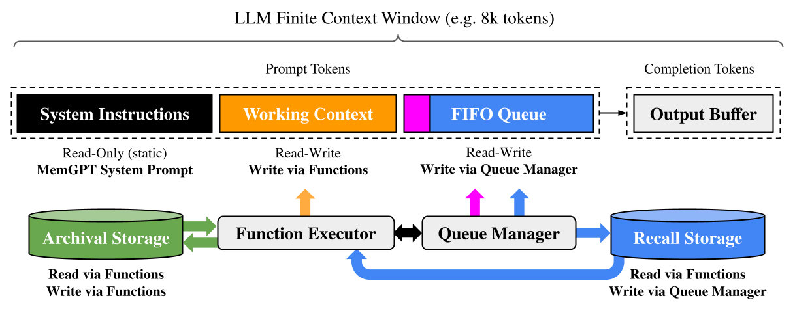
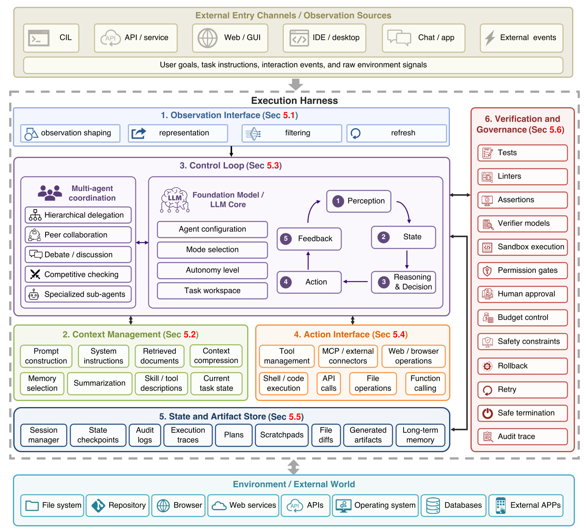
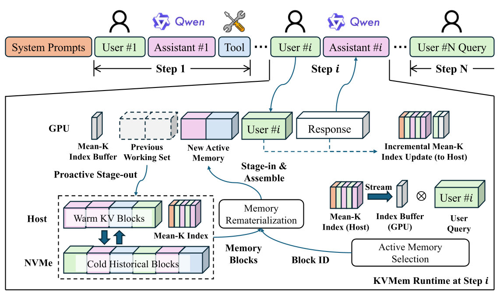
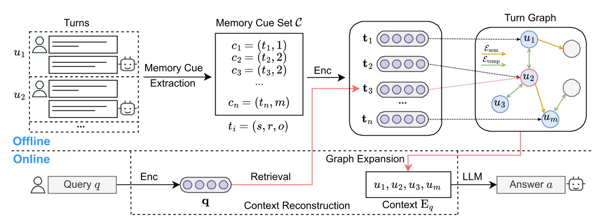
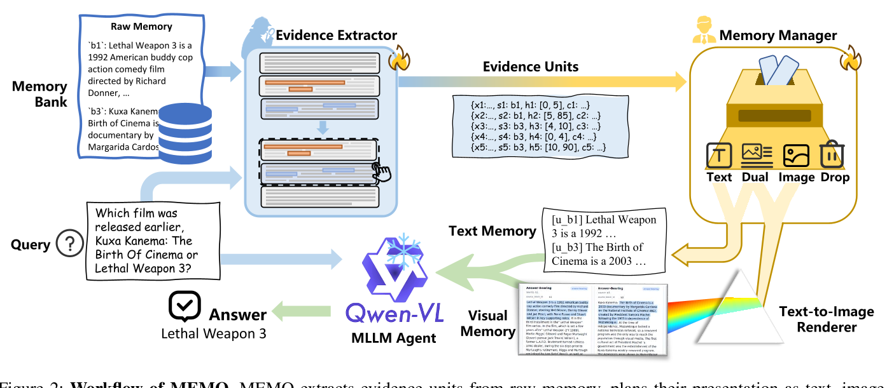
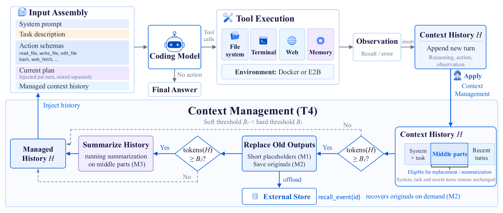

[TOC]

# 智能体上下文管理调研

> **调研背景**: LLM 智能体在长时程任务中会持续累积观察、工具输出、检索证据与记忆记录，而模型的原生上下文窗口是固定且有界的。本调研梳理近三年该方向的代表性方法，重点比较它们在"压缩什么、记忆存在哪里、以什么粒度召回"上的技术路线差异与各自代价。
> **调研范围**: 2023-2026 年，入选论文 6 篇（FULL_TEXT 6 篇，仅摘要来源 0 篇）

**关于详细内容**：每篇论文的四维信息、公式逐字抄录与来源等级保存在
`investigation/智能体上下文管理/analysis/{论文短名}.md`。本文档只做**归纳与对比**，
不复述这些文件的正文——需要细节时请直接查阅对应文件。

---

## 论文清单

| # | 论文 | 年份/会议 | 来源等级 | 一句话定位 | 详细分析 |
| - | ---- | --------- | -------- | ---------- | -------- |
| 1 | MemGPT | 2023（arXiv:2310.08560，会议/期刊 [信息缺失]） | FULL_TEXT | 用 OS 虚拟内存类比把固定窗口 LLM 的上下文分层管理，是"分层记忆 + 自主换页"路线的奠基作 | [analysis/MemGPT.md](../analysis/MemGPT.md) |
| 2 | AgentHarnessSurvey | 2026（arXiv:2606.20683，会议/期刊 [信息缺失]） | FULL_TEXT | 以"模型 + 执行框架"视角把上下文管理定位为 harness 六大运行时职责之一，给出本课题的领域地图 | [analysis/AgentHarnessSurvey.md](../analysis/AgentHarnessSurvey.md) |
| 3 | KVMem | 2026（arXiv:2609.04852，会议/期刊 [信息缺失]） | FULL_TEXT | 把溢出的工作区历史保留为跨 GPU/主机/NVMe 的分页 KV 状态，用 KV 复用替代文本重算，代表长上下文处理路线 | [analysis/KVMem.md](../analysis/KVMem.md) |
| 4 | CueMem | 2026（arXiv:2609.12354，会议/期刊 [信息缺失]） | FULL_TEXT | 把抽取的记忆当作检索线索而非自足证据，回到源轮次重建对话证据，代表"压缩后重建"路线 | [analysis/CueMem.md](../analysis/CueMem.md) |
| 5 | MEMO | 2026（arXiv:2609.07471，会议/期刊 [信息缺失]） | FULL_TEXT | 把记忆读出重构为证据单元粒度的多模态组织，在预算内联合决定保留什么与以何种模态呈现 | [analysis/MEMO.md](../analysis/MEMO.md) |
| 6 | HarnessDesign | 2026（arXiv:2609.20804，会议/期刊 [信息缺失]） | FULL_TEXT | 对编码智能体的上下文管理策略做跨 4 模型、4 档预算的受控消融，给出"何时上下文管理才值得"的实证边界 | [analysis/HarnessDesign.md](../analysis/HarnessDesign.md) |

---

# 1. 逐篇定位

## 1.1 MemGPT

针对固定上下文窗口无法支撑长对话与长文档推理的问题，MemGPT 提出 **virtual context management**：把 LLM 的 prompt tokens 视作受限的"主上下文"，把窗口之外的信息视作"外部上下文"，通过函数调用让模型自主在两者之间换页，从而制造"无限上下文"的错觉。它是本课题中"**分层记忆 + 自主换页**"路线的奠基作，其 OS 类比也被后续工作（如 KVMem）沿用。

> 图注原文：Figure 3. In MemGPT, a fixed-context LLM processor is augmented with a hierarchical memory system and functions that let it manage its own memory.

## 1.2 AgentHarnessSurvey

这篇综述不提出新方法，而是主张用 **model–harness lens** 重审智能体领域：把 agent 写成 $\langle M,H\rangle$，并把执行框架 $H$ 分解为 observation interface、context manager、control loop、action interface、state and artifact store、verification and governance layer 六个耦合的运行时职责。它在本课题中的位置是**领域地图**——把上下文管理明确为"决定哪些信息进入当前模型调用、以何种形式进入"的独立职责，并给出任务压力到框架配置的映射。

> 图注原文：Fig. 3: Implementation view of an LLM-based agent as a foundation model coupled with an execution harness.

## 1.3 KVMem

KVMem 关注以文本为中心的溢出处理所导致的 **fidelity–efficiency problem**：compaction 必须在未来步骤揭示相关性之前就决定保留什么，而文本式召回又必须重新 prefill 才能重建可用状态。它的做法是把溢出的工作区历史保留为跨 GPU 内存、主机内存与 NVMe 的**分页 KV 状态**，按 agent step 检索相关块并物化一个有界的执行视图。它是本课题中**长上下文处理**路线的代表，也是唯一把"可复用 KV 计算"本身当作管理对象的一篇。

> 图注原文：Figure 1: Overview of KVMEM's three core designs.

## 1.4 CueMem

CueMem 指出，把检索到的记忆单元当作可直接用于生成的 **self-contained evidence** 会丢失细粒度细节与局部语境，且把多个事实合并进同一单元会让向量索引中的语义信号互相纠缠。它的解法是把抽取的三元组当作**检索线索**，每条线索带指针指回源轮次，查询时线索映射为锚点、再在轮次级图上做一跳扩展重建证据上下文。它是本课题中"**压缩后重建**"路线的代表，与"压缩后直接使用"形成直接对照。

> 图注原文：Figure 2: Overview of CueMem.

## 1.5 MEMO

MEMO 关注长时程智能体的 **memory readout**：在给定 query、候选记忆与上下文预算下，选出必要证据并决定其呈现模态。它把记忆管理的最小对象定义为 **evidence unit**（携带 source、key span 与 priority rule 的可追溯条目），并用两个可训练组件——证据抽取器与记忆管理器——在共享预算下联合决定保留什么、以 text/image/dual/drop 哪种形式呈现。它是本课题中唯一**同时处理内容选择与呈现模态**的一篇，也是少数需要训练的方法。

> 图注原文：Figure 2: Workflow of MEMO.

## 1.6 HarnessDesign

这篇实证研究质疑"整体式评估 harness"的做法，指出完整 harness 之间的比较会混淆多个机制，无法判断增益来自规划、工具设计还是上下文管理。它构建执行循环固定、仅变动 planning / action space / context management 三个组件的轻量 harness，在 4 个模型、2 个长时程编码基准、4 档上下文预算上做 176 个匹配设置。它在本课题中的位置是**对上下文管理的批判性检验**：给出"上下文管理在预算紧张时才最有价值"这一条件性结论。

> 图注原文：Figure 2 Overview of the coding harness. Top: the ReAct loop... Bottom: the T4 strategy.

---

# 2. 对比分析

## 2.1 方法框架对比

六篇在"上下文/记忆被当作什么"这一点上分成三类：**运行时职责**（AgentHarnessSurvey）、**分层存储介质**（MemGPT、KVMem）、**可组织的证据集合**（CueMem、MEMO），HarnessDesign 则是策略组合的消融矩阵。

| 对比维度 | MemGPT | AgentHarnessSurvey | KVMem | CueMem | MEMO | HarnessDesign |
| -------- | ------ | ------------------ | ----- | ------ | ---- | ------------- |
| 框架定位 | OS 启发的多层记忆系统 | 综述：agent = model + harness 的六元组分解 | KV 上下文虚拟化系统 | cue → anchor → context 重建流水线 | 证据单元粒度的记忆组织 | 组件级归因的受控消融 |
| 模块划分 | Main context（system instructions / working context / FIFO queue）+ Queue Manager + Function Executor | $I_{obs}$ + $C$ + $L$ + $I_{act}$ + $S$ + $V$ | Step-Level Memory Scheduling + Query-Conditioned KV Retrieval + Tiered KV Management | Memory Cue Extraction + Turn Graph Construction + Context Reconstruction（+ 轻量 Memory Management） | Query-Conditioned Evidence Extraction + Memory Manager + Working Memory Building | Planning + Action Space + Context Management（T0–T4 五档策略） |
| 被管理的对象 | prompt tokens 与外部文本存储 | 观察、工具输出、检索证据、memory records、摘要、任务产物 | 历史工作区的 KV 状态（逻辑块） | 对话轮次、线索三元组、轮次图边 | evidence units（含 key span 与 source link） | 交互历史 $H$ 的 middle region |
| 数据流方向 | 事件触发推理 → 函数调用在主/外部上下文间搬数据 | 观察经 $I_{obs}$ 进入，$C$ 选择组装，$S$ 回喂 $C$ 与 $V$ | prefill 收集信号 → 每步选工作集 → 差量搬 KV → 组装执行视图 → decode | 离线抽线索建图 → 在线检索线索 → 映射锚点 → 图上扩展 → 重建上下文 | $q,R,B$ → 抽取单元 → 记忆计划 → 构建工作记忆 → frozen reader | 每轮组装输入 → 执行工具 → 观察追加 $H$ → 按阈值压缩 |
| 管理的触发时机 | token 阈值（warning / flush）触发 | 每步由 $C$ 决定 inclusion / representation / refresh | 每个 agent step 更新一次，prefill 后 decode 前 | 查询时在线重建 | 每次 reader 调用前 | 每轮，跨软阈值 $B_1$ 与硬阈值 $B_2$ |
| 是否需要改动底层模型 | 否 | 不适用（综述） | 是（需端到端控制 KV 分配与位置恢复） | 否 | 否（reader 冻结，但训练旁路组件） | 否 |

**关键分野**：MemGPT、CueMem、HarnessDesign 都在**文本/token 层面**管理上下文，模型可视为黑盒；KVMem 则下沉到 **KV 状态层面**，代价是必须端到端控制推理引擎，作者明确说明其实现"cannot be transparently layered over black-box LLM APIs"。MEMO 走的是第三条路：不改模型也不改引擎，但训练两个旁路组件来学习"如何组织"。

## 2.2 关键机制对比

| 论文 | 核心机制 | 解决什么 | 代价 / 边界 |
| ---- | -------- | -------- | ----------- |
| MemGPT | 分层记忆 + 函数调用换页；队列逐出时用「已有递归摘要 + 被逐出消息」生成新递归摘要 | 固定窗口下的无限上下文错觉 | 依赖模型自身的 function calling 与指令跟随能力；摘要必然有损 |
| AgentHarnessSurvey | 把 context 视为动态组装对象 $C = A(c_1,\dots,c_n)$，工程问题转为优化组装函数 | 解释"为何同模型在不同运行时表现差异巨大" | 属分析性框架，不提供可直接部署的机制 |
| KVMem | 保留位置无关 raw K 作为重建权威，用 Mean-K 块级索引检索，re-RoPE 恢复位置一致性 | 文本召回必须重复 prefill；有损 compaction 丢失未来相关证据 | KV 状态远大于文本，以牺牲后备存储容量换取可复用模型状态；KV 复用与按新上下文重算文本在数学上不等价 |
| CueMem | 线索（三元组 + 源轮次指针）作为检索目标；线索级语义边 + 时间边做图扩展 | 压缩记忆丢失细粒度证据；单元内语义信号纠缠 | 需要离线建图；证据仍受一跳图邻域限制 |
| MEMO | evidence unit 粒度上联合决定内容选择与呈现模态；用离线 frozen reader 的反事实结果做监督标签 | 文本记忆单位成本近乎均一；单一模态无法兼顾保真、结构与效率 | 需要训练两个组件；呈现决策受共享预算硬约束 |
| HarnessDesign | 分档组合 elision / recall / summarization，隔离每个机制的贡献 | 整体式评估无法归因单个组件的效果 | 结论是对特定 harness 实现的条件效应估计，非普适最优 |

**机制层面的共同收敛点**：MemGPT 的队列逐出、CueMem 的线索压缩、MEMO 的 unit 抽取、HarnessDesign 的 elision 与 summarization，本质上都在回答同一个问题——**在还不知道未来什么会重要的时候，决定丢掉什么**。KVMem 用不可区分性论证把这一困境形式化：由于 compaction 有损，存在 $H_1 \neq H_2$ 使 $C(H_1) = C(H_2)$，因此在压缩时无从保证保留未来所需的全部信息。它给出的出路不是"压缩得更聪明"，而是**不丢弃可复用的 KV 计算**。

**两条对立的应对策略**：

- **可逆化**：HarnessDesign 的 M2（recall）把被 elide 的观测外存并暴露 `recall_event` 工具读回，使压缩可逆。但实证显示这条路收益有限——64 个 T2/T4 设置中有 36 个（56.3%）从未调用 `recall_event`。
- **重建化**：CueMem 不追求保留原文，而是保留**指针**，用时回到源轮次重建。消融显示关闭图扩展后 LoCoMo 整体准确率从 81.1% 降到 71.4%，说明"锚点轮次本身常不足以提供证据"。

**粒度上的分歧**：MEMO 明确反对 passage / chunk 级抽取，认为其"often too coarse-grained to directly support fine-grained memory management"，因而下沉到字符级 key span；CueMem 则停在关系三元组粒度，靠图扩展补回语境。前者用更细的粒度换预算效率，后者用更粗的粒度换构图与检索的简洁。

> 机制细节与逐字抄录的公式见各篇 analysis 文件的"关键机制与创新点"一节，本文档不重复。

## 2.3 训练目标对比

| 论文 | 是否训练 | 训练什么 | 阶段划分 | 与预训练目标的关系 |
| ---- | -------- | -------- | -------- | ------------------ |
| MemGPT | **否** | 无新增训练参数 | — | 复用 LLM 已有的 function calling 与指令跟随能力 |
| AgentHarnessSurvey | **否**（综述） | 不训练任何模块，无自身损失函数 | — | 文中式 (4) 是对既有 context 优化目标的综述性回顾；式 (5)–(8) 属评测/部署期与框架演化目标，**均非训练损失** |
| KVMem | **否** | 无新增训练参数 | — | 沿用模型原有自回归生成行为；KV 状态是 prefill 的既有产物 |
| CueMem | **否** | 无新增训练参数；embedding 模型不微调 | — | 完全复用现成 LLM 与 embedding 模型的预训练能力 |
| MEMO | **是** | Evidence Extractor（全参数 SFT）+ Memory Manager（SFT） | 两个组件各自单阶段 SFT | 两个目标均为标准自回归负对数似然，属预训练 LLM 之上的任务特定 SFT |
| HarnessDesign | **否** | 无新增训练参数 | — | 纯实证研究；文中 "summarization" 是推理期压缩操作，不是训练监督信号 |

**必须区分的两处易混点**：

1. **HarnessDesign 的 summarization 不是训练目标**。它由对同一被测模型的一次单独的、无工具的调用生成，属推理期上下文压缩操作；软/硬阈值 $B_1$、$B_2$（可用窗口的 0.6 / 0.85）与 `recall_event` 同样是推理期工程约束。
2. **AgentHarnessSurvey 的式 (5)–(8) 不是训练损失**。式 (5)–(7) 是作者建议未来评测采用的部署期价值感知目标（含成本、延迟、风险、可靠性约束），式 (8) 是框架侧演化的可验证更新规则；论文没有给出任何训练损失表达式。

**training-free 阵营的共同替代物**：MemGPT 靠 prompt 中的 system instructions 与 function schema；KVMem 靠推理期 KV 调度策略；CueMem 靠纯相似度检索与图操作；HarnessDesign 靠手工工程规则。四者都不改模型权重。MEMO 是唯一需要训练的例外，其监督信号也非人工标注，而来自**离线 frozen reader 的反事实评估结果**（答案质量 + 记忆用量）。

## 2.4 对比汇总表

| 论文 | 作者主要想解决的问题 | 方法框架 | 关键机制 | 是否 Training-free |
| ---- | -------------------- | -------- | -------- | ------------------ |
| MemGPT | 固定窗口 LLM 无法支撑长上下文 | Main context + Queue Manager + Function Executor | 分层记忆 + 函数调用换页，逐出时生成递归摘要 | 是 |
| AgentHarnessSurvey | 领域缺少解释 harness 差异的分析框架 | $I_{obs}$ + $C$ + $L$ + $I_{act}$ + $S$ + $V$ | 把 context 视为动态组装对象，优化组装函数 | 是（综述，无训练） |
| KVMem | 文本式溢出处理丢弃可复用 KV 且需重复 prefill | Step-Level Scheduling + Query-Conditioned Retrieval + Tiered KV Management | 保留位置无关 raw K，Mean-K 索引检索后 re-RoPE 恢复 | 是 |
| CueMem | 记忆单元作为自足证据会丢失细粒度语境 | Cue Extraction + Turn Graph + Context Reconstruction | 线索当检索目标，映射锚点后在轮次图上扩展重建 | 是 |
| MEMO | 记忆读出未同时决定内容与呈现模态 | Evidence Extraction + Memory Manager + Working Memory Building | evidence unit 粒度联合选择内容与 text/image/dual/drop | 否 |
| HarnessDesign | 整体式评估无法归因单个 harness 组件 | Planning + Action Space + Context Management（T0–T4） | 分档组合 elision / recall / summarization 做受控消融 | 是 |

---

# 3. 结论与开放问题

**共识**：六篇都认同上下文管理的核心困难是**在相关性尚未揭示时决定保留什么**。AgentHarnessSurvey 把这一困难表述为 fidelity 与 manageability 的权衡，并指出"the crucial distinction is not between long and short prompts, but between monolithic and managed context"；KVMem 用不可区分性论证把同一困难形式化。差别只在于把管理动作放在哪一层：token 层（MemGPT、CueMem、HarnessDesign）、KV 层（KVMem），还是证据单元层（MEMO）。

**分歧**：

1. **压缩是否应当可逆**。HarnessDesign 的实证给出了偏否定的答案——让被 elide 的内容可恢复"adds machinery that models rarely use and yields no accuracy gain"，56.3% 的设置从未调用 `recall_event`；而 CueMem 的消融显示回到源轮次重建是必要的（关闭图扩展后准确率降 9.7 个百分点）。两者的差别可能在于"读回"是被动工具调用还是被动的自动重建，但**目前没有第三方实验把两者放在同一基准下比较**。
2. **管理动作该不该被学习**。MEMO 训练旁路组件来学"如何组织"，其余五篇均 training-free。MEMO 的消融显示两个组件都开启时 EM 从 47.49 升到 57.78，说明学习确有收益；但 HarnessDesign 又表明手工规则的 elision 在成本上最优。**"学到的管理"与"手工的管理"的边界尚不清楚**。
3. **上下文管理的价值边界**。HarnessDesign 给出了目前最明确的量化边界：managed tiers 相对 T0 的成功率差随预算从 32k 放宽到 128k 而递减（SWE-Bench 上 35.7 → 2.7 个百分点），且收益主要来自避免窗口溢出。这意味着**当预算充裕时，上下文管理的边际价值趋于零**。

**尚未解决的问题**：

1. **保真度与成本的联合刻画**。AgentHarnessSurvey 把"如何在保持 summary faithfulness 与 state integrity 的同时把 context cost 控制在界内"列为关键开放问题，尤其是当 context repair 必须与 long-horizon 设置下的 verification、recovery 互动时。
2. **多模态记忆的评测口径**。MEMO 是唯一处理呈现模态的一篇，其结论建立在四个 benchmark 与三个 frozen reader 之上；模态选择在更广任务上的泛化性缺乏独立验证。
3. **KV 层的可移植性**。KVMem 的收益以端到端控制推理引擎为前提，其作者自述当前实现无法透明叠加在黑盒 LLM API 之上，多用户并发服务列为未来工作——这条路线能否在工程上普及仍是开放问题。
4. **上下文管理与验证/恢复的耦合**。AgentHarnessSurvey 指出 harness design 是耦合系统问题，"stronger compression can reduce cost while weakening downstream verification"；目前没有一篇被调研论文把压缩策略与验证/回滚机制联合优化。

---

# 参考文献

> 以下 6 篇均为 arXiv 预印本；摘要页未标注已接收的会议/期刊，正式发表信息标为 `[信息缺失]`，原样保留，未编造。

1. Charles Packer, Sarah Wooders, Kevin Lin, Vivian Fang, Shishir G. Patil, Ion Stoica, Joseph E. Gonzalez. *MemGPT: Towards LLMs as Operating Systems.* arXiv preprint arXiv:2310.08560 (cs.AI), 2023 (v1), 2024 (v2). https://arxiv.org/abs/2310.08560 —— 来源等级：FULL_TEXT
2. Jianyuan Guo, Zhiwei Hao, Chengcheng Wang, Cheng Fan, Tingzhang Luo, Hongguang Li, Ying Gao, Hefei Mei, Jiankun Peng, Rongjian Xu, Minjing Dong, Han Wu, Mengyu Zheng, Kai Han, Shiqi Wang, Chang Xu, Yunhe Wang. *From Question Answering to Task Completion: A Survey on Agent System and Harness Design.* arXiv preprint arXiv:2606.20683 (cs.AI; cs.CL), 2026. https://arxiv.org/abs/2606.20683 —— 来源等级：FULL_TEXT
3. Di Chai, Leye Wang, Zeshen Su, Zhiguo Xia, Zhihang Yu. *KVMem: Virtualizing Million-Token Agent Workspaces on a Consumer GPU.* arXiv preprint arXiv:2609.04852 (cs.LG), 2026. https://arxiv.org/abs/2609.04852 —— 来源等级：FULL_TEXT
4. Changjian Wang, Rongzhen Li, Weili Guan, Shuming Shi, Quan Lu, Ning Jiang. *CueMem: Cue-Guided Context Reconstruction for Long-Term Conversational Memory.* arXiv preprint arXiv:2609.12354 (cs.CL), 2026. https://arxiv.org/abs/2609.12354 —— 来源等级：FULL_TEXT
5. Xian Gao, Jinpeng Wang, Jiacheng Ruan, Guangyu Cao, Ting Liu, Yuzhuo Fu. *MEMO: Multimodal Evidence Memory Organization for Long-Horizon LLM Agents.* arXiv preprint arXiv:2609.07471 (cs.CL), 2026. https://arxiv.org/abs/2609.07471 —— 来源等级：FULL_TEXT
6. Run-Ze Fan, Zihao Zhang, Simin Ma, Yebowen Hu, Shouju Wang, Kaiqiang Song, Fei Liu, Hamed Zamani, Xiaoyang Wang. *An Empirical Study of Harness Design for Coding Agents.* arXiv preprint arXiv:2609.20804 (cs.AI), 2026. https://arxiv.org/abs/2609.20804 —— 来源等级：FULL_TEXT
