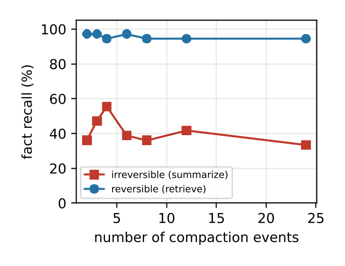

# MemoryCompactionSurvey

> 来源等级：FULL_TEXT
> 一句话定位：用统一的率–失真（rate–distortion）视角把 KV 缓存、提示词、架构状态与智能体记忆四类压缩统一为一个问题，并提出七轴分类法与 COMPACT-Bench 评测协议。
> 生成时间：2026-09-19 19:39:23

---

## 1. 论文概要与作者意图

**英文全称**：What to Keep, What to Forget: A Rate–Distortion View of Memory Compaction in LLMs and Agents
**通用缩写**：论文未自报缩写，短名为 MemoryCompactionSurvey
**作者**：Ashwin Gerard Colaco、Nada Lahjouji（University of California, Irvine）
**年份与发表信息**：arXiv:2607.08032v1 [cs.LG]，2026 年 7 月 9 日；正文未标注具体会议/期刊（arXiv 预印本）。CCS Concepts 归入 NLP、机器学习与信息检索。

**核心问题**：这篇综述关注的是 **memory compaction（记忆压缩）**——即 LLM 与智能体在"记住"上花费的算力与内存不断增长时，如何决定**保留什么上下文派生信息、丢弃什么、以什么保真度保留、在什么资源预算下保留**。作者主张，KV 缓存压缩、提示词/上下文压缩、架构状态压缩、智能体记忆压缩这四条彼此几乎不往来的研究线，其实是**同一个率–失真（rate–distortion）决策**的不同外衣。

作者指出的现有方法/文献不足：

- **四类社区彼此隔绝（"little contact between them"）**：KV 缓存、提示词、架构、智能体记忆各有自己的 benchmark 与成功标准（固定困惑度下的压缩比、固定准确率下省下的 token、固定状态大小下的召回），"a method from one line seldom cites a method from another"。
- **重要性启发式是系统性地有偏的替代量（biased surrogate）**：几乎所有方法都用注意力大小或近因性（recency）作为"丢掉这个会损失多少"的代理，这一代理**在查询已知之前就做出决定、且无法撤销**，因此"迟早会丢掉查询需要的东西"。
- **度量缺口（measurement gap）**：压缩只在单轮长上下文任务上被仔细测量，而智能体实际反复执行的**重复压缩（repeated compaction）几乎从未被测量**；且没有任何 benchmark 能在所有层上共享同一条预算轴。
- **理论缺口**：现有下界是worst-case 或机制性的，无法预测实践中 80–93% 的 KV 缩减与约 20× 的提示词压缩；"what the theory still owes us is a predictive compression scaling law"。

作者的核心意图与主张：

> We argue that these are instances of one problem: a rate–distortion decision about what context-derived information to retain versus discard, at what fidelity, under a resource budget, so as to preserve downstream task utility.

> Two patterns hold across the survey. At every layer the signal that decides what to keep is attention magnitude or recency, and it fails in the same way everywhere, by discarding, before the query is known and with no way to undo it, information the query later needs.

论文自报六项贡献：把记忆压缩形式化为一个率–失真问题并给出**层无关下界（Eq. 2）**；提出**七轴分类法**与主表；按形式化逐层综述（KV §4、提示词 §5、架构 §6、智能体 §7，以及 §8 可训练稀疏注意力、§9 多模态/多智能体）；显式搭建 **inference↔agent-memory 桥梁**（§10）并导出五条压缩感知设计原则；提出并小规模运行 **COMPACT-Bench**（§13–14）；汇总开放问题优先级议程（§15）。

## 2. 方法框架

这是一篇**综述/立场论文**，其"方法框架"即它提出的统一形式化与分类体系，而非一个可训练的模型。整体框架可拆为三个关键部件：

1. **统一形式化（A Unified Formalism for Compaction，§2）**
   - 输入：模型在某一生成时刻可动用的全部历史 $H$（prompt token 及其激活、KV 缓存、循环状态、此前轮次/会话的记忆）。
   - 输出：一个满足预算的紧凑表示 $Z$，以及由此产生的输出 $Y$。
   - 功能：把任一层的压缩方法写成一对算子 $(C_\theta, U)$——压缩算子 $C_\theta: H \mapsto Z$ 与使用算子 $U$；并把设计问题写成一个受速率约束的期望损失最小化（Eq. 1）。
   - 关键产物：层无关下界 Eq. (2)，以及由它推出的三条推论（见 §3）。
2. **七轴分类法（A Seven-Axis Taxonomy，§3）**
   - 输入：来自四层的约七十个方法（附录 A 给出逐方法分类）。
   - 输出：每个方法在七个近正交轴上的一个点：粒度、生命周期阶段、有损性/保真度、查询/任务自适应、可学习性、机制、存储基底。
   - 功能：使跨层方法可被统一比较；作者指出真正区分层的是其中三轴——**粒度、生命周期阶段、以及保留决策是否查询条件化**。
3. **COMPACT-Bench 评测协议（§13）与参考实验（§14）**
   - 输入：SCBench 与 KVPress 的任务语料与 KV 测试框架（论文明确说这是**扩展而非替代**）。
   - 输出：一条共享的 **bytes-per-token-of-history（BPT）** 预算轴，以及三个任务族（loss attribution、reversibility、calibrated compaction confidence）。
   - 功能：让 KV 驱逐、量化、提示词压缩与摘要落在同一张 accuracy-versus-budget 前沿图上，并测量重复压缩下的误差累积。

贯穿全文的两条主线：**可逆性（reversibility）通常比任何打分技巧更重要**；以及**度量缺口**——智能体反复压缩同一记忆，而几乎没人测量这重复的代价。

框架图说明：论文的 Fig. 1（survey map，p.2）、Fig. 2（rate–distortion view，p.3）、Fig. 3（lifecycle，p.4）、Fig. 4（memory hierarchy，p.14）在本 PDF 中**取不到可定位的图像区域**（`listPaperFigures` 仅索引到 Fig. 5 与 Fig. 6）。按降级写法：

图见原文 Fig. 1（p.2）：Map of the survey。
图见原文 Fig. 2（p.3）：The rate–distortion view of Section 2。
图见原文 Fig. 3（p.4）：Where compaction acts across the model and agent lifecycle。
图见原文 Fig. 4（p.14）：The memory hierarchy of Section 10。

论文中可提取的图为其两个实验图，其一（Fig. 5，BPT 预算轴上的 accuracy–budget 前沿）正是"统一预算轴"这一方法主张的直接体现：

> 图注原文：Figure 5: The accuracy–budget frontier on natural-filler needle retrieval with Qwen2.5-1.5B, six KV-compaction methods on one bytes-per-token-of-history axis. Accuracy collapses once the budget falls below the task's information content, and the random-eviction control isolates the value each scorer adds.
> 文档引用：../analysis/figures/MemoryCompactionSurvey_Fig5.png

## 3. 关键机制与创新点

### 统一的压缩目标（Eq. 1）

论文把压缩方案定义为算子对 $(C_\theta, U)$：$C_\theta: H \mapsto Z$ 产生满足 $\text{rate}(Z) \le B$ 的紧凑表示，$U$ 消费 $Z$（几乎总是继续模型计算）以产生输出 $Y$。设计问题是：

$$
\min_\theta \ \underbrace{\mathbb{E}_{(H,Q,Y)} \Big[ \ell\big( U\big(C_\theta(H), Q\big), Y \big) \Big]}_{D(\theta) = \text{distortion}} \quad \text{s.t.} \ \text{rate}(Z) \le B. \tag{1}
$$

其中：

- $H$ 是模型在该时刻可动用的全部历史（prompt token 与激活、KV 缓存、循环状态、先前轮次记忆）；
- $Z$ 是压缩后的紧凑表示，$B$ 是其预算；
- $\text{rate}(\cdot)$ 以**与层相称的货币**度量内存（KV 缓存用 GPU 字节、prompt 用 token、循环模型用状态维度、智能体用 store 大小）；
- $U$ 是使用算子，$Q$ 是查询、$Y$ 是目标；
- $\ell$ 是任务损失，$D(\theta)$ 即期望失真。

其信息瓶颈形式为：在 $\mathrm{I}(Z;H) \le B$ 约束下最大化 $\mathrm{I}(Z;Y \mid Q)$——"keep the bits of the history that predict the answer, spend nothing on the rest."

### 层无关下界（Eq. 2）

令 $I^\star(Q) = \mathrm{I}(Y;H \mid Q)$ 为任务条件信息量（回答 $Q$ 真正需要的 $H$ 的比特数）。因为 $Y = U(Z,Q)$ 是 $(Z,Q)$ 的函数，且对查询无关的 $C$，链 $Y - H - Z$ 在给定 $Q$ 下是 Markov 的，数据处理不等式给出 $\mathrm{I}(Y;\hat{Y} \mid Q) \le \min(I^\star(Q), B)$。Fano 不等式由此界定错误概率 $P_e = \Pr[\hat{Y} \ne Y]$：

$$
P_e \ge \frac{H(Y \mid Q) - B - 1}{\log |\mathcal{Y}|}, \quad \text{whenever } B < I^\star(Q). \tag{2}
$$

其中：

- $P_e = \Pr[\hat{Y} \ne Y]$ 是答案空间 $\mathcal{Y}$ 上的错误概率；
- $H(Y \mid Q)$ 是给定查询下答案的条件熵；
- $B$ 是速率预算；
- $I^\star(Q) = \mathrm{I}(Y;H \mid Q)$ 是任务条件信息量；
- $|\mathcal{Y}|$ 是答案空间大小。

该下界对任何紧凑记忆 $Z$ 都成立——无论 KV 缓存、gist 向量、循环状态还是智能体的笔记库，这正是它能统一整个领域的原因。三条直接推论：

- **(i)** 在任务信息需求 $I^\star(Q)$ 之下，**每一层都必须出错**，且错误率由同一表达式支配，不存在架构特有的逃逸路径。
- **(ii)** 固定质量下可达的压缩比是**任务相关的**，$\propto 1/I^\star(Q)$：答案携带很多比特的任务（精确检索、多跳检索）难以压缩，低熵答案的任务（分类、冗余散文的 gisting）容易压缩。
- **(iii)** 查询无关的算子必须把预算摊到整个查询分布上，其**有效每查询预算约为 $B - H(Q)$**；而查询条件化的算子可以把全部 $B$ 花在与答案相关的比特上。差距 $H(Q)$ 就是"不知道查询"的精确代价。

作者指出，精确注意力内存的 $\Theta(nd)$ 下界与固定状态无法做精确 in-context 检索的不可能性，都是这一图景的特例。

### 三个一等属性（P-rev / P-q / P-fid）

作者把式 (1) 隐含、但决定成败的三个属性提升为综述的中心：

- **(P-rev) Reversibility（可逆性）**：被 $C$ 丢弃的内容，若后续查询需要，能否被重新导出？检索支撑与归档方案可以；驱逐与摘要不能。
- **(P-q) Query-conditioning（查询条件化）**：$C$ 在决定保留什么时，是否看到查询（或其分布）？离线 gisting 看不到；LongLLMLingua 与 Quest 看得到。
- **(P-fid) Fidelity profile（保真度剖面）**：表示是无损、近无损、均匀有损，还是多保真（小的高保真层 + 大的有损层）？

### 重要性启发式＝失真替代量（distortion surrogate）

作者的关键论证是：没有方法能直接评估 $D$，因为压缩时 $Y$ 未知；每个方法都挑了一个廉价的替代量。透过式 (1) 看，领域内看似无关的启发式其实都是**同一个量的估计器**：累积注意力质量（H2O、SnapKV）、token 自信息或困惑度（LLMLingua）、显式互信息估计（QUITO-X）、诱导输出误差的界（Ada-KV）、以及 LLM 自身的显著性判断（Mem0、reflection）。把它们命名为同一个量的估计器，正是它们可比较、可跨层迁移的原因。

### 四条可证伪预测

下界蕴含：违反 (P-rev) + (P-q) 会在每一层产生相同的失败，且带层特有的、可检验的特征。

1. **KV**：对注意力分数驱逐，一旦每 token 预算低于 needle 在注意力质量中的占比，needle 召回即崩塌，崩塌点随答案位置的熵变化，在 mid-context 更差。
2. **Prompt**：查询感知压缩把任务效用奖励曲线向查询无关压缩的右侧平移，平移量恰为互信息差。
3. **Architectural**：$s$ 比特的状态无法回答需要超过 $s$ 比特的查询，故状态空间/线性注意力模型在多键召回上出现硬性精度悬崖，键数与状态大小成正比，而注意力平滑退化。
4. **Agent**：在重复的不可逆摘要下，端任务误差随压缩事件数**超线性增长**，而可逆、检索支撑的记忆保持平坦。

作者在 §14 直接检验了 (1) 与 (4)。

### 参考实验：重复压缩下的可逆 vs 不可逆（Fig. 6）

第二个实验（§14.2）让智能体分块读入长文档、累积十二个散布的键值事实并周期性压缩工作记忆，比较不可逆算子（用 LLM 生成的摘要覆盖工作记忆）与可逆算子（把所有 chunk 存入归档、查询时检索相关 chunk）。结果显示：可逆算子在任何压缩频率下召回都保持在约 0.95，不可逆算子则在 0.33–0.56 之间，且在最高压缩频率下最弱。作者据此论证：

> Two operators at the same average budget therefore part by roughly 0.5 in recall once memory is reused over a horizon, even though a single-turn needle test cannot tell them apart. This is what it means in practice to say that at equal budget, reversible compaction dominates.

> 图注原文：Figure 6: Fact recall against the number of compaction events for an irreversible (summarize) and a reversible (retrieve) operator. Reversible memory stays near 0.95; irreversible memory loses roughly half its facts at every frequency. The two look identical under single-turn evaluation and diverge only when compaction repeats.
> 文档引用：../analysis/figures/MemoryCompactionSurvey_Fig6.png

## 4. 训练目标

**这是一篇综述，不训练任何模型，因此没有新的训练目标。** 论文中出现的"目标"是两类，需与训练监督信号严格区分：

- **式 (1) 的率–失真优化目标**：它是作者用来**统一描述**所有层压缩方法的分析性框架（一个设计问题），不是被优化的训练损失。论文中没有任何实验在最小化式 (1)。
- **被综述方法的训练目标（回顾性质）**：论文在描述具体方法时提到它们的训练信号，例如 gisting 在指令微调时用受限注意力掩码训练 LLM、AutoCompressor 递归摘要、ICAE 用 LoRA 适配的 LLM 作编码器、KV-Distill 以 KL 目标做 student-teacher 蒸馏、TACO-RL 用强化学习针对任务特定奖励训练分类器、Context-Folding 用 FoldGRPO 端到端训练、ReSum-GRPO 训练智能体从摘要中流畅推理。这些均为**被引用方法自身的目标**，不是本综述提出的训练目标。

**训练策略层面**：论文沿"可学习性"轴区分 training-free 启发式、后训练适配器、从零训练的架构、RL 学到的策略、以及不改权重的 LLM-as-controller。它明确把 §4 的 KV 缓存方法归为"training-free heuristics that fix a compaction operator $C$ after the model is trained, then ask the frozen weights to tolerate it"，而把 §8 的可训练稀疏注意力（NSA、MoBA、DSA）归为让 $C$ 本身可学习、与权重协同适应。

**推理期约束与训练目标的区分**：论文强调的 (P-rev)、(P-q)、(P-fid) 都是**推理/设计期属性**，不是训练监督信号。Ada-KV 的输出误差界被作者当作"驱逐后注意力输出误差的界"来推导预算分配，并进一步被提议用作**智能体摘要的停止规则**——这同样是推理期约束，而非训练目标。COMPACT-Bench 的三个任务族（loss attribution、reversibility、calibrated compaction confidence）也都是**评测协议**，不是训练目标。

**参考实验的设置**：单张消费级 GPU（NVIDIA RTX 4060，8GB），模型 Qwen2.5-1.5B-Instruct。作者明确声明"we are not chasing state of the art here; we want to demonstrate the methodology the survey advocates"，绝对数值只应读作方法学示例而非排行榜。

## 5. 可引用原句（供 blockquote）

- "We argue that these are instances of one problem: a rate–distortion decision about what context-derived information to retain versus discard, at what fidelity, under a resource budget, so as to preserve downstream task utility."
- "At every layer the signal that decides what to keep is attention magnitude or recency, and it fails in the same way everywhere, by discarding, before the query is known and with no way to undo it, information the query later needs."
- "The bound holds for any compact memory $Z$, whether a KV cache, a gist vector, a recurrent state, or an agent's note store, which is what lets it unify the field."
- "At equal budget, a reversible operator beats an irreversible one: of two methods that keep the same number of bytes, the one that can recover what it dropped wins on the queries that depend on it."
- "The agenda that follows (Section 15) is, in one sentence, to make compaction query-conditioned, reversible, and attributable."
- "This is a survey: it proposes a formalism and a benchmark protocol but does not provide large-scale empirical validation of either."
- "The gap between the lower bounds and observed compressibility is thus the gap between worst-case and data-conditional $I^\star(Q)$, and that gap is not yet characterized."

## 6. 材料限制说明

- 本文件基于 **FULL_TEXT**（已读正文 p.1–21，p.22–24 为参考文献），公式 Eq. (1) 与 Eq. (2) 均逐字对照原文抄录并核对符号上下标与期望下标。
- 论文的 Fig. 1–Fig. 4 在本 PDF 中**取不到图像区域**，已按降级写法记录图号与页码；仅 Fig. 5 与 Fig. 6 可提取。
- 论文的发表会议/期刊信息在正文中未给出 `[材料未提供]`，仅有 arXiv 编号与日期。
- 论文未自报通用缩写 `[材料未提供]`。
