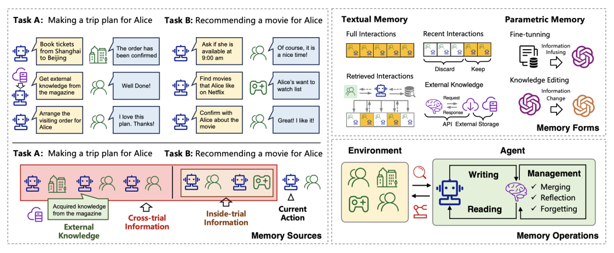
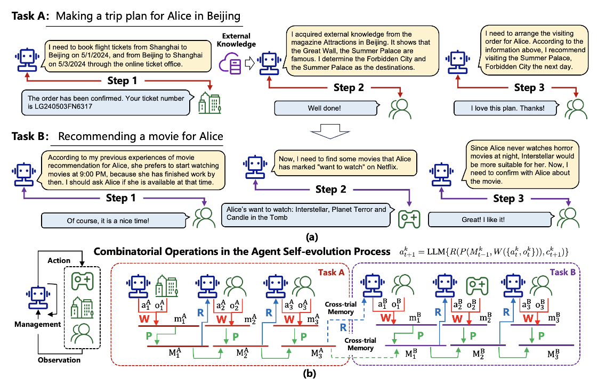

# MemorySurvey

> 来源等级：FULL_TEXT
> 一句话定位：首篇系统综述 LLM 智能体记忆机制，从记忆来源、形式、操作三维度归纳设计范式并梳理评测方法与应用。
> 生成时间：2026-09-19 19:39:14

---

## 1. 论文概要与作者意图

**A Survey on the Memory Mechanism of Large Language Model based Agents**（通用缩写：LLM Agent Memory Survey），Zeyu Zhang、Xiaohe Bo、Chen Ma、Rui Li、Xu Chen 等（中国人民大学高瓴人工智能学院、华为诺亚方舟实验室），Preprint，arXiv:2404.13501v1，2024 年 4 月 21 日（论文页脚标注 "Preprint. Under review."）。附带仓库 https://github.com/nuster1128/LLM_Agent_Memory_Survey 。

本论文关注的是 **LLM-based agent 的 memory 机制**这一核心问题域。作者主张：相比原始 LLM，LLM-based agent 的特征在于其 **self-evolving capability**，而支撑 agent-environment interaction 的关键组件正是 agent 的 memory——"memory is a key component that differentiates the agents from original LLMs, making an agent truly an agent"。

作者指出的现有方法不足：

- **研究散落、缺乏整体视角**：已有工作提出了许多有前景的 memory mechanism，但它们 "are scattered in different papers"，缺乏从 holistic perspective 出发的系统性梳理与比较。
- **未能抽象出通用设计模式**：现有综述没有 "abstract common and effective designing patterns for inspiring future studies"。
- **评测缺乏统一认识**：作者明确指出 "How to effectively evaluate the memory module remains an open problem"，且 "there are no open-sourced benchmarks tailored for the memory modules in LLM-based agents"。

作者的核心意图与主张：

> While previous studies have proposed many promising memory mechanisms, they are scattered in different papers, and there lacks a systematic review to summarize and compare these works from a holistic perspective, failing to abstract common and effective designing patterns for inspiring future studies. To bridge this gap, in this paper, we propose a comprehensive survey on the memory mechanism of LLM-based agents.

作者自述四点贡献：(1) 形式化定义 memory module 并分析其必要性；(2) 系统总结 memory module 的设计与评测研究，给出清晰 taxonomy；(3) 展示典型 agent 应用；(4) 分析关键局限并给出未来方向。作者声称这是 "the first survey on the memory mechanism of LLM-based agents"。

## 2. 方法框架

本文是综述，其"方法框架"即作者提出的**记忆机制统一分析框架**。作者先用形式化定义刻画 agent-environment interaction 的基本概念，再把记忆实现拆为三个正交维度：**memory sources（来源）／memory forms（形式）／memory operations（操作）**，并给出统一的记忆演化函数。

1. **基本概念与记忆定义（Section 3）**
   - 输入：Task $T$、Environment、Trial 与 Step 的交互序列。
   - 输出：narrow definition 与 broad definition 两种记忆定义。
   - 功能：给出后续所有讨论的形式化基础。narrow 定义下记忆只与同一 trial 内的历史信息 $\xi_t$ 相关；broad 定义下记忆来自三类来源：同 trial 历史信息 $\xi_t^k$、跨 trial 历史信息 $\Xi^k$、外部知识 $D_t^k$。

2. **Memory Sources（Section 5.1）**
   - 输入：agent 感知到的原始信息。
   - 输出：三类来源划分——Inside-trial Information（短期记忆）、Cross-trial Information（长期经验）、External Knowledge（外部知识）。
   - 功能：回答"记忆内容从哪来"。作者用 Table 1 统计了 27 个模型对三类来源的采用情况。

3. **Memory Forms（Section 5.2）**
   - 输入：待存储的记忆内容。
   - 输出：Textual Form（complete / recent / retrieved interactions / external knowledge 四种文本记忆）与 Parametric Form（fine-tuning 与 memory editing 两类）。
   - 功能：回答"记忆如何表示"，并从 effectiveness / efficiency / interpretability 三方面对比两种形式的优劣。

4. **Memory Operations（Section 5.3）**
   - 输入：原始观测与已有记忆。
   - 输出：Memory Writing、Memory Management（merging / reflection / forgetting）、Memory Reading 三类操作。
   - 功能：回答"记忆如何被处理"，并给出统一演化函数（见 §3）。

5. **Evaluation 框架（Section 6）**
   - 输入：待评测的 memory module。
   - 输出：Direct Evaluation（subjective / objective）与 Indirect Evaluation（conversation、multi-source QA、long-context、other tasks）两大类策略。

数据流关系：原始 observation 经 **Memory Writing** $W$ 投影为可存储内容 $m_t^k$，再经 **Memory Management** $P$ 迭代整合为记忆状态 $M_t^k$，最后由 **Memory Reading** $R$ 结合下一步上下文 $c_{t+1}^k$ 取出 $\hat{M}_t^k$ 注入 prompt，驱动 LLM 产生下一步动作 $a_{t+1}^k$。

框架图：Fig. 4（p.11），"An overview of the sources, forms, and operations of the memory in LLM-based agents."

> 图注原文：Figure 4: An overview of the sources, forms, and operations of the memory in LLM-based agents.
> 文档引用：../analysis/figures/MemorySurvey_Fig4.png

## 3. 关键机制与创新点

### 记忆的 narrow / broad 定义

narrow 定义下，给定任务在 step $t$ 之前的 trial 历史信息为

$$
\xi_t = \{a_1, o_1, a_2, o_2, ..., a_{t-1}, o_{t-1}\}
$$

其中：

- $a_t$ 表示 step $t$ 的 agent action；
- $o_t$ 表示 step $t$ 观测到的 environment response；
- $\xi_t$ 即同一 trial 内的历史信息，记忆由 $\xi_t$ 导出。

一个长度为 $T$ 的 trial 表示为 $\xi^T = \{a_1, o_1, a_2, o_2, ..., a_T, a_T\}$（原文如此）。

broad 定义下，给定一系列顺序任务 $\{T_1, T_2, ..., T_K\}$，任务 $T_k$ 在 step $t$ 的记忆信息来自三个来源：(1) 同一 trial 内的历史信息 $\xi_t^k = \{a_1^k, o_1^k, ..., a_{t-1}^k, o_{t-1}^k\}$；(2) 跨 trial 的历史信息 $\Xi^k = \{\xi^1, \xi^2, ..., \xi^{k-1}, \xi^{k'}\}$；(3) 外部知识 $D_t^k$。记忆由 $(\xi_t^k, \Xi^k, D_t^k)$ 导出。

### 三类记忆操作与统一演化函数（核心创新）

这是本文最有价值的形式化贡献：把 agent 的记忆过程统一为 writing / management / reading 三个操作。

**Memory Writing**：把原始观测投影为真正被存储、更具信息量且更简洁的记忆内容：

$$
m_t^k = W(\{a_t^k, o_t^k\})
$$

其中：

- $W$ 是 projecting function；
- $m_t^k$ 是最终存储的记忆内容，可以是 natural languages 或 parametric representations。

**Memory Management**：对已存记忆做处理，使其更有效（总结高层概念、合并相似信息、遗忘不重要信息）：

$$
M_t^k = P(M_{t-1}^k, m_t^k)
$$

其中：

- $M_{t-1}^k$ 是任务 $k$ 在 step $t$ 之前的记忆内容；
- $P$ 是迭代处理已存记忆信息的函数；
- narrow 定义下迭代只发生在同一 trial 内、trial 结束即清空；broad 定义下迭代跨 trial 甚至跨任务，并整合外部知识。

**Memory Reading**：从记忆中取出重要信息以支撑下一步动作：

$$
\hat{M}_t^k = R(M_t^k, c_{t+1}^k)
$$

其中：

- $c_{t+1}^k$ 是下一步动作的 context；
- $R$ 通常通过计算 $M_t^k$ 与 $c_{t+1}^k$ 的相似度实现；
- $\hat{M}_t^k$ 作为最终 prompt 的一部分驱动 agent 的下一步动作。

**统一演化函数**：由上述三操作可导出从 $\{a_t^k, o_t^k\}$ 到 $a_{t+1}^k$ 的演化过程：

$$
a_{t+1}^k = \text{LLM}\{R(P(M_{t-1}^k, W(\{a_t^k, o_t^k\})), c_{t+1}^k)\}
$$

其中 $\text{LLM}$ 即 large language model；迭代展开该函数即得到完整的 agent-environment interaction 过程。

作者对该统一框架适用性的论证（Remark）：

> This function provides a general formulation of the agent memorizing process. Previous works may use different specifications. For example, in [5], R and P are set as identical functions, and P only takes effect at the end of a trial. In Park et al. [83], R is implemented based on three criteria including similarity, time interval, and importance, and P is realized by a reflection process to obtain more abstract thoughts.

机制图：Fig. 3（p.8），"(a) Examples of the potential trials in the agent-environment interaction process. (b) Illustration of the memory reading, writing, and management processes, where dotted lines mean that the cross-trial information can be incorporated into the memory module."

> 图注原文：Figure 3: (a) Examples of the potential trials in the agent-environment interaction process. (b) Illustration of the memory reading, writing, and management processes, where dotted lines mean that the cross-trial information can be incorporated into the memory module.
> 文档引用：../analysis/figures/MemorySurvey_Fig3.png

### 文本记忆与参数化记忆的权衡

作者从三个维度给出对比结论：**Effectiveness** 上文本记忆更全面细致但受 prompt token 限制，参数化记忆不受长度限制但存在信息损失；**Efficiency** 上 "textual memory is more efficient in writing, while parametric memory is more efficient in reading"；**Interpretability** 上文本记忆更可解释，但可解释性以 information density 为代价（离散 token 空间不如连续参数空间稠密）。

### 评测指标（objective evaluation 中的公式）

Result Correctness（准确率）：

$$
\text{Correctness} = \frac{1}{N} \sum_{i=1}^{N} \mathbb{I}[a_i = \hat{a}_i]
$$

其中：

- $N$ 是问题数量；
- $a_i$ 是第 $i$ 个问题的 ground truth；
- $\hat{a}_i$ 是 agent 给出的答案；
- $\mathbb{I}[a_i = \hat{a}_i]$ 是匹配函数，取 1（当 $a_i = \hat{a}_i$）或 0（当 $a_i \neq \hat{a}_i$）。

Reference Accuracy（F1）：

$$
F1 = 2 \cdot \frac{\text{Precision} \cdot \text{Recall}}{\text{Precision} + \text{Recall}}
$$

其中 $\text{Precision} = \frac{TP}{TP+FP}$，$\text{Recall} = \frac{TP}{TP+FN}$；$TP$ 为 true positive 记忆内容数，$FP$ 为 false positive 数，$FN$ 为 false negative 数。

Time Cost（平均耗时）：

$$
\Delta \text{time} = \frac{1}{M} \sum_{i=1}^{M} (t_i^{end} - t_i^{start})
$$

其中：

- $M$ 是操作数量；
- $t_i^{end}$ 是第 $i$ 个操作的结束时间；
- $t_i^{start}$ 是该操作的开始时间。

## 4. 训练目标

本文是**综述论文，不提出新的模型、损失函数或训练目标**，因此严格来说本文没有自己的训练目标。

文中出现的与训练相关的内容均为对既有工作的归纳，而非本文提出的目标：

- **Fine-tuning Methods（参数化记忆）**：作者归纳指出，supervised fine-tuning 是把领域知识注入 LLM 参数的常见做法，代表工作如 Character-LLM（用 role-related data 做 SFT）、Huatuo（在中文医学知识库上微调 Llama）、DoctorGLM（用 LoRA 微调 ChatGLM）、Radiology-GPT、InvestLM。作者同时指出其代价：可能过拟合、catastrophic forgetting、计算与时间开销大、需要大量数据，因此 "most fine-tuning approaches are applied to offline scenarios"，难以处理在线场景。
- **Memory Editing Methods（参数化记忆）**：作者归纳 knowledge editing 类方法（MAC 用 meta-learning 替代优化步骤、MEND 用 meta-learning 训练轻量模型生成参数修改、KnowledgeEditor 训练 hyper-network 预测参数修改等），特点是只针对性调整需要改变的事实、计算成本较低、更适合在线场景。
- **与预训练目标的关系**：本文不涉及对预训练目标的改动或沿用；上述 SFT / 知识编辑均是对已有方法的转述。

**推理期约束与训练目标的区分**：本文不涉及推理期损失（如 attention loss）。需要区分的是记忆操作的**读写时机**属于推理期机制设计而非训练监督信号——例如 MemGPT 的 memory writing "is entirely self-directed"，SCM 设计 memory controller 决定何时执行操作，这些都不构成训练目标。

## 5. 可引用原句（供 blockquote）

- "Among all the added modules, memory is a key component that differentiates the agents from original LLMs, making an agent truly an agent."
- "While previous studies have proposed many promising memory mechanisms, they are scattered in different papers, and there lacks a systematic review to summarize and compare these works from a holistic perspective, failing to abstract common and effective designing patterns for inspiring future studies."
- "To our knowledge, this is the first survey on the memory mechanism of LLM-based agents."
- "In a nutshell, textual memory is more efficient in writing, while parametric memory is more efficient in reading."
- "How to effectively evaluate the memory module remains an open problem."
- "However, to our knowledge, there are no open-sourced benchmarks tailored for the memory modules in LLM-based agents."
- "the positions of text segments in a long context can greatly affect their utilization, so the memory in the long-context prompt can not be treated equally and stably."
