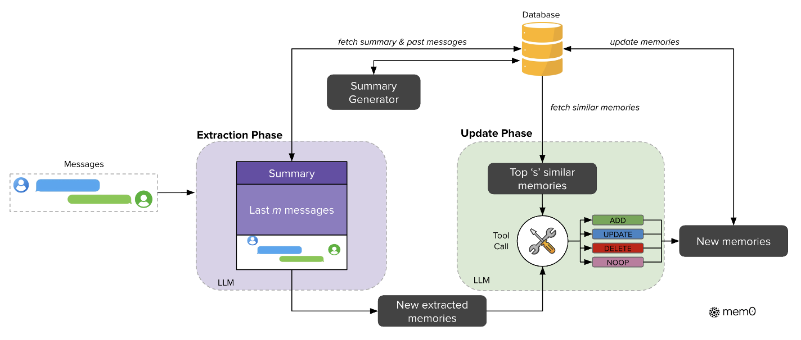
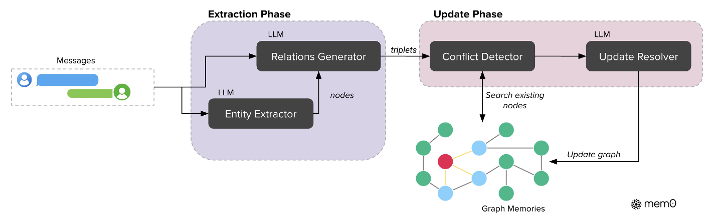
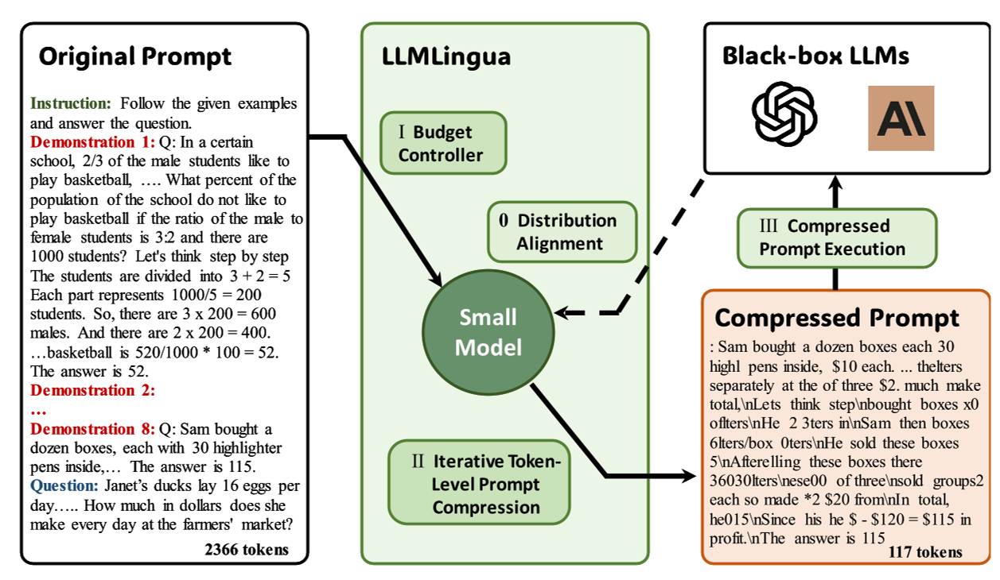
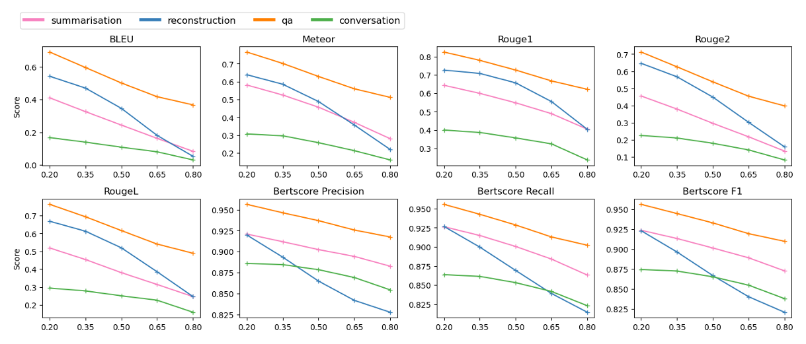
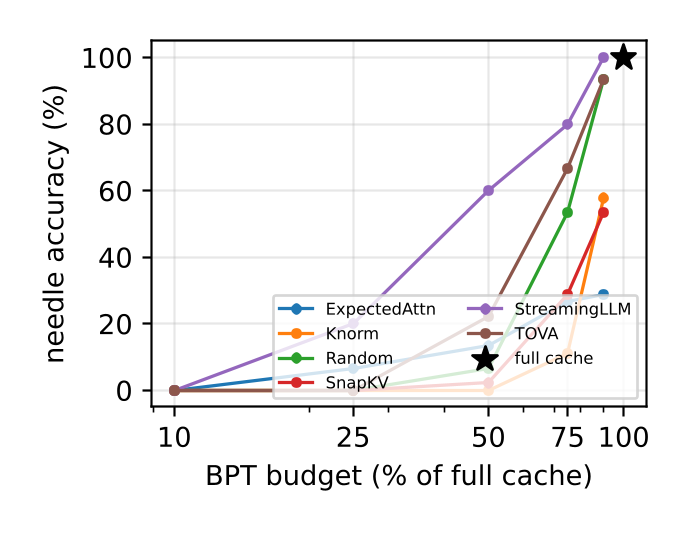

[TOC]

# 智能体的上下文管理

> **调研背景**: LLM 的上下文窗口是有限的固定资源，而智能体在长对话、长文档与跨会话任务中持续产生远超窗口容量的信息。本调研梳理近三年（2023–2026）在上下文压缩、记忆管理与长上下文处理三条路线上的代表性工作，重点比较它们在"保留什么、如何保留、代价是什么"上的取舍。
> **调研范围**: 2023–2026 年，入选论文 6 篇（FULL_TEXT 6 篇，仅摘要来源 0 篇）

**关于详细内容**：每篇论文的四维信息、公式逐字抄录与来源等级保存在
`investigation/智能体的上下文管理/analysis/{论文短名}.md`。本文档只做**归纳与对比**，
不复述这些文件的正文——需要细节时请直接查阅对应文件。

---

## 论文清单

| # | 论文 | 年份/会议 | 来源等级 | 一句话定位 | 详细分析 |
| - | ---- | --------- | -------- | ---------- | -------- |
| 1 | MemGPT | 2023（v2 2024），arXiv:2310.08560 | FULL_TEXT | 借鉴操作系统虚拟内存分页，用函数调用让 LLM 自主在分层记忆间搬运数据，突破固定上下文窗口 | [analysis/MemGPT.md](../analysis/MemGPT.md) |
| 2 | Mem0 | 2025，arXiv:2504.19413 | FULL_TEXT | 提出"抽取—更新"两阶段长期记忆架构，用 LLM 工具调用管理记忆库，并以图记忆变体 Mem0g 增强关系推理 | [analysis/Mem0.md](../analysis/Mem0.md) |
| 3 | LLMLingua | 2023（EMNLP 2023），arXiv:2310.05736 | FULL_TEXT | 用预算控制器 + 迭代 token 级压缩 + 分布对齐，在几乎不损性能下实现最高 20x 提示词压缩 | [analysis/LLMLingua.md](../analysis/LLMLingua.md) |
| 4 | SelectiveContext | 2023（EMNLP 2023），arXiv:2310.06201 | FULL_TEXT | 用自信息衡量词元/短语/句子冗余度并按百分位剪枝输入上下文，免训练降低推理显存与延迟 | [analysis/SelectiveContext.md](../analysis/SelectiveContext.md) |
| 5 | MemorySurvey | 2024，arXiv:2404.13501 | FULL_TEXT | 首篇系统综述 LLM 智能体记忆机制，从来源、形式、操作三维度归纳设计范式并梳理评测方法 | [analysis/MemorySurvey.md](../analysis/MemorySurvey.md) |
| 6 | MemoryCompactionSurvey | 2026，arXiv:2607.08032 | FULL_TEXT | 用统一的率–失真视角把 KV 缓存、提示词、架构状态与智能体记忆四类压缩统一为一个问题，并给出七轴分类法与 COMPACT-Bench | [analysis/MemoryCompactionSurvey.md](../analysis/MemoryCompactionSurvey.md) |

---

# 1. 逐篇定位

## 1.1 MemGPT

针对固定上下文窗口无法承载长对话与长文档的问题，MemGPT 借鉴操作系统的虚拟内存分页，把 LLM 的 prompt tokens 视为"主存"、把外部数据库视为"磁盘"，并通过函数调用让模型自主在两者之间搬运数据。它是本课题中"**用系统架构而非模型改造换取长上下文**"这一路线的开创性工作，代价是记忆搬运完全依赖模型自身的自主决策质量。

> 图注原文：Figure 3. In MemGPT, a fixed-context LLM processor is augmented with a hierarchical memory system and functions that let it manage its own memory.

## 1.2 Mem0

Mem0 关注智能体在多会话交互中缺乏持久记忆、信息一旦滑出窗口即"reset"的问题，提出"抽取—更新"两阶段记忆架构：先从对话中抽取候选事实，再借助 LLM 的工具调用在外部记忆库上执行增删改。它是本课题中"**把记忆管理下沉为独立可复用服务**"的工业级代表，代价是记忆质量受抽取提示与 LLM 判断稳定性影响。

> 图注原文：Figure 2: Architectural overview of the Mem0 system showing extraction and update phase.

Mem0 的图记忆变体 Mem0g 把记忆表示为有向带标签图，是本文档中唯一以"实体—关系"结构组织长期记忆的机制：

> 图注原文：Figure 3: Graph-based memory architecture of Mem0g illustrating entity extraction and update phase.

## 1.3 LLMLingua

LLMLingua 解决的是长提示词（instruction / demonstrations / question 合计上万 token）带来的推理成本问题，用预算控制器在 demonstration 级做粗压缩、再用迭代 token 级算法做细压缩，并额外微调小模型以对齐目标 LLM 的分布。它是本课题中"**面向输入提示词的有监督压缩**"路线的代表，在接近极限压缩率时性能会明显下滑。

> 图注原文：Figure 1: Framework of the proposed approach LLMLingua.

## 1.4 SelectiveContext

SelectiveContext 指出长上下文推理的瓶颈之一是输入自身固有的冗余，主张从输入侧而非架构侧解决，用一个小语言模型计算每个词元的自信息，聚合成短语/句子级单位后按百分位剪枝。它是本课题中"**免训练、模型无关的输入侧压缩**"路线的代表，代价是压缩粒度依赖短语边界识别质量。

> 图注原文：Figure 3: Performance of selective context on different tasks. x-axix represents compression ratios (same below).

## 1.5 MemorySurvey

MemorySurvey 面向"记忆机制散落在不同论文、缺乏整体视角"的问题，从记忆来源、记忆形式与记忆操作三个维度归纳设计范式，并梳理评测方法。它提出 writing–management–reading 三操作的统一形式化（细节见 `analysis/MemorySurvey.md`），是本课题的**领域地图**，为比较不同记忆系统提供了共同坐标系。

> 图注原文：Figure 4: An overview of the sources, forms, and operations of the memory in LLM-based agents.

## 1.6 MemoryCompactionSurvey

MemoryCompactionSurvey 指出 KV 缓存压缩、提示词压缩、架构状态压缩与智能体记忆压缩这四条研究线彼此几乎不往来，主张它们本质上是同一个率–失真决策问题。它给出统一形式化、七轴分类法与 COMPACT-Bench 评测协议，是本课题中**最新、也最具统一野心**的综述，其核心论点是不可逆的压缩在重复发生时误差会持续累积。

图见原文 Fig. 1（p.2）：Map of the survey。
图见原文 Fig. 2（p.3）：The rate–distortion view of Section 2。

> 图注原文：Figure 5: The accuracy–budget frontier on natural-filler needle retrieval with Qwen2.5-1.5B, six KV-compaction methods on one bytes-per-token-of-history axis.

---

# 2. 对比分析

## 2.1 方法框架对比

| 对比维度 | MemGPT | Mem0 | LLMLingua | SelectiveContext | MemorySurvey | MemoryCompactionSurvey |
| -------- | ------ | ---- | --------- | ---------------- | ------------ | ---------------------- |
| 模块划分 | Main Context（System Instructions + Working Context + FIFO Queue）+ Queue Manager + Function Executor | 抽取阶段（摘要 + 近期消息 → 候选事实）+ 更新阶段（Tool Call 决策）；Mem0g 另加图记忆 | Budget Controller + Iterative Token-level Prompt Compression + Distribution Alignment | 自信息计算 + lexical unit 合并 + 百分位过滤 | 来源 / 形式 / 操作三维度分析框架（综述） | 统一率–失真形式化（压缩算子 + 使用算子）+ 七轴分类法 + COMPACT-Bench |
| 数据流 | 事件 → 追加到 main context → LLM 生成 → 解析并执行函数 → 在主/外部上下文间搬运 | 消息对 + 摘要 + 近期消息 → 抽取 → 候选事实 → 相似检索 + LLM 决策 → 记忆库 | 长提示词 → 预算分配 → segment 级迭代过滤 → 压缩提示词 → 黑盒 LLM | 上下文 → 逐句算自信息 → 按 unit 聚合 → 百分位筛选 → 目标 LLM | 原始观测 → 写入 → 管理 → 读取 → 注入 prompt | 全部历史 → 压缩算子 → 紧凑表示 → 使用算子 → 输出 |
| 压缩/管理的作用对象 | 对话历史与文档（主上下文 ↔ 外部存储） | 会话事实（外部记忆库） | 输入提示词（instruction / demonstrations / question） | 输入上下文（token / phrase / sentence） | 不适用（综述，不提出具体方法） | 跨层统一：KV 缓存、提示词、架构状态、智能体记忆 |
| 是否引入新增参数 | 否 | 否 | 是（仅小模型做分布对齐） | 否 | 不适用 | 不适用 |

差别集中在一点：**MemGPT 与 Mem0 管理的是"记忆"（跨轮次持久化的状态），LLMLingua 与 SelectiveContext 压缩的是"输入"（本次推理的提示词），两篇综述则分别提供记忆机制与压缩机制的统一坐标系。** 这一分野决定了 §2.3 中训练成本的分布。

## 2.2 关键机制对比

| 论文 | 核心机制 | 解决什么 | 代价 |
| ---- | -------- | -------- | ---- |
| MemGPT | 用函数调用在分层记忆（main context / recall storage / archival storage）之间分页，由 LLM 自主决定搬运时机 | 固定上下文窗口无法承载长对话与长文档 | 依赖模型自主决策质量；搬运本身消耗推理调用 |
| Mem0 | 用 LLM 工具调用在外部记忆库上执行 ADD / UPDATE / DELETE / NOOP；Mem0g 以图结构表示实体关系并标记失效而非物理删除 | 多会话长期记忆的冗余与矛盾 | 抽取与更新质量受提示与 LLM 判断稳定性影响 |
| LLMLingua | 预算控制器按提示词组件分配压缩率，迭代 token 级压缩建模被压缩内容的相互依赖，小模型指令微调对齐目标 LLM | 长提示词的推理成本 | 高压缩率（如 25x–30x）下性能明显下滑；需额外小模型 |
| SelectiveContext | 以自信息度量冗余，聚合为 lexical unit 后按百分位自适应剪枝 | 输入上下文自身固有冗余 | 依赖短语边界识别；最优压缩百分位随任务变化 |
| MemorySurvey | 提出 writing–management–reading 三操作的统一演化框架，并从来源/形式/操作三维度给出分类 | 记忆机制研究散落、缺乏整体视角 | 综述性质，不提供可运行方法 |
| MemoryCompactionSurvey | 把四层压缩统一为受速率约束的期望失真最小化，并提升可逆性、查询条件化、保真度剖面为三个一等属性 | 四类压缩研究线彼此隔绝、度量口径不一 | 作者自述为综述，未提供大规模实证验证 |

**共同的收敛点**：六篇最终都在回答同一个问题——**在预算约束下，哪些历史信息值得保留**。区别在于预算的度量单位（token、显存字节、状态维度、记忆库大小）、压缩发生的层级（输入、记忆、架构），以及决策是否能看到查询。MemoryCompactionSurvey 对此给出了最一般的表述：可逆的算子在同预算下优于不可逆算子，因为前者能找回被丢弃的内容。

## 2.3 训练目标对比

| 论文 | 是否训练 | 训练什么 | 阶段划分 | 与预训练目标的关系 |
| ---- | -------- | -------- | -------- | ------------------ |
| MemGPT | **否，无新增训练目标** | 无新增训练参数；能力来自分层架构 + 系统提示 + 事件驱动控制流 | — | 原样复用已有 LLM 的生成与函数调用能力 |
| Mem0 | **否，无新增训练目标** | 无新增训练参数；抽取、更新、冲突消解全部由提示词驱动的 LLM 完成 | — | 完全建立在现成 LLM 的零样本推理与工具调用之上 |
| LLMLingua | 是（仅小模型） | 仅用指令微调对齐小语言模型与目标 LLM 的分布；目标 LLM 不训练、无梯度回传 | 单阶段（对齐与压缩流程解耦） | 预算控制器与迭代压缩复用小模型预训练的语言建模能力；对齐阶段引入新的指令微调目标 |
| SelectiveContext | **否，无新增训练目标** | 无新增训练参数；仅用现成 base LM 计算自信息 | — | 直接复用预训练模型输出的概率，不做任何梯度更新 |
| MemorySurvey | 不适用（综述） | 不提出新模型或训练目标；所述 SFT / 知识编辑均为对既有工作的归纳 | — | 不涉及对预训练目标的改动 |
| MemoryCompactionSurvey | 不适用（综述） | 不训练任何模型；所述各层方法的训练信号均为对被综述方法的回顾 | — | 其率–失真目标为分析性框架，不是被优化的训练损失 |

**四篇方法类工作均无新增训练目标**；LLMLingua 仅训练对齐用的小模型，Mem0 的 ADD / UPDATE / DELETE / NOOP 是外部记忆库的符号操作而非梯度更新。两篇综述不提出训练目标。汇总表据此填写。

## 2.4 对比汇总表

| 论文 | 作者主要想解决的问题 | 方法框架 | 关键机制 | 是否 Training-free |
| ---- | -------------------- | -------- | -------- | ------------------ |
| MemGPT | 固定上下文窗口无法承载长对话与长文档 | Main Context + Queue Manager + Function Executor | 用函数调用在分层记忆间分页，由 LLM 自主搬运 | 是 |
| Mem0 | 多会话交互缺乏持久记忆、易冗余与矛盾 | 抽取阶段 + 更新阶段（+ Mem0g 图记忆） | LLM 工具调用执行记忆增删改；图结构标记失效而非删除 | 是 |
| LLMLingua | 长提示词导致推理成本过高 | Budget Controller + ITPC + Distribution Alignment | 按组件分配压缩率 + 迭代 token 级压缩建模相互依赖 | 否（仅小模型做分布对齐） |
| SelectiveContext | 输入上下文自身固有冗余未被处理 | 自信息计算 + lexical unit 合并 + 百分位过滤 | 以自信息度量冗余并按百分位自适应剪枝 | 是 |
| MemorySurvey | 记忆机制研究散落、缺乏整体视角 | 来源 / 形式 / 操作三维度分析框架 | 统一演化函数（writing / management / reading） | 不适用（综述） |
| MemoryCompactionSurvey | 四类压缩研究线彼此隔绝、度量口径不一 | 统一率–失真形式化 + 七轴分类法 + COMPACT-Bench | 把四层压缩统一为同一预算下的保留/丢弃决策 | 不适用（综述） |

---

# 3. 结论与开放问题

**共识**：六篇都认同一件事——**上下文管理本质上是预算约束下的信息取舍问题**。差异只在于预算的度量单位、压缩发生的层级，以及决策是否查询条件化。MemorySurvey 与 MemoryCompactionSurvey 分别从记忆机制与压缩机制两侧给出了统一坐标系，说明这一领域正在从"各自造轮子"走向"共享同一把尺子"。

**分歧**：主要分歧在于**记忆该以什么形式承载**。MemGPT 与 Mem0 走文本/结构化外部存储路线，主张记忆可读可改、可解释；MemorySurvey 则指出参数化记忆在读取效率上更优，而文本记忆在写入效率与可解释性上更优，两种形式各有其位。另一处分歧是**压缩是否应当可逆**：MemoryCompactionSurvey 明确主张同预算下可逆算子占优，而 MemGPT 的队列逐出与 Mem0 的 DELETE 都属于不可逆操作。

**尚未解决的问题**：

1. **评测口径不统一**：各篇使用不同数据集与指标（MemGPT 用 MSC/DMR 与文档 QA，Mem0 用 LOCOMO，LLMLingua 用 GSM8K/BBH），压缩率与任务效用之间缺乏统一量尺。MemoryCompactionSurvey 提出的 COMPACT-Bench 是对此的初步回应，但作者自述未做大规模实证。
2. **重复压缩的代价几乎未被测量**：智能体会反复压缩同一份记忆，而现有工作大多只在单轮长上下文任务上评估。
3. **查询无关压缩的理论代价已有刻画但未被利用**：MemoryCompactionSurvey 给出查询无关算子的有效每查询预算约为"速率预算 $B$ 减去查询熵 $H(Q)$"，即"不知道查询"的精确代价是 $H(Q)$；如何据此设计查询条件化的压缩策略仍是开放问题。
4. **长期记忆的一致性维护缺乏标准做法**：Mem0 用 LLM 判断矛盾并删除或标记失效，但何时应当覆盖、何时应当保留历史版本，尚无公认准则。
5. **压缩与记忆管理仍被分开研究**：LLMLingua 与 SelectiveContext 压缩的是单次输入，MemGPT 与 Mem0 管理的是跨轮次状态，两篇综述虽尝试搭桥，但尚无工作把二者纳入同一套运行时策略。

---

# 参考文献

1. Charles Packer, Sarah Wooders, Kevin Lin, Vivian Fang, Shishir G. Patil, Ion Stoica, Joseph E. Gonzalez. *MemGPT: Towards LLMs as Operating Systems.* arXiv preprint arXiv:2310.08560 (cs.AI), 2023（v2, 2024）. https://arxiv.org/abs/2310.08560 — `FULL_TEXT`
2. Prateek Chhikara, Dev Khant, Saket Aryan, Taranjeet Singh, Deshraj Yadav. *Mem0: Building Production-Ready AI Agents with Scalable Long-Term Memory.* arXiv preprint arXiv:2504.19413 (cs.CL), 2025. https://arxiv.org/abs/2504.19413 — `FULL_TEXT`
3. Huiqiang Jiang, Qianhui Wu, Chin-Yew Lin, Yuqing Yang, Lili Qiu. *LLMLingua: Compressing Prompts for Accelerated Inference of Large Language Models.* In Proceedings of EMNLP 2023. arXiv:2310.05736. https://arxiv.org/abs/2310.05736 — `FULL_TEXT`
4. Yucheng Li, Bo Dong, Chenghua Lin, Frank Guerin. *Compressing Context to Enhance Inference Efficiency of Large Language Models.* In Proceedings of EMNLP 2023. arXiv:2310.06201. https://arxiv.org/abs/2310.06201 — `FULL_TEXT`
5. Zeyu Zhang, Xiaohe Bo, Chen Ma, Rui Li, Xu Chen, Quanyu Dai, Jieming Zhu, Zhenhua Dong, Ji-Rong Wen. *A Survey on the Memory Mechanism of Large Language Model based Agents.* arXiv preprint arXiv:2404.13501 (cs.AI), 2024. https://arxiv.org/abs/2404.13501 — `FULL_TEXT`
6. Ashwin Gerard Colaco, Nada Lahjouji. *What to Keep, What to Forget: A Rate–Distortion View of Memory Compaction in LLMs and Agents.* arXiv preprint arXiv:2607.08032 (cs.LG), 2026. https://arxiv.org/abs/2607.08032 — `FULL_TEXT`
